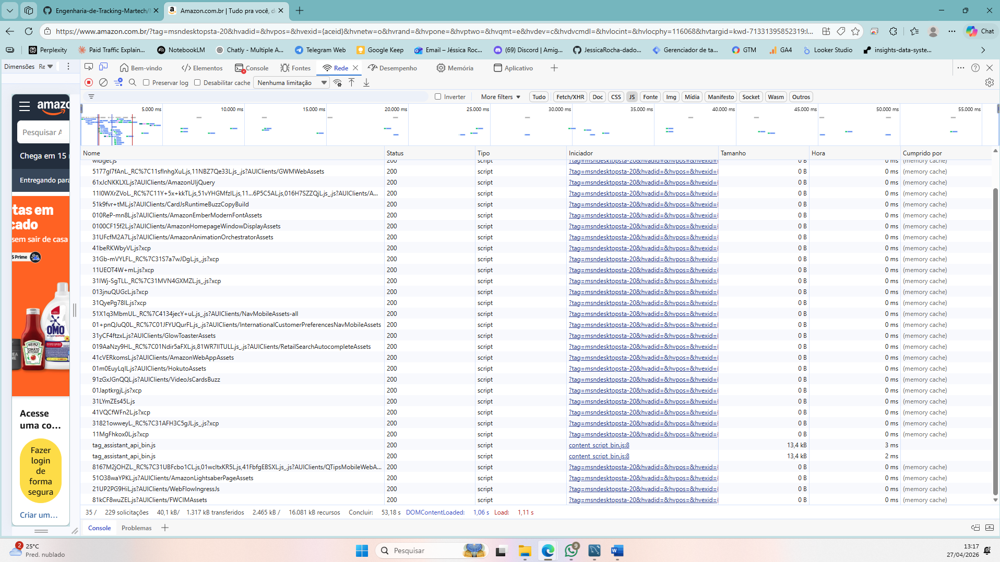
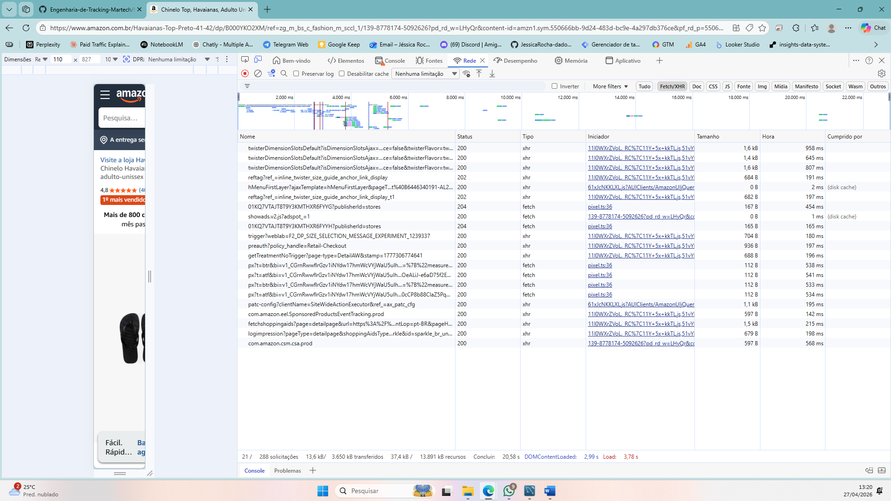
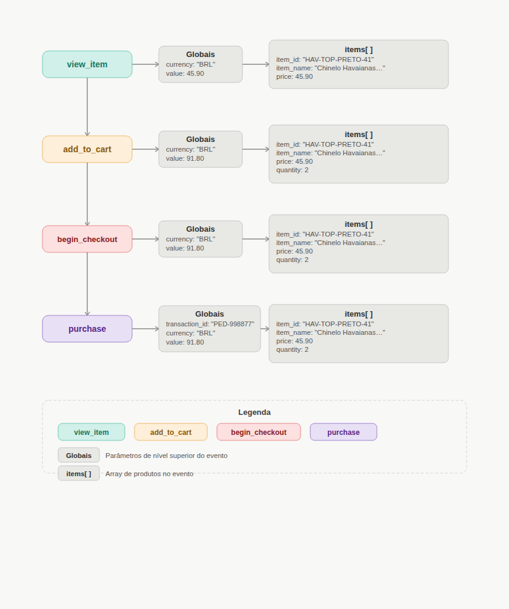

# 🌐 Dia 01: O Ecossistema Web e a "Matrix" do Navegador

**Módulo:** 1 (Os Fundamentos da Coleta)  
**Status:** Concluído ✔️

## 🎯 Objetivo do Dia
Entender a base da internet (a comunicação Client-Server) e aprender a utilizar a aba **Network (Rede)** do navegador para inspecionar os disparos reais de rastreamento, antes de abrir ferramentas como GTM ou GA4.

## 🧠 Teoria Absorvida

Para atuar com engenharia de rastreamento, é preciso entender que a web funciona através de um fluxo contínuo de **Requisições e Respostas**.
* **O Navegador (Client):** Solicita as informações e interage com o usuário.
* **O Servidor (Server):** Devolve os arquivos que constroem a experiência (HTML, CSS, JS) e recebe os dados de volta.

**Os agentes do Tracking Client-Side:**
1. **Scripts (JavaScript):** São os "trabalhadores" dinâmicos. Eles rodam na página do navegador, "escutando" as interações do usuário (cliques, rolagens, adições ao carrinho).
2. **Cookies (1st e 3rd Party):** Arquivos de texto que dão "memória" ao navegador. Sem eles, o protocolo HTTP sofre de amnésia a cada clique.
3. **Payloads (Disparos):** É o pacote de dados empacotado pelo Script e enviado de volta ao servidor quando um evento acontece.

---

## 💻 Prática: Inspecionando o Tráfego (O caso Amazon)

Utilizei o **DevTools (F12)** no e-commerce da Amazon, focando na aba **Network (Rede)** — a verdadeira mesa de cirurgia de quem trabalha com dados na web.

### Laboratório executado:

1. Filtrei o tráfego por **JS** (JavaScript) e observei a "cachoeira" de scripts de terceiros sendo carregados apenas para montar a página inicial.

2. Limpei o console e alterei o filtro para **Fetch/XHR** para monitorar a comunicação silenciosa de dados.
3. **A captura:** Ao interagir com o site e clicar em um produto (Havaianas), interceptei em tempo real as requisições disparando na aba Rede.

Essas requisições `fetch/xhr` são o coração do Martech: pacotes de dados saindo do meu navegador avisando os servidores da Amazon sobre a minha interação exata.

---

## 💡 Insight Principal
> *Garbage in, garbage out.* Se um bloqueador de anúncios (AdBlock) ou uma restrição de navegador (ITP da Apple) barrar essa requisição `fetch` na aba Network, o dado morre ali. Ele nunca chegará ao Google Analytics ou ao BigQuery. A **Engenharia de Dados aplicada ao Marketing** começa na trincheira do navegador, garantindo que a requisição web aconteça com sucesso.

---
**Autora:** Jéssica Rocha  
*Estudante de Ciência de Dados & Engenharia de Analytics*

# 📊 Dia 02: Arquitetura de Dados e Mensuração de E-commerce (GA4)

Neste segundo dia de documentação, o foco foi sair da execução operacional e entrar na mentalidade de **Engenharia de Analytics**. Antes de configurar o Google Tag Manager, desenvolvemos o planejamento arquitetural estruturando o fluxo de dados de um e-commerce para garantir a precisão da coleta.

---

## 🎯 1. O Problema de Negócio (Discovery)

Para criar uma arquitetura de dados eficiente, partimos de perguntas reais que precisam ser respondidas para otimizar o ROI e a conversão:

*   **Validação de Intenção:** "Muitas pessoas clicam no botão de comprar, mas o item realmente entra no carrinho com sucesso?"
*   **Análise de Atrito:** "O usuário desiste da compra na reta final por causa do preço do produto ou pelo valor do frete?"
*   **Métricas de Performance:** "Como garantir que a receita e o ROI das campanhas reflitam o faturamento real, sem vendas duplicadas?"

---

## 🧠 2. O Framework de Solução (Metodologia)

Antes de desenhar qualquer fluxo técnico, aplicamos um framework de 5 etapas para garantir que a mensuração esteja alinhada aos objetivos estratégicos de Marketing Performance.

1.  **Discovery (A Origem):** Identificação da pergunta de negócio fundamental.
2.  **Jornada do Usuário (O Caminho):** Mapeamento visual das interações, telas e botões que o usuário percorre até a conversão.
3.  **O Verbo (A Ação no GA4):** Tradução das ações para a nomenclatura padrão do Google Analytics 4 (ex: `view_item`, `add_to_cart`).
4.  **O Payload (O Contexto):** Definição técnica dos parâmetros globais e matriz de itens (`array`) necessários (ex: `price`, `quantity`).
5.  **O Entregável (A Formalização):** Consolidação estratégica em um dicionário de dados (SDR) e fluxograma visual.

---

## 📑 3. Dicionário de Dados (SDR)

Abaixo está o mapeamento técnico dos eventos que serão implementados na camada de dados (DataLayer). O parâmetro `items` deve acompanhar o usuário em toda a jornada para manter a integridade do funil.

| Etapa do Funil | Evento (Verbo) | Parâmetros Globais | Parâmetros do Array (`items`) | Objetivo de Negócio |
| :--- | :--- | :--- | :--- | :--- |
| **Vitrine** | `view_item` | `currency`, `value` | `item_id`, `item_name`, `price` | Medir o interesse inicial em produtos específicos. |
| **Carrinho** | `add_to_cart` | `currency`, `value` | *Mesmos do anterior* + `quantity` | Identificar taxa de adição ao carrinho e volume. |
| **Checkout** | `begin_checkout` | `currency`, `value` | *Mesmos do passo anterior* | Medir abandono na tela de pagamento. |
| **Fechamento** | `purchase` | `transaction_id`, `currency`, `value` | *Mesmos do passo anterior* | Validar faturamento real e calcular ROI. |

> **Nota Técnica:** O disparo do evento `add_to_cart` ocorre apenas na confirmação de sucesso do sistema, evitando falsos positivos no funil.

---

## 🗺️ 4. Fluxograma Arquitetural

Representação visual da esteira de dados e interação dos parâmetros em cada disparo para o GA4.

---

## 🏗️ Dia 03: Estrutura, Hierarquia e Instalação Prática do GTM

### 🎯 Objetivo do Dia
Sair da teoria e realizar a instalação física do **Google Tag Manager (GTM)** em um ambiente real. Compreender a hierarquia organizacional da ferramenta (Conta vs. Contêiner) e validar o "encanamento" de dados através de um deploy utilizando o **GitHub Pages**.

---

### 🛠️ O Que Foi Feito (Laboratório Prático)

#### 1. Arquitetura e Governança no GTM
O primeiro passo foi criar a infraestrutura básica. Entendi que a **Conta** representa a empresa ou organização principal, enquanto o **Contêiner** representa o ativo digital específico (neste caso, focado em Web).
> **Evidência (Criação do Ambiente):**  
> 

#### 2. Anatomia dos Scripts (Head e Body)
O GTM não é apenas um script, mas um sistema composto por duas partes vitais. O painel forneceu os códigos necessários e a instrução exata de onde posicioná-los para garantir a máxima eficiência na coleta.
> **Evidência (Snippets Gerados):**  
> 

A aplicação seguiu a regra técnica:
*   **Script do `<head>`:** Inserido no topo para garantir o carregamento prioritário e não perder eventos iniciais da página.
*   **Script do `<body>`:** Inserido logo após a abertura da tag como um *fallback* (noscript) para ambientes sem JavaScript.
> **Evidência (Código Implementado):**  
>   
> 

#### 3. Hospedagem e Deploy (GitHub Pages)
Não me limitei a um simulador local. Criei um repositório dedicado, subi o arquivo estático e utilizei o **GitHub Pages** para colocar o ambiente de testes em produção real com protocolo HTTPS.
> **Evidências (Ambiente de Deploy):**  
>   
> 

#### 4. Validação Técnica com Tag Assistant
De nada adianta instalar se não houver validação. Utilizei o modo de depuração (Preview Mode) do GTM para testar a comunicação entre o servidor do Google e o meu novo site.
> **Evidência (Conexão do Debug):**  
> .png)

#### 5. Resultado Final: Sucesso na Conexão
O teste retornou o selo verde de **"Connected"**. Isso atesta que a base da arquitetura de tracking está operante e pronta para receber as futuras tags de métricas e conversões.
> **Evidência (Status Conectado):**  
> 

---

### 💡 Insight de Engenharia de Analytics
> "A instalação do GTM é o alicerce de qualquer projeto de dados em Marketing. Uma tag mal posicionada no código não é um erro de sintaxe, é a perda de dados cruciais (como a origem de uma campanha) em um mundo onde a velocidade de carregamento define a permanência do usuário."

**Metodologia Aplicada:** *Logic-First*. Antes de manipular qualquer arquivo no GitHub, documentei mentalmente e no papel a hierarquia das tags. Isso garantiu que os IDs sensíveis fossem tratados com as devidas políticas de segurança de dados em um repositório público.

---

### ✅ Checklist de Conclusão
* [x] Conta e Contêiner Web criados no GTM.
* [x] Compreensão da distinção entre os scripts de `<head>` e `<body>`.
* [x] Código HTML criado e injetado com os snippets corretamente.
* [x] Deploy realizado com sucesso no domínio do GitHub Pages.
* [x] Ambiente de debug (Tag Assistant) conectado e validado.
* [x] Documentação higienizada mantendo a governança de dados.
