#  Dia 01: O Ecossistema Web e a "Matrix" do Navegador

**Módulo:** 1 (Os Fundamentos da Coleta)  
**Status:** Concluído ✔️

##  Objetivo do Dia
Entender a base da internet (a comunicação Client-Server) e aprender a utilizar a aba **Network (Rede)** do navegador para inspecionar os disparos reais de rastreamento, antes de abrir ferramentas como GTM ou GA4.

## Teoria Absorvida

Para atuar com engenharia de rastreamento, é preciso entender que a web funciona através de um fluxo contínuo de **Requisições e Respostas**.
* **O Navegador (Client):** Solicita as informações e interage com o usuário.
* **O Servidor (Server):** Devolve os arquivos que constroem a experiência (HTML, CSS, JS) e recebe os dados de volta.

**Os agentes do Tracking Client-Side:**
1. **Scripts (JavaScript):** São os "trabalhadores" dinâmicos. Eles rodam na página do navegador, "escutando" as interações do usuário (cliques, rolagens, adições ao carrinho).
2. **Cookies (1st e 3rd Party):** Arquivos de texto que dão "memória" ao navegador. Sem eles, o protocolo HTTP sofre de amnésia a cada clique.
3. **Payloads (Disparos):** É o pacote de dados empacotado pelo Script e enviado de volta ao servidor quando um evento acontece.

---

##  Prática: Inspecionando o Tráfego (O caso Amazon)

Utilizei o **DevTools (F12)** no e-commerce da Amazon, focando na aba **Network (Rede)** — a verdadeira mesa de cirurgia de quem trabalha com dados na web.

### Laboratório executado:

1. Filtrei o tráfego por **JS** (JavaScript) e observei a "cachoeira" de scripts de terceiros sendo carregados apenas para montar a página inicial.

2. Limpei o console e alterei o filtro para **Fetch/XHR** para monitorar a comunicação silenciosa de dados.
3. **A captura:** Ao interagir com o site e clicar em um produto (Havaianas), interceptei em tempo real as requisições disparando na aba Rede.

Essas requisições `fetch/xhr` são o coração do Martech: pacotes de dados saindo do meu navegador avisando os servidores da Amazon sobre a minha interação exata.

---

##  Insight Principal
> *Garbage in, garbage out.* Se um bloqueador de anúncios (AdBlock) ou uma restrição de navegador (ITP da Apple) barrar essa requisição `fetch` na aba Network, o dado morre ali. Ele nunca chegará ao Google Analytics ou ao BigQuery. A **Engenharia de Dados aplicada ao Marketing** começa na trincheira do navegador, garantindo que a requisição web aconteça com sucesso.

---
**Autora:** Jéssica Rocha  
*Estudante de Ciência de Dados & Engenharia de Analytics*

# Dia 02: Arquitetura de Dados e Mensuração de E-commerce (GA4)

Neste segundo dia de documentação, o foco foi sair da execução operacional e entrar na mentalidade de **Engenharia de Analytics**. Antes de configurar o Google Tag Manager, desenvolvemos o planejamento arquitetural estruturando o fluxo de dados de um e-commerce para garantir a precisão da coleta.

---

## 1. O Problema de Negócio (Discovery)

Para criar uma arquitetura de dados eficiente, partimos de perguntas reais que precisam ser respondidas para otimizar o ROI e a conversão:

*   **Validação de Intenção:** "Muitas pessoas clicam no botão de comprar, mas o item realmente entra no carrinho com sucesso?"
*   **Análise de Atrito:** "O usuário desiste da compra na reta final por causa do preço do produto ou pelo valor do frete?"
*   **Métricas de Performance:** "Como garantir que a receita e o ROI das campanhas reflitam o faturamento real, sem vendas duplicadas?"

---

##  2. O Framework de Solução (Metodologia)

Antes de desenhar qualquer fluxo técnico, aplicamos um framework de 5 etapas para garantir que a mensuração esteja alinhada aos objetivos estratégicos de Marketing Performance.

1.  **Discovery (A Origem):** Identificação da pergunta de negócio fundamental.
2.  **Jornada do Usuário (O Caminho):** Mapeamento visual das interações, telas e botões que o usuário percorre até a conversão.
3.  **O Verbo (A Ação no GA4):** Tradução das ações para a nomenclatura padrão do Google Analytics 4 (ex: `view_item`, `add_to_cart`).
4.  **O Payload (O Contexto):** Definição técnica dos parâmetros globais e matriz de itens (`array`) necessários (ex: `price`, `quantity`).
5.  **O Entregável (A Formalização):** Consolidação estratégica em um dicionário de dados (SDR) e fluxograma visual.

---

##  3. Dicionário de Dados (SDR)

Abaixo está o mapeamento técnico dos eventos que serão implementados na camada de dados (DataLayer). O parâmetro `items` deve acompanhar o usuário em toda a jornada para manter a integridade do funil.

| Etapa do Funil | Evento (Verbo) | Parâmetros Globais | Parâmetros do Array (`items`) | Objetivo de Negócio |
| :--- | :--- | :--- | :--- | :--- |
| **Vitrine** | `view_item` | `currency`, `value` | `item_id`, `item_name`, `price` | Medir o interesse inicial em produtos específicos. |
| **Carrinho** | `add_to_cart` | `currency`, `value` | *Mesmos do anterior* + `quantity` | Identificar taxa de adição ao carrinho e volume. |
| **Checkout** | `begin_checkout` | `currency`, `value` | *Mesmos do passo anterior* | Medir abandono na tela de pagamento. |
| **Fechamento** | `purchase` | `transaction_id`, `currency`, `value` | *Mesmos do passo anterior* | Validar faturamento real e calcular ROI. |

> **Nota Técnica:** O disparo do evento `add_to_cart` ocorre apenas na confirmação de sucesso do sistema, evitando falsos positivos no funil.

---

##  4. Fluxograma Arquitetural

Representação visual da esteira de dados e interação dos parâmetros em cada disparo para o GA4.

---

##  Dia 03: Estrutura, Hierarquia e Instalação Prática do GTM

###  Objetivo do Dia
Sair da teoria e realizar a instalação física do **Google Tag Manager (GTM)** em um ambiente real. Compreender a hierarquia organizacional da ferramenta (Conta vs. Contêiner) e validar o "encanamento" de dados através de um deploy utilizando o **GitHub Pages**.

---

###  O Que Foi Feito (Laboratório Prático)

#### 1. Arquitetura e Governança no GTM
O primeiro passo foi criar a infraestrutura básica. Entendi que a **Conta** representa a empresa ou organização principal, enquanto o **Contêiner** representa o ativo digital específico (neste caso, focado em Web).
> **Evidência (Criação do Ambiente):**  
> 

#### 2. Anatomia dos Scripts (Head e Body)
O GTM não é apenas um script, mas um sistema composto por duas partes vitais. O painel forneceu os códigos necessários e a instrução exata de onde posicioná-los para garantir a máxima eficiência na coleta.
> **Evidência (Snippets Gerados):**  
> 

A aplicação seguiu a regra técnica:
*   **Script do `<head>`:** Inserido no topo para garantir o carregamento prioritário e não perder eventos iniciais da página.
*   **Script do `<body>`:** Inserido logo após a abertura da tag como um *fallback* (noscript) para ambientes sem JavaScript.
> **Evidência (Código Implementado):**  
>   
> 

#### 3. Hospedagem e Deploy (GitHub Pages)
Não me limitei a um simulador local. Criei um repositório dedicado, subi o arquivo estático e utilizei o **GitHub Pages** para colocar o ambiente de testes em produção real com protocolo HTTPS.
> **Evidências (Ambiente de Deploy):**  
>   
> 

#### 4. Validação Técnica com Tag Assistant
De nada adianta instalar se não houver validação. Utilizei o modo de depuração (Preview Mode) do GTM para testar a comunicação entre o servidor do Google e o meu novo site.
> **Evidência (Conexão do Debug):**  
> .png)

#### 5. Resultado Final: Sucesso na Conexão
O teste retornou o selo verde de **"Connected"**. Isso atesta que a base da arquitetura de tracking está operante e pronta para receber as futuras tags de métricas e conversões.
> **Evidência (Status Conectado):**  
> 

---

### Insight de Engenharia de Analytics
> "A instalação do GTM é o alicerce de qualquer projeto de dados em Marketing. Uma tag mal posicionada no código não é um erro de sintaxe, é a perda de dados cruciais (como a origem de uma campanha) em um mundo onde a velocidade de carregamento define a permanência do usuário."

**Metodologia Aplicada:** *Logic-First*. Antes de manipular qualquer arquivo no GitHub, documentei mentalmente e no papel a hierarquia das tags. Isso garantiu que os IDs sensíveis fossem tratados com as devidas políticas de segurança de dados em um repositório público.

---

###  Checklist de Conclusão
* [x] Conta e Contêiner Web criados no GTM.
* [x] Compreensão da distinção entre os scripts de `<head>` e `<body>`.
* [x] Código HTML criado e injetado com os snippets corretamente.
* [x] Deploy realizado com sucesso no domínio do GitHub Pages.
* [x] Ambiente de debug (Tag Assistant) conectado e validado.
* [x] Documentação higienizada mantendo a governança de dados.

---

##  Dia 04: A Primeira Tag (GA4)

**Módulo:** 1 (Fundamentos da Coleta)  
**Status:** Concluído ✅

###  Objetivo do Dia
Estabelecer a conexão fundamental entre o site de testes (GitHub Pages) e o Google Analytics 4 (GA4) utilizando o Google Tag Manager (GTM). O foco foi garantir a coleta da métrica base (`page_view`) e validar rigorosamente o fluxo de dados tanto no front-end quanto no back-end.

### Teoria Aplicada
A arquitetura de dados do GA4 via GTM exige uma fundação antes de qualquer evento personalizado. 
* **Tag do Google (Configuração):** Carrega a biblioteca global `gtag.js` e dispara eventos automáticos de medição otimizada. É o "abre-alas" do rastreamento.
* **Validação em Duas Etapas (QA):** Nunca assumimos que um dado chegou apenas porque a tag disparou. A validação ocorre em duas frentes:
  1. **Front-end (GTM Preview):** Confirma se a regra de acionamento (Trigger) funcionou na página.
  2. **Back-end (GA4 DebugView):** Confirma se os servidores do Google receberam e processaram o payload.

---

###  Laboratório Prático

#### Exercício 1: Configuração da Tag Base no GTM
Criação da Tag do Google vinculada ao ID de Medida da propriedade de testes, acionada no evento `Initialization - All Pages` para garantir o carregamento prioritário.

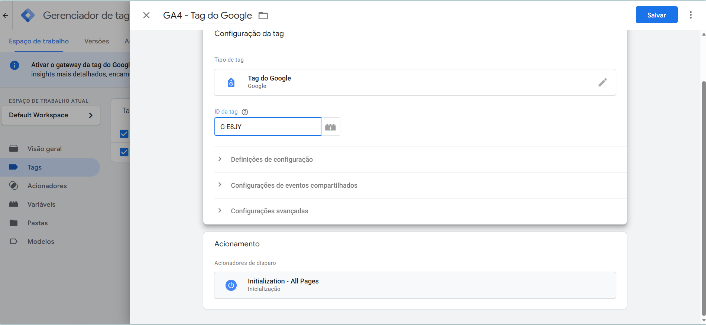

#### Exercício 2: Validação de Disparo (Front-end)
Teste realizado via Google Tag Assistant (Preview Mode) comprovando que a Tag foi injetada corretamente no código do site e disparou na inicialização do contêiner.

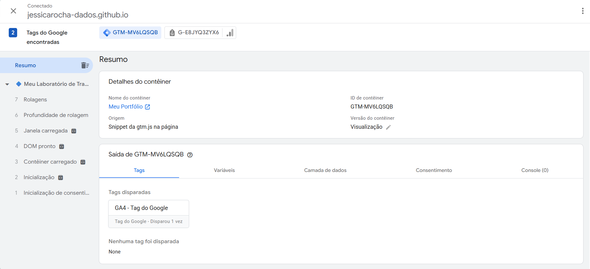

#### Exercício 3: Validação de Recebimento (Back-end)
Monitoramento em tempo real via **DebugView** do GA4. O teste comprova a chegada do evento `page_view` (junto com engajamento e sessão), confirmando que a ponte de dados está 100% funcional.

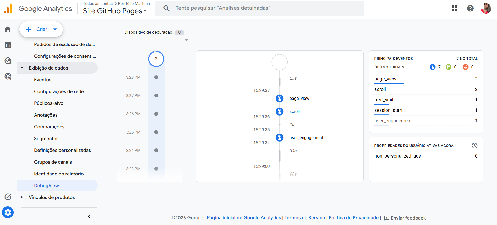

---

##  Dia 05: Acionadores Básicos e Ciclo da Página

**Módulo:** 1 (Fundamentos da Coleta)  
**Status:** Concluído ✅

###  Objetivo do Dia
Dominar o "quando" disparar uma tag, entendendo o ciclo de vida de carregamento de uma página no navegador e criando filtros baseados em Variáveis de URL.

###  Teoria Aplicada
Para garantir dados limpos, não podemos disparar tudo ao mesmo tempo. Compreender a cronologia de renderização é vital:
* **Initialization:** Usado para a base do GA4 (feito no Dia 04).
* **Container Loaded (Page View):** O navegador começa a ler a estrutura. É onde verificamos se a URL atende a algum requisito específico.
* **DOM Ready / Window Loaded:** Estágios posteriores para quando precisarmos interagir com botões ou aguardar recursos pesados.

###  Laboratório Prático e Evidências

O desafio foi criar uma Tag de Evento Personalizado (`view_sobre`) que só dispara quando o usuário entra na rota específica da página.

**1. Criação do Acionador Filtrado:**
Configuração de um Trigger do tipo *Page View*, condicionado a disparar apenas quando a Variável Incorporada `{{Page URL}}` contiver a palavra `sobre`.

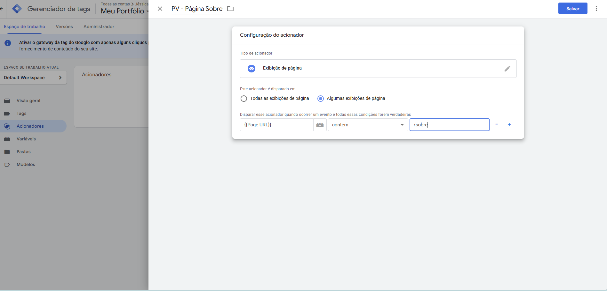

**2. Configuração da Tag de Evento:**
Criação do evento personalizado linkado diretamente ao acionador criado.

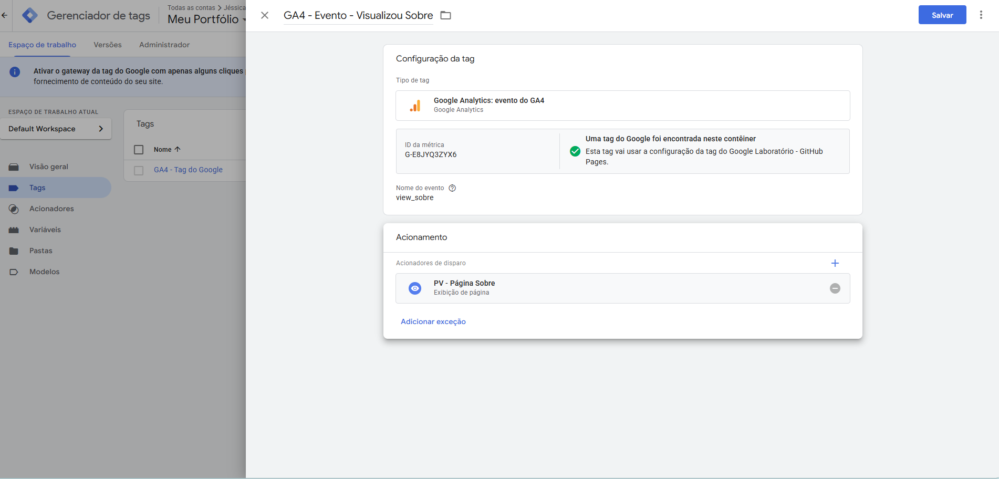

**3. QA de Front-end (Tag Assistant):**
Utilização do recurso de *Query Parameters* (`?teste=sobre`) na URL para simular a rota no ambiente do GitHub Pages. A validação comprova a leitura correta da variável e o disparo exclusivo da Tag de Evento no momento em que o Contêiner é carregado.

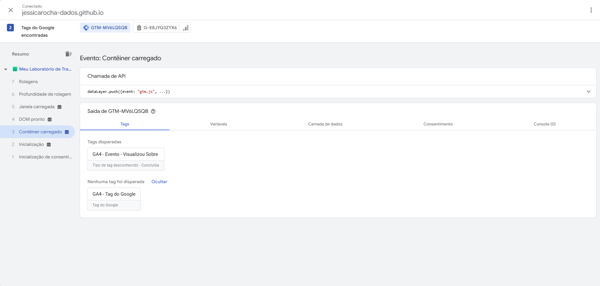

---
##  Dia 06: Variáveis Nativas e o Pilar da Governança de Dados

**Módulo:** 1 (Fundamentos da Coleta)  
**Status:** Concluído ✅

###  Objetivo do Dia
Compreender como o GTM extrai contexto dinâmico das interações do usuário e, mais importante, aplicar as melhores práticas de **Governança de Dados** na arquitetura de rastreamento.

###  Teoria Aplicada
* **Variáveis Nativas (Built-in):** Sensores pré-programados do GTM para ler atributos nativos do HTML e do navegador (ex: links de destino, classes CSS de botões e textos clicados).
* **Single Source of Truth (Fonte Única da Verdade):** Princípio de governança onde um dado crítico de negócio (como IDs de ferramentas) é armazenado num único local centralizado, garantindo escalabilidade e prevenção de erros em manutenções futuras.

###  Laboratório Prático e Evidências

O desafio consistiu em duas missões: ativar o rastreamento profundo de interações de front-end ("Click Listener") e refatorar a tag base para seguir padrões de Governança e escalabilidade.

**1. Ativação de Sensores e Gatilho:**
* Ativação das variáveis Built-in de Clique (`Click Classes`, `Click ID`, `Click URL`, `Click Text`).
* Criação de um Acionador genérico de Cliques (All Elements) para injetar o *Listener* no código fonte.

**2.  Governança de Dados e Refatoração:**
* Criação de uma Variável Definida pelo Usuário do tipo "Permanente" (Constante) para blindar o ID da Métrica do GA4 (`G-E8JYQ3ZYX6`).
* Refatoração das tags existentes: substituição de dados *hardcoded* (digitados manualmente) pela chamada dinâmica da variável `{{Permanente - ID do GA4}}`. Isso garante que futuras manutenções sejam feitas num único nó da arquitetura.

**3. QA de Front-end (Tag Assistant):**
Validação do evento assíncrono `gtm.click`. A auditoria na aba "Variables" comprova a captura do contexto do clique e a injeção perfeita da variável constante de Governança no momento do disparo.

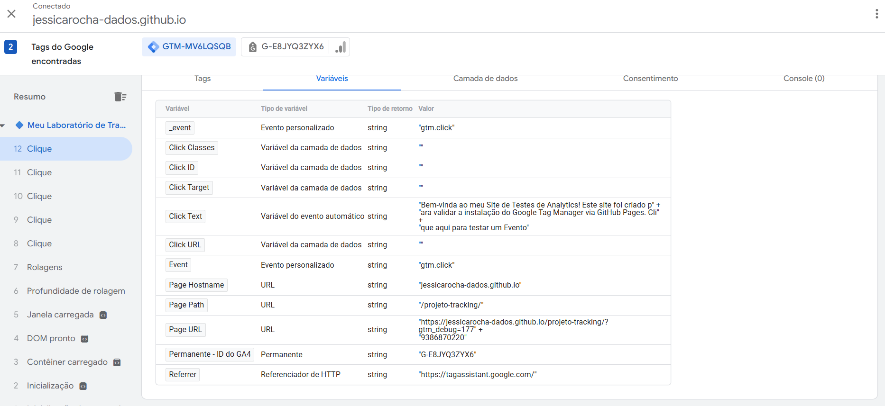

---
##  Dia 07: Auto-Event Tracking, Engenharia Reversa e Refatoração de Gatilhos

**Módulo:** 1 (Fundamentos da Coleta)  
**Status:** Concluído ✅

###  Objetivo do Dia
Aprender a isolar interações de alto valor (Auto-Event Tracking), aplicar engenharia reversa para descobrir atributos ocultos no HTML e refatorar arquiteturas de rastreamento buscando o "Padrão Ouro" de segurança (uso de IDs em vez de Textos), aplicando rigorosas práticas de Governança e ofuscação de dados sensíveis.

###  Teoria Aplicada
* **Just Links vs. All Elements:** Entendimento de quando rastrear âncoras (`<a>`) com destino de URL (Just Links) e quando rastrear cliques genéricos na interface (botões, modais) diretamente no DOM (All Elements).
* **Engenharia Reversa no Front-end:** Utilização do Tag Assistant para auditar eventos reais e descobrir quais atributos (Classes, Textos, IDs) estão disponíveis no elemento alvo.
* **O "Padrão Ouro" do Tracking:** Por que rastrear eventos por `Click ID` é infinitamente mais robusto do que por `Click Text` (textos podem sofrer testes A/B ou alterações de copy, enquanto IDs são fixos, únicos e estruturais).

###  Laboratório Prático e Evidências

O laboratório simulou um cenário real onde o botão alvo no front-end não possuía documentação prévia, exigindo investigação, adaptação e posterior refatoração da arquitetura.

**1. Diagnóstico Inicial e Tracking por Texto:**
* Mapeamento do elemento interativo utilizando o atributo visual `Click Text` ("Clique aqui para testar um Evento").
* Configuração inicial e validação positiva da Tag de Evento GA4 (`click_botao_teste`), garantindo a ocultação de IDs da infraestrutura (GTM/GA4) nas evidências de QA.

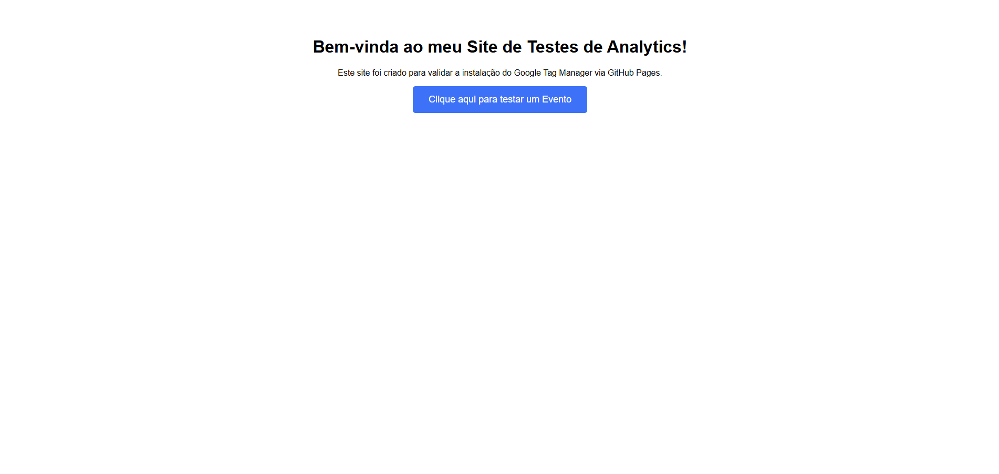
 
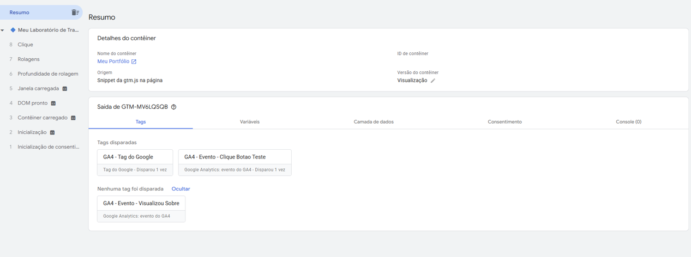

**2. Engenharia Reversa e Refatoração (A Busca pela Robustez):**
* Durante a auditoria do dataLayer, foi identificado que o botão possuía um ID oculto (`btn-teste`).
* **Refatoração:** O Acionador original foi editado para abandonar o rastreamento frágil por texto (`Click Text`) e adotar a regra condicional absoluta: `Click ID` é igual a `btn-teste`.

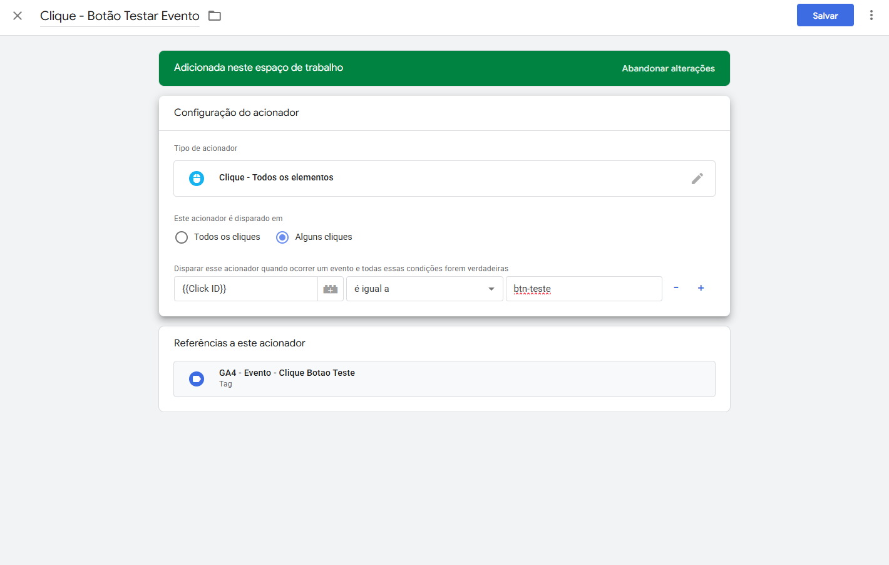

**3. QA Final (Quality Assurance):**
Validação positiva da nova arquitetura. A auditoria confirmou a captura perfeita do ID estrutural e o disparo seguro do evento no exato milissegundo da interação.

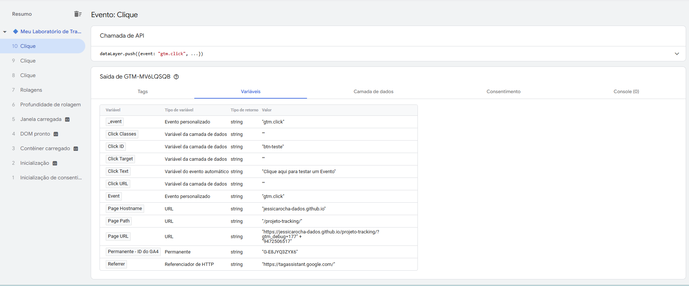

---
##  Dia 08: Rastreamento Avançado de Formulários (AJAX) e Resolução de Falsos Positivos

###  Visão Geral do Projeto
No ambiente de Web Analytics corporativo, um dos maiores desafios enfrentados por Engenheiros de Dados é o rastreamento preciso de conversões em formulários modernos. Formulários baseados em requisições assíncronas (AJAX) não recarregam a página ao serem enviados. Como consequência, estratégias comuns de rastreamento (como gatilhos baseados em cliques no botão de envio ou submissão simples de formulário) geram um volume massivo de **Falsos Positivos**, registrando conversões mesmo quando o usuário falha na validação de campos obrigatórios.

Neste laboratório prático (Dia 08), atuando tanto na camada de **Desenvolvimento Front-end** quanto na de **Arquitetura de Analytics**, implementamos uma solução tática de alta precisão baseada no comportamento do Document Object Model (DOM) para mitigar completamente os falsos positivos.

---

###  O que foi feito hoje

#### 1. Implementação no Front-end (`index.html`)
Desenvolvemos e injetamos uma estrutura de formulário AJAX resiliente para captura de leads (Newsletter) diretamente no código fonte do site de testes hospedado no GitHub Pages. 
* Utilizamos o método `event.preventDefault()` para interceptar e bloquear o comportamento padrão de recarregamento da página.
* Criamos uma estrutura condicional onde, mediante o sucesso do envio, o formulário é ocultado (`display: none`) e um elemento de feedback de sucesso (`
`) é dinamicamente injetado na tela via manipulação JavaScript.

#### 2. Configuração Inteligente no Google Tag Manager (GTM)
Para capturar o sucesso real da conversão sem depender de um programador para disparar uma camada de dados dedicada (`dataLayer`), criamos um "radar" de comportamento visual no GTM:
* **Acionador:** Tipo **Visibilidade do Elemento** configurado pelo método de seleção **ID** buscando especificamente a string `mensagem-sucesso`.
* **Configuração Crítica:** Ativamos a diretiva **"Acompanhar alterações do DOM"**. Essa flag força o container do GTM a monitorar ativamente a árvore HTML do site em tempo real, disparando o gatilho no milissegundo exato em que o JavaScript altera o estado do elemento de invisível para visível na tela do usuário.

#### 3. Integração e Governança com o GA4
* **Tag de Evento:** Vinculamos o acionador de visibilidade a uma nova tag do Google Analytics 4 utilizando a nomenclatura recomendada oficial do Google: `generate_lead`.
* **Segurança da Informação:** Durante o processo de auditoria de dados, aplicamos rígidos padrões de governança, realizando a **ofuscação completa do ID do container GTM** nas capturas de tela finais para assegurar a confidencialidade e a segurança da infraestrutura de rastreamento do portfólio.

---

###  Sucesso Obtido

* **Zero Falsos Positivos:** O evento só é disparado quando a mensagem de sucesso é efetivamente renderizada na tela para o usuário, garantindo integridade absoluta à métrica de conversão.
* **Rastreamento Assíncrono Perfeito:** Superamos a limitação física do recarregamento de página em ambientes AJAX/SPA.
* **Padrão de Governança Corporativa:** Documentação limpa, padronizada e segura seguindo boas práticas internacionais de engenharia de web analytics.

---

###  Evidências do Laboratório Prático (QA)

**A Lógica do Acionador no GTM** *Configuração detalhada do gatilho de visibilidade, operando sob monitoramento do DOM do navegador.* 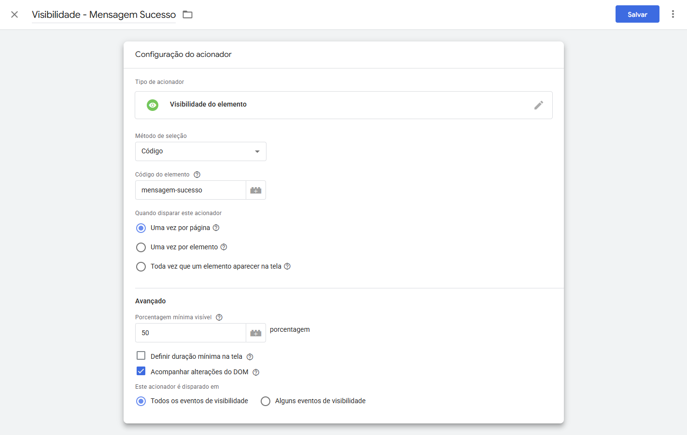

**A Experiência do Usuário (Front-end)** *Interface do site de testes apresentando o disparo visual de sucesso após o preenchimento correto do formulário de newsletter.* 

**Auditoria e Validação Final (Tag Assistant)** *A prova irrefutável do sucesso técnico. O evento `Element Visibility` foi registrado na linha do tempo, engatilhando com sucesso a tag de conversão do GA4 com o ID do container devidamente ocultado.* 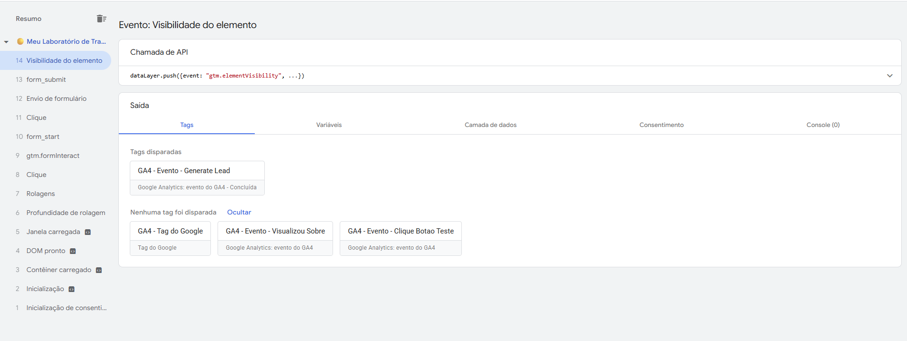

---

##  Dia 09: Element Visibility e Engajamento de Leitura

###  Visão Geral do Projeto
Em arquiteturas de Web Analytics, basear a análise de engajamento exclusivamente em cliques ("Click Tracking") gera uma visão míope sobre o comportamento do utilizador. Muitas vezes, um utilizador consome um conteúdo extenso (como um artigo de blog ou uma Landing Page longa) de forma altamente engajada sem nunca clicar num botão. 

Neste laboratório prático (Dia 09), foi implementado uma métrica qualitativa avançada baseada no comportamento da *Viewport* do navegador. O objetivo foi rastrear a **Visibilidade de Elemento** para medir o consumo efetivo do conteúdo até ao final da página (o rodapé), gerando um evento no Google Analytics 4.

---

###  O que foi feito hoje

#### 1. Implementação no Front-end (`index.html`)
Para simular um ambiente de página longa, injetámos um bloco de distanciamento estrutural no código-fonte e implementámos o alvo da nossa captura visual no final do documento:
* Criação de uma `div` com altura forçada (`height: 800px`) para exigir a rolagem da página por parte do utilizador.
* Inserção de uma tag `<footer>` contendo o ID exclusivo `rodape-site`, que servirá como âncora para o rastreamento do GTM.

#### 2. Configuração no Google Tag Manager (GTM)
Configurámos um radar visual focado num elemento específico do DOM, garantindo alta precisão na recolha de dados:
* **Acionador:** Tipo **Visibilidade do Elemento** configurado via método de seleção **ID** buscando o código `rodape-site`.
* **Regra de Qualidade:** Definimos a "Percentagem mínima visível" em **50%**, garantindo que o disparo só ocorra quando pelo menos metade da área do rodapé entrar no ecrã do utilizador. Isto evita "falsos positivos" causados por uma rolagem superficial.
* **Governança de Disparo:** Regra definida como "Uma vez por página", evitando a duplicação do evento caso o utilizador suba e desça a página repetidas vezes.

#### 3. Integração com o GA4
* **Tag de Evento:** Criação da tag `GA4 - Evento - View Footer`, ancorada no acionador de visibilidade e direcionando o payload de dados para a propriedade do GA4.

---

###  Sucesso Obtido

* **Medição de Engajamento Real:** Conseguimos comprovar de forma analítica que o utilizador consumiu todo o conteúdo da página antes de sair.
* **Métrica Qualitativa Isolada:** Ao contrário do gatilho genérico de *Scroll Depth* (que mede percentagens abstratas da página inteira), fomos cirúrgicos ao focar num elemento estrutural chave da interface.

---

###  Evidências do Laboratório Prático (QA)

**Auditoria e Validação Final (Tag Assistant)** * O evento `Element Visibility` foi isolado na linha do tempo, engatilhando com sucesso a tag de conversão do GA4 ao atingir 50% de visibilidade do rodapé.*

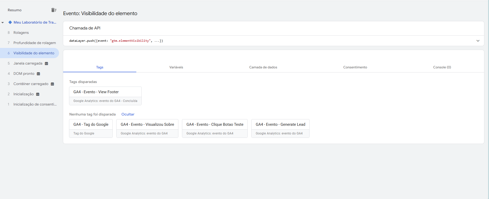

---

##  Dia 10: Auditoria Avançada e Debug (Tags Not Fired)

### Visão Geral do Projeto
A construção de uma arquitetura de dados confiável exige mais do que apenas criar Tags e Acionadores; exige a habilidade de diagnosticar falhas na recolha de dados. Quando uma conversão de marketing não é registrada, o analista deve ser capaz de isolar o momento exato em que a regra do contêiner foi quebrada.

Neste laboratório (Dia 10), focámos no desenvolvimento da competência de **QA (Quality Assurance) e Debugging**, utilizando o Tag Assistant para ler a "lógica de bloqueio" do Google Tag Manager.

### O que foi feito hoje

#### 1. Simulação de um Erro de Implementação
Para treinar a investigação, criámos intencionalmente uma "armadilha" (um erro de lógica) no ambiente de testes:
* **Acionador Falho:** Criámos um gatilho de Exibição de Página configurado para disparar apenas quando a regra `Page URL` contivesse um caminho impossível (`/pagina-inexistente-teste`).
* **Tag de Evento:** Vinculámos este acionador à tag `GA4 - Evento - Simulacao de Erro`, garantindo que ela estaria programada para falhar.

#### 2. Metodologia de Investigação no Tag Assistant (Debug)
Abandonámos a visão de "Resumo"  e operámos na análise de eventos isolados na linha do tempo:
* Isolámos o momento do carregamento da página (evento `DOM pronto`).
* Explorámos a secção **Tags Not Fired** para localizar a tag silenciada.
* Analisámos o *Drill-down* de acionamento para encontrar a raiz do problema.

### Sucesso Obtido

* **Eliminação de "Achismos":** Demonstramos que o GTM fornece provas inequívocas de falha. Ao invés de especular por que uma tag não disparou, conseguimos identificar visualmente o `❌` vermelho imposto pelo motor de regras do GTM.
* **Governança Acelerada:** Esta competência permite reduzir drasticamente o tempo de resposta e correção caso as URLs do site sejam alteradas pela equipe de desenvolvimento ou campanhas de tráfego quebrem os parâmetros de UTMs.

### Evidências do Laboratório Prático (QA)

**Auditoria e Isolamento de Falha:** *A prova técnica de que o GTM barrou o envio do pacote de dados para o GA4. Note a avaliação das regras de disparo com a sinalização `❌`, provando a não-conformidade com a regra da URL naquele evento específico.*

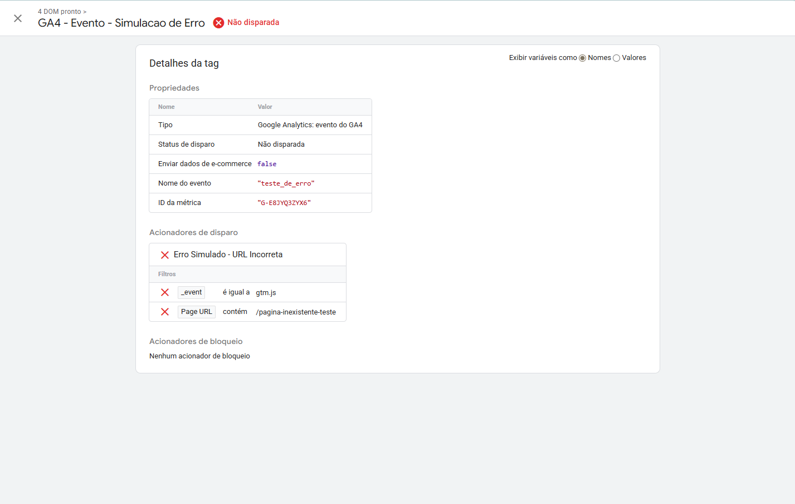

---
##  Dia 11: Governança, Versionamento e Rollback

### Visão Geral do Projeto
Em arquiteturas de dados complexas, gerir o ciclo de vida do código é tão importante quanto escrevê-lo. A publicação de tags no Google Tag Manager afeta diretamente o código front-end do site em produção. Portanto, um sistema robusto de controle de versão é obrigatório para mitigar riscos de quebra de layout ou perda de dados.

Neste laboratório (Dia 11), implementámos práticas de governança, utilizando nomenclatura semântica para lançamentos e executando um procedimento de emergência (*Rollback*) para reverter uma publicação falha.

### O que foi feito hoje

#### 1. Publicação e Nomenclatura Semântica (Release v1.0)
Consolidámos todo o trabalho de infraestrutura de rastreamento (GA4 Base, Eventos de Clique, Scroll e Visibilidade) num único pacote de publicação.
* Criámos a versão estável `v1.0 - Base GA4 e Rastreamento de Engajamento`.
* Preenchemos a documentação interna da versão (Descrição) para manter o histórico claro para futuros auditores ou membros da equipe.

#### 2. Simulação de Incidente em Produção (Release v1.1)
Para testar a resiliência do sistema, injetámos uma tag fictícia de HTML Personalizado (simulando um script problemático) e publicámos a `v1.1 - Tag Problematica (Erro Simulado)`, colocando o erro propositadamente no ambiente *Live*.

#### 3. Procedimento de Rollback (Disaster Recovery)
Em resposta à simulação de erro no ambiente de produção, operámos o painel de versões do GTM para efetuar a reversão imediata do código:
* Isolámos a versão estável anterior (`v1.0`).
* Sobrescrevemos o ambiente *Live*, desativando instantaneamente a tag problemática e restaurando a integridade da recolha de dados, sem a necessidade de eliminar ou alterar o *Workspace* atual.

###  Sucesso Obtido

* **Segurança Arquitetural:** Garantimos que qualquer erro futuro de implementação não será fatal, pois o ambiente possui pontos de restauro documentados e acessíveis em poucos cliques.
* **Profissionalização do Histórico:** Substituímos publicações genéricas por um histórico rastreável, onde cada alteração possui um nome descritivo (ex: `v1.0`, `v1.1`), facilitando a auditoria de quem publicou o quê e quando.

### Evidências do Laboratório Prático (QA)

**Auditoria de Versionamento e Execução de Rollback:** *Visualização do painel de versões no momento exato em que a versão v1.0 está a ser preparada para substituir a versão problemática v1.1 no ambiente Live.*

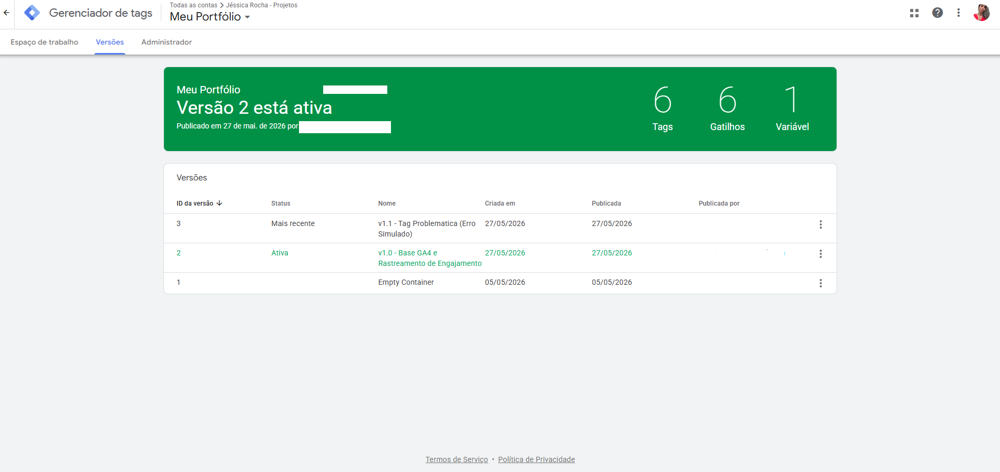

---
