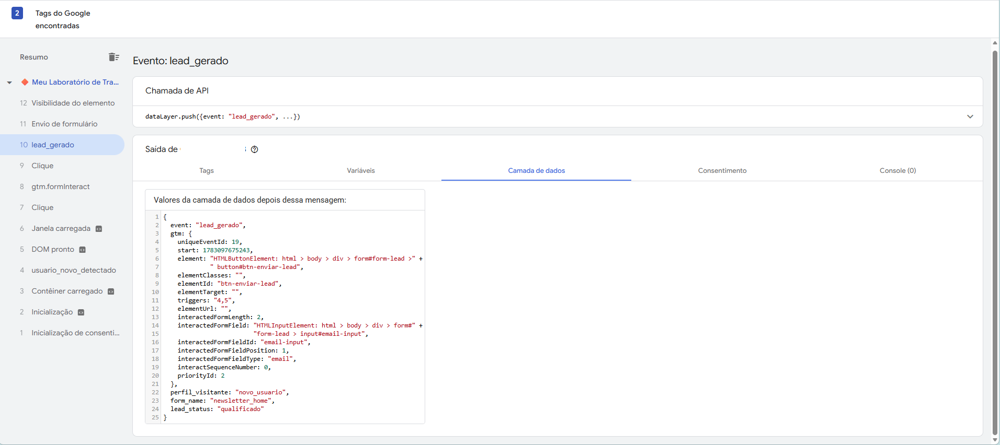
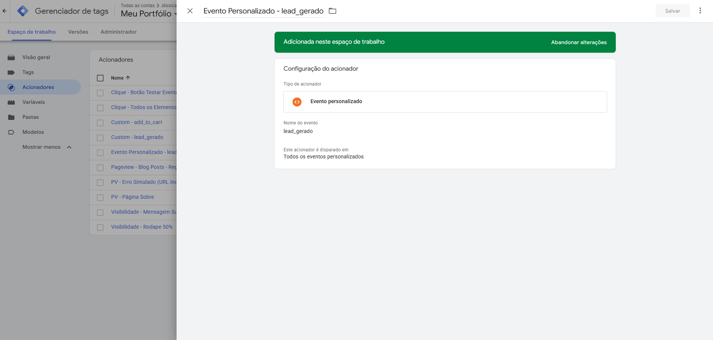
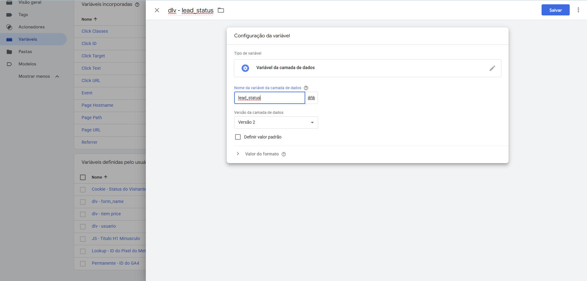
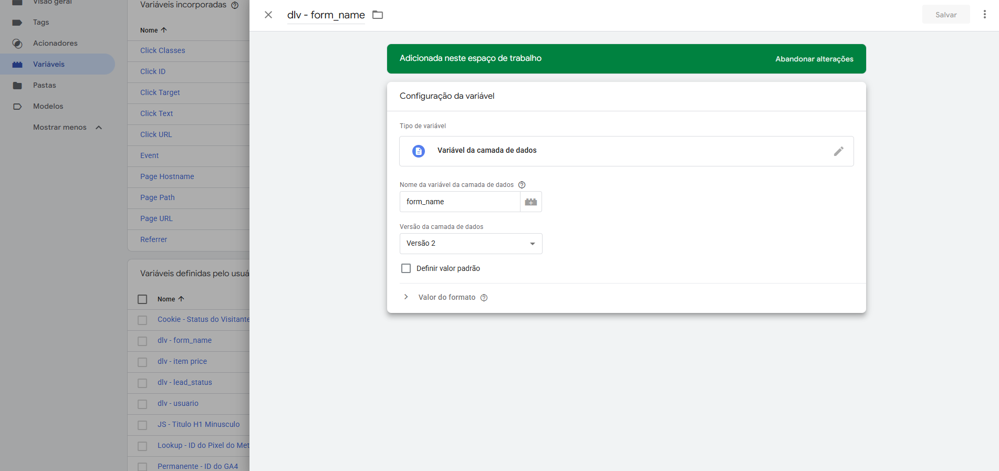
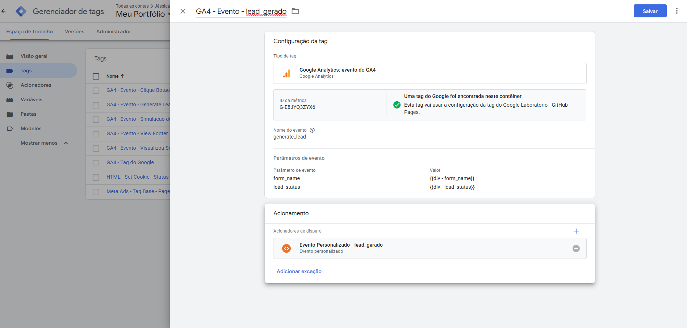

#  Refatoração de Tracking de Formulário

## 📌 Visão Geral do Projeto
Este projeto documenta a evolução da arquitetura de rastreamento de um formulário de captação de leads. O objetivo foi migrar de um acionador genérico (`Form Submission`), altamente propenso a disparos falsos, para uma estrutura robusta baseada em **Data Layer Push**.

Como o site utiliza formulários **AJAX** (sem recarregamento de página), a injeção do evento via Camada de Dados garante que o GTM e as plataformas de mídia (GA4 e Meta Ads) só registrem a conversão após a validação real do envio, eliminando a sujeira de dados na origem e garantindo a integridade dos relatórios de performance.

---

##  Etapas de Execução

- [x] **Etapa 1:** Planejamento Arquitetural (Dia 24)
- [x] **Etapa 2:** Configuração do Gatilho Avançado (Dia 25)
- [x] **Etapa 3:** Enriquecimento de Dados com Variáveis (Dia 26)
- [x] **Etapa 4:** Configuração das Tags de Conversão (Dia 27)
- [ ] **Etapa 5:** QA, Validação de Disparo e Conclusão (Dia 28)

---

##  Etapa 1: Planejamento Arquitetural e Dicionário de Dados

A primeira decisão técnica foi abandonar abordagens passivas (como Visibilidade do Elemento) e atuar diretamente no código-fonte do site. Foi injetado um script na função de sucesso do formulário para empurrar um pacote de dados limpo para o GTM.

**Payload Definido (Dicionário de Dados):**
Para enriquecer a coleta e permitir segmentações futuras, definimos o seguinte padrão de envio no momento exato da conversão:

```javascript
window.dataLayer = window.dataLayer || [];
window.dataLayer.push({
    'event': 'lead_gerado',           // Gatilho principal e exclusivo da conversão
    'form_name': 'newsletter_home',   // Identificador de contexto do lead
    'lead_status': 'qualificado'      // Regra de negócio aplicada via código
});
```

### 📸 Evidência Visual: Disparo do Data Layer Push



Acima, o painel de Debug do GTM comprova a injeção do evento `lead_gerado` e do payload de contexto (`form_name` e `lead_status`) perfeitamente estruturados na Camada de Dados, atestando o sucesso da nova arquitetura no código-fonte.

----
##  Etapa 2: Configuração do Gatilho Avançado (Acionador)

Para capturar o disparo executado pelo código-fonte, foi implementado um mecanismo de escuta no Google Tag Manager. Substituímos o gatilho nativo de submissão de formulários pela criação de um Acionador de Evento Personalizado (Custom Event Trigger), configurado explicitamente para intercetar o evento declarado na Camada de Dados.

**Detalhes do Acionador:**
* **Tipo:** Evento Personalizado (Custom Event)
* **Nome do Evento:** `lead_gerado`
* **Condição de Disparo:** Todos os eventos personalizados

Essa configuração garante **zero falsos positivos**. O GTM e as tags de mídia (como o Meta Ads) só serão ativados quando o site confirmar ativamente que o processo do formulário AJAX foi concluído com êxito.

**📸 Evidência Visual: Acionador Customizado no GTM (Etapa 2)**

Abaixo, a configuração do Acionador de Evento Personalizado no Google Tag Manager. Ele foi criado para interceptar exatamente o evento `lead_gerado` disparado pelo nosso código AJAX, servindo como o gatilho principal para as tags de conversão.


*Imagem: GTM configurado para escutar o Data Layer Push.*

---
##  Etapa 3: Enriquecimento de Dados com Variáveis

Para que o contexto de negócio (payload) injetado no Data Layer pudesse ser repassado para as plataformas de mídia, foi necessário mapear esses atributos dentro do Google Tag Manager utilizando **Variáveis da Camada de Dados (Data Layer Variables)**.

**Variáveis Mapeadas:**
1. **`dlv - form_name`**: Captura a chave `form_name`. Permite identificar exatamente a origem do lead (ex: `newsletter_home`), viabilizando a análise de performance por posicionamento na página.
2. **`dlv - lead_status`**: Captura a chave `lead_status`. Insere uma regra de qualificação primária (ex: `qualificado`), essencial para a segmentação de públicos de remarketing e modelagem de lookalike no Meta Ads.

Esta etapa transforma um disparo binário (converteu ou não) numa coleta rica e contextualizada, base fundamental para projetos avançados em Martech.

**📸 Evidência Visual: Variáveis da Camada de Dados (Etapa 3)**

Abaixo, o mapeamento das chaves de negócio transformadas em variáveis no GTM. Elas são as responsáveis por extrair o contexto gerado pelo código (`form_name` e `lead_status`) para enriquecer o payload enviado às plataformas de mídia.


*Imagem: Variável Data Layer para captura do status do lead.*


*Imagem: Variável Data Layer para captura do nome do formulário.*

---
## Etapa 4: Configuração das Tags de Conversão

Com a infraestrutura de captura (Acionador) e contexto (Variáveis) finalizada, o passo seguinte foi estruturar as Tags de envio para as plataformas de destino. Utilizamos o **Google Analytics 4 (GA4)** como referência para demonstrar o roteamento dos dados.

**Estrutura da Tag de Evento (GA4):**
* **Nome do Evento:** `generate_lead` (Nomenclatura recomendada nativamente pelo Google para otimização de machine learning em campanhas).
* **Parâmetros de Evento Adicionados:**
  * `form_name` mapeado dinamicamente recebendo a variável `{{dlv - form_name}}`.
  * `lead_status` mapeado dinamicamente recebendo a variável `{{dlv - lead_status}}`.
* **Acionamento:** Vinculada estritamente ao gatilho `Evento Personalizado - lead_gerado`.

Esta etapa consolida o pipeline de dados: o site emite o sinal estruturado, o GTM o intercepta, enriquece com as variáveis de negócio e despacha a conversão com contexto rico para os servidores do Google.

**📸 Evidência Visual: Configuração da Tag de Conversão **

Abaixo, a consolidação da nossa arquitetura. A tag do GA4 estruturada para disparar no momento exato definido pelo gatilho personalizado, carregando consigo os parâmetros de negócio extraídos diretamente do código-fonte do site.


*Imagem: Tag do GA4 integrada com Variáveis de Camada de Dados e Acionador Personalizado.*

---
