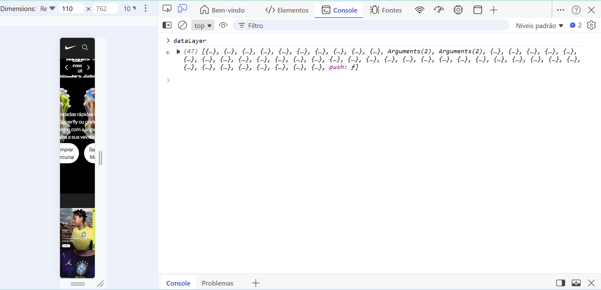
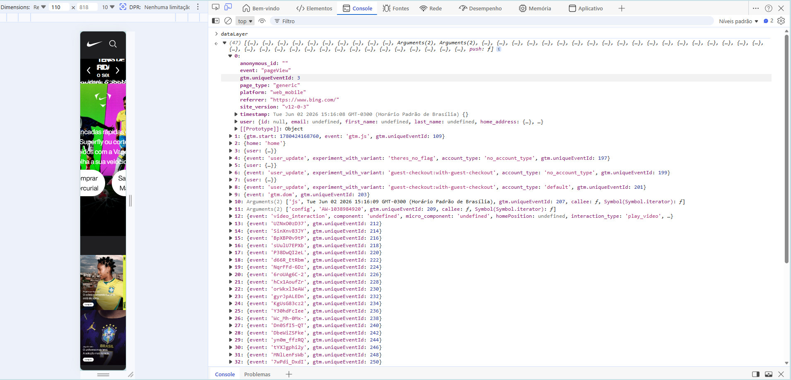
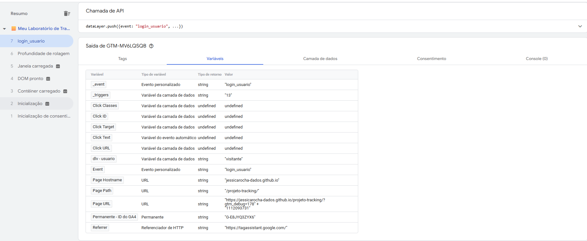
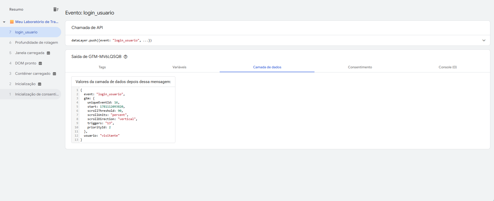

##  Módulo 2: Tracking e Lógica Avançada
**Objetivo:** Parar de depender de CSS (raspagem de tela), utilizar o Data Layer como fonte da verdade e aplicar lógica de programação no Google Tag Manager.


###  Dia 15: O Conceito de Data Layer (Camada de Dados)

####  Visão Geral da Teoria
O Data Layer (Camada de Dados) é um objeto JavaScript do tipo *Array* (uma lista) que armazena informações estruturadas. Ele funciona como uma ponte de comunicação blindada entre o back-end/front-end do site e o Google Tag Manager. 

Ao invés do GTM tentar "adivinhar" dados lendo textos na tela (o que quebra se o layout mudar), a equipe de engenharia do site injeta os dados reais diretamente nesta camada invisível.

**A Regra de Ouro da Injeção de Dados:**
* **Declaração (`=`):** Sobrescreve e apaga o histórico do GTM. Deve ser evitado após o carregamento inicial da página.
* **O Método `.push()`:** O padrão ouro. Adiciona novas informações ao final da lista (array) sem destruir os dados anteriores, acionando o GTM em tempo real a cada novo evento.


#### Laboratório Prático: Explorando a "Matrix"
A missão consistiu em acessar um e-commerce de grande porte (Nike) e inspecionar a arquitetura de dados deles diretamente pelo Console do navegador (DevTools).

**Passo 1: Destravando a Segurança do Navegador (Self-XSS)**
Ao tentar interagir com o console pela primeira vez, o Chrome ativa uma proteção contra *Self-XSS*. Foi necessário executar o comando `permitir colagem` para habilitar a execução de scripts no ambiente, um procedimento de segurança padrão para desenvolvedores e analistas.



**Passo 2: Inspeção do Array `dataLayer`**
Após liberar o console, executamos a chamada `dataLayer` para revelar os pacotes de dados injetados pela engenharia da Nike no carregamento da página. 

Ao expandir o Objeto `0`, pudemos ler chaves riquíssimas em detalhes, sem nenhuma dependência visual da página:
* `event: "pageView"` (aviso claro da ação).
* `platform: "web_mobile"` (identificação exata do ambiente).
* `user: {id: null, email: undefined...}` (comprovação do estado de navegação anônima/deslogada do usuário).



---

# Dia 16: Data Layer Variable (Variáveis de Camada de Dados)

Neste dia, focamos em um dos conceitos mais importantes do web analytics e governança de dados: extrair informações seguras do código do site para o Google Tag Manager usando a **Camada de Dados (Data Layer)**.

## Teoria: O Padrão do Rastreamento

Rastrear interações baseadas em elementos visuais do HTML (como classes CSS ou IDs) é uma prática frágil em ambientes de produção corporativos, pois qualquer mudança de layout ou design feita pela equipe de desenvolvimento pode quebrar a coleta de dados silenciosamente.

O **Data Layer** resolve isso. Ele é um objeto virtual JavaScript que roda de forma independente da interface gráfica. Ele organiza os dados vitais do negócio em um formato estruturado de dicionário (chave-valor), permitindo que o GTM capture essas informações com segurança, previsibilidade e estabilidade.


## Prática: Simulação e Captura de Dados

O objetivo prático do dia foi simular o comportamento de um sistema enviando uma informação dinâmica para o site e configurar o GTM para "pegar" esse dado através de uma **Variável da Camada de Dados**.


### Injeção de Dados no Navegador

Para simular o sistema, abrimos as Ferramentas de Desenvolvedor do navegador (F12) na aba **Console** e executamos o comando de `push` abaixo para avisar ao Data Layer que um usuário do tipo `"visitante"` havia logado:

```javascript
window.dataLayer = window.dataLayer || [];
window.dataLayer.push({
  'event': 'login_usuario',
  'usuario': 'visitante'
});
```

O retorno `true` no console confirmou que o objeto foi inserido com sucesso na camada de dados.


### Criação da Regra de Captura no GTM

O dado foi enviado ao site, mas precisávamos ensinar o GTM a isolar e ler a chave específica. Realizamos a seguinte configuração:

- **Menu de Navegação:** Variáveis > Nova Variável Definida pelo Usuário
- **Tipo de Variável:** Variável da camada de dados *(Data Layer Variable)*
- **Nome da variável da camada de dados:** `usuario` *(exatamente como escrito no JavaScript, respeitando letras minúsculas)*
- **Nomeação da Variável (organização interna):** `dlv - usuario`


### Validação no Tag Assistant (Modo Debug)

Com a variável criada e o ambiente de Preview atualizado, disparamos o evento novamente e validamos o sucesso da operação analisando o evento `login_usuario`.

#### Verificação da Variável Dinâmica

Na aba **Variáveis**, confirmamos que a variável `dlv - usuario` conseguiu encontrar a chave e capturou com sucesso o valor dinâmico `"visitante"`.




#### Verificação da Estrutura Crua (Data Layer)

Na aba **Camada de dados**, auditamos os bastidores. Foi possível visualizar exatamente o pacote de dados estruturados recebido pelo GTM, confirmando que a chave `usuario: "visitante"` estava limpa e disponível.




## Conclusão e Aplicação

Conseguimos extrair a informação com **100% de precisão**. A grande vantagem dessa arquitetura é a **automação**: basta inserir a variável `{{dlv - usuario}}` em Tags do Google Analytics 4 ou Meta Ads.

Se futuramente o sistema enviar valores diferentes — como `"admin"` ou `"cliente_premium"` — o GTM fará a captura dinamicamente, **sem necessidade de intervenção ou manutenção manual** por parte do analista.

| Situação | Comportamento |
|---|---|
| Sistema envia `usuario: "visitante"` | GTM captura → `{{dlv - usuario}}` = `"visitante"` |
| Sistema envia `usuario: "admin"` | GTM captura → `{{dlv - usuario}}` = `"admin"` |
| Sistema envia `usuario: "cliente_premium"` | GTM captura → `{{dlv - usuario}}` = `"cliente_premium"` |

> **Regra:** o nome da chave no `dataLayer.push` do código (`usuario`) deve ser **idêntico** ao nome configurado no GTM. Qualquer divergência retorna `undefined`.
                                                                                                                                                                                                                         
