##  Módulo 2: Tracking e Lógica Avançada
**Objetivo:** Parar de depender de CSS (raspagem de tela), utilizar o Data Layer como fonte da verdade e aplicar lógica de programação no Google Tag Manager.


###  Dia 15: O Conceito de Data Layer (Camada de Dados)

####  Visão Geral da Teoria
O Data Layer (Camada de Dados) é um objeto JavaScript do tipo *Array* (uma lista) que armazena informações estruturadas. Ele funciona como uma ponte de comunicação blindada entre o back-end/front-end do site e o Google Tag Manager. 

Ao invés do GTM tentar "adivinhar" dados lendo textos na tela (o que quebra se o layout mudar), a equipe de engenharia do site injeta os dados reais diretamente nesta camada invisível.

**A Regra de Ouro da Injeção de Dados:**
* **Declaração (`=`):** Sobrescreve e apaga o histórico do GTM. Deve ser evitado após o carregamento inicial da página.
* **O Método `.push()`:** O padrão ouro. Adiciona novas informações ao final da lista (array) sem destruir os dados anteriores, acionando o GTM em tempo real a cada novo evento.


#### Laboratório Prático: Explorando a "Matrix"
A missão consistiu em acessar um e-commerce de grande porte (Nike) e inspecionar a arquitetura de dados deles diretamente pelo Console do navegador (DevTools).

**Passo 1: Destravando a Segurança do Navegador (Self-XSS)**
Ao tentar interagir com o console pela primeira vez, o Chrome ativa uma proteção contra *Self-XSS*. Foi necessário executar o comando `permitir colagem` para habilitar a execução de scripts no ambiente, um procedimento de segurança padrão para desenvolvedores e analistas.


**Passo 2: Inspeção do Array `dataLayer`**
Após liberar o console, executamos a chamada `dataLayer` para revelar os pacotes de dados injetados pela engenharia da Nike no carregamento da página. 

Ao expandir o Objeto `0`, pudemos ler chaves riquíssimas em detalhes, sem nenhuma dependência visual da página:
* `event: "pageView"` (aviso claro da ação).
* `platform: "web_mobile"` (identificação exata do ambiente).
* `user: {id: null, email: undefined...}` (comprovação do estado de navegação anônima/deslogada do usuário).


---

# Dia 16: Data Layer Variable (Variáveis de Camada de Dados)

Neste dia, focamos em um dos conceitos mais importantes do web analytics e governança de dados: extrair informações seguras do código do site para o Google Tag Manager usando a **Camada de Dados (Data Layer)**.

## Teoria: O Padrão do Rastreamento

Rastrear interações baseadas em elementos visuais do HTML (como classes CSS ou IDs) é uma prática frágil em ambientes de produção corporativos, pois qualquer mudança de layout ou design feita pela equipe de desenvolvimento pode quebrar a coleta de dados silenciosamente.

O **Data Layer** resolve isso. Ele é um objeto virtual JavaScript que roda de forma independente da interface gráfica. Ele organiza os dados vitais do negócio em um formato estruturado de dicionário (chave-valor), permitindo que o GTM capture essas informações com segurança, previsibilidade e estabilidade.


## Prática: Simulação e Captura de Dados

O objetivo prático do dia foi simular o comportamento de um sistema enviando uma informação dinâmica para o site e configurar o GTM para "pegar" esse dado através de uma **Variável da Camada de Dados**.


### Injeção de Dados no Navegador

Para simular o sistema, abrimos as Ferramentas de Desenvolvedor do navegador (F12) na aba **Console** e executamos o comando de `push` abaixo para avisar ao Data Layer que um usuário do tipo `"visitante"` havia logado:

```javascript
window.dataLayer = window.dataLayer || [];
window.dataLayer.push({
  'event': 'login_usuario',
  'usuario': 'visitante'
});
```

O retorno `true` no console confirmou que o objeto foi inserido com sucesso na camada de dados.


### Criação da Regra de Captura no GTM

O dado foi enviado ao site, mas precisávamos ensinar o GTM a isolar e ler a chave específica. Realizamos a seguinte configuração:

- **Menu de Navegação:** Variáveis > Nova Variável Definida pelo Usuário
- **Tipo de Variável:** Variável da camada de dados *(Data Layer Variable)*
- **Nome da variável da camada de dados:** `usuario` *(exatamente como escrito no JavaScript, respeitando letras minúsculas)*
- **Nomeação da Variável (organização interna):** `dlv - usuario`


### Validação no Tag Assistant (Modo Debug)

Com a variável criada e o ambiente de Preview atualizado, disparamos o evento novamente e validamos o sucesso da operação analisando o evento `login_usuario`.

#### Verificação da Variável Dinâmica

Na aba **Variáveis**, confirmamos que a variável `dlv - usuario` conseguiu encontrar a chave e capturou com sucesso o valor dinâmico `"visitante"`.


#### Verificação da Estrutura Crua (Data Layer)

Na aba **Camada de dados**, auditamos os bastidores. Foi possível visualizar exatamente o pacote de dados estruturados recebido pelo GTM, confirmando que a chave `usuario: "visitante"` estava limpa e disponível.


## Conclusão e Aplicação

Conseguimos extrair a informação com **100% de precisão**. A grande vantagem dessa arquitetura é a **automação**: basta inserir a variável `{{dlv - usuario}}` em Tags do Google Analytics 4 ou Meta Ads.

Se futuramente o sistema enviar valores diferentes — como `"admin"` ou `"cliente_premium"` — o GTM fará a captura dinamicamente, **sem necessidade de intervenção ou manutenção manual** por parte do analista.

| Situação | Comportamento |
|---|---|
| Sistema envia `usuario: "visitante"` | GTM captura → `{{dlv - usuario}}` = `"visitante"` |
| Sistema envia `usuario: "admin"` | GTM captura → `{{dlv - usuario}}` = `"admin"` |
| Sistema envia `usuario: "cliente_premium"` | GTM captura → `{{dlv - usuario}}` = `"cliente_premium"` |

> **Regra:** o nome da chave no `dataLayer.push` do código (`usuario`) deve ser **idêntico** ao nome configurado no GTM. Qualquer divergência retorna `undefined`.
>
> 
---

# Dia 17: Eventos Personalizados (Custom Events) & Variáveis Aninhadas (Dot Notation)

Neste dia, elevamos o nível do laboratório combinando o conceito de acionadores baseados em respostas do sistema com a extração de dados complexos e aninhados usando a **Notação de Ponto (Dot Notation)**.

---

## Teoria: Acionadores de Sistema vs. Interações de Interface

Confiar apenas em cliques de botões ou IDs de elementos HTML para mensurar conversões é uma prática instável. Se um usuário clicar em um botão de formulário que contém erros de preenchimento, a conversão é disparada incorretamente.

Os **Eventos Personalizados (Custom Events)** corrigem essa falha, pois escutam o back-end do site. O GTM só reage quando o sistema valida a ação com sucesso e envia um sinal definitivo via Camada de Dados utilizando a chave reservada `'event'`.

Além disso, em cenários complexos como o e-commerce, os dados não vêm soltos na superfície. Eles chegam estruturados em objetos e arrays (listas). Para acessá-los, mapeamos o caminho exato substituindo os colchetes por pontos, navegando pela hierarquia até o dado final.

---

##  Prática — Parte 1: Evento Personalizado (`lead_gerado`)

Simulamos o comportamento de um formulário que, após o envio bem-sucedido, notifica o GTM.

### Passo 1: Injeção do Evento no Console

Disparamos o evento de sistema utilizando o método `push`:

```javascript
window.dataLayer = window.dataLayer || [];
window.dataLayer.push({
  'event': 'lead_gerado'
});
```


---

### Passo 2: Validação do Gatilho no Tag Assistant

Configuramos um **Acionador** do tipo **Evento Personalizado** para ouvir o nome exato `lead_gerado`. No modo de depuração, o evento foi capturado na linha do tempo e a variável nativa `_event` registrou o valor `"lead_gerado"` corretamente.


---

##  Prática — Parte 2: Extração de Dados Aninhados de E-commerce

Aprofundamos o estudo simulando o evento de adição ao carrinho (`add_to_cart`), onde o preço do produto está encapsulado dentro de um objeto de e-commerce e uma lista de itens.

### Passo 1: Injeção do Payload de E-commerce

Injetamos uma estrutura de dados padrão GA4 contendo chaves aninhadas:

```javascript
window.dataLayer = window.dataLayer || [];
window.dataLayer.push({
  'event': 'add_to_cart',
  'ecommerce': {
    'currency': 'BRL',
    'value': 399.90,
    'items': [
      {
        'item_id': 'NK-12345',
        'item_name': 'Tênis Nike Air Zoom',
        'item_category': 'Calçados Esportivos',
        'price': 399.90,
        'quantity': 1
      }
    ]
  }
});
```


---

### Passo 2: Configuração da Variável com Notação de Ponto (Dot Notation)

Para ler o preço contido no primeiro item do array, criamos uma **Variável de Camada de Dados** mapeando o caminho lógico:

| Segmento         | Significado                                      |
|------------------|--------------------------------------------------|
| `ecommerce`      | Objeto raiz do payload                           |
| `items`          | Array de produtos                                |
| `0`              | Primeiro item do array (índice começa em zero)   |
| `price`          | Chave com o valor numérico do preço              |

**Nome da variável no GTM:** `dlv - item price`

---

### Passo 3: Validação do Valor Dinâmico

Após atualizar o ambiente de Preview e reexecutar o push, inspecionamos o evento `add_to_cart`. Na aba **Variáveis**, confirmamos que a variável `dlv - item price` isolou com sucesso o valor numérico `399.9`.


---

##  Conclusão e Impacto de Negócio

A união do **Acionador Customizado** com a **Variável Aninhada** cria a fundação para o rastreamento avançado de conversões.

Agora o GTM:

- **Sabe o momento exato** em que a ação de e-commerce ocorre (`add_to_cart`)
- **Possui o valor financeiro preciso** (`399.9`) pronto para ser injetado em tags de conversão

Isso permite:

- Cálculo exato do **ROAS** (Retorno sobre Investimento em Anúncios)
- Alimentação dos algoritmos de **lances automáticos** do Google Ads e Meta Ads com dados de alta fidelidade
- Rastreamento confiável baseado em **resposta do sistema**, e não em interação de interface

---
# Dia 18: Expressões Regulares (RegEx) em Acionadores

Neste dia, introduzimos o uso de Expressões Regulares (RegEx) para criar regras dinâmicas e inteligentes de disparo no Google Tag Manager, superando a limitação de URLs estáticas.


## Teoria:

Em arquiteturas reais de web analytics, raramente lidamos com URLs perfeitamente exatas. Lidamos frequentemente com parâmetros de busca, IDs dinâmicos de produtos e variações de rotas de campanhas. O RegEx atua como um "curinga" de rastreamento, permitindo que o GTM identifique padrões estruturais em vez de textos engessados.

Os três símbolos fundamentais aplicados neste laboratório foram:
* **`^` (Circunflexo):** Trava a correspondência no **início** do texto (Começa com).
* **`.` (Ponto final):** Representa **qualquer caractere** (uma letra, um número, um hífen, etc.).
* **`*` (Asterisco):** Indica que a regra anterior pode se repetir **zero ou mais vezes**.

**A Fórmula:** `^/projeto-tracking/blog/.*`
*Tradução do GTM:* "O gatilho deve disparar se a URL começar obrigatoriamente com `/projeto-tracking/blog/` e, depois disso, aceitar absolutamente qualquer conjunto de caracteres."


## Prática: 

Criamos um acionador do tipo **Exibição de página (Page View)** configurado para reagir apenas quando a URL se encaixa no padrão estabelecido pela expressão.

### Configuração no GTM:
1. **Tipo de Acionador:** Exibição de página (Page View).
2. **Condição:** Algumas exibições de página.
3. **Regra:** `{{Page Path}}` -> `corresponde a RegEx (ignorar caso)` -> `^/projeto-tracking/blog/.*`

> **Imagem de Referência:**
> 


## Laboratório de Debug: Erro 404 e URL Encoding

Durante os testes práticos de simulação da pasta (`/blog/`), esbarramos em dois conceitos avançados de infraestrutura que todo Analytics Engineer precisa dominar:

1. **O Erro 404:** Como a pasta `/blog/` não existia fisicamente no servidor do GitHub Pages, fomos redirecionados para a página de erro 404 padrão do GitHub. Por ser uma página automática do servidor, ela **não possui o snippet do GTM instalado**. Resultado: O Tag Assistant perdeu a conexão imediatamente. A lição clara foi que o GTM só consegue ler e disparar dados em páginas onde seu código-fonte base está fisicamente injetado.
2. **URL Encoding (Codificação de URL):** Ao tentarmos contornar o Erro 404 adicionando um parâmetro falso de busca na URL principal (ex: `?teste=/blog/`), observamos pela variável `Page URL` que o GTM leu o valor como `%2Fblog%2F`. Isso acontece porque navegadores codificam caracteres especiais (como a barra `/`, que vira `%2F`) quando inseridos como parâmetros. Esse detalhe provou que expressões regulares literais podem falhar se não considerarmos a transformação nativa dos dados no navegador.

> **Imagem de Referência: A captura do URL Encoding na variável Page URL**
> 

## Conclusão e Impacto de Negócio

Dominar Expressões Regulares liberta a arquitetura de dados da dependência de URLs exatas. A capacidade de usar padrões matemáticos de texto garante que as configurações de tagueamento permaneçam perfeitamente ativas e escaláveis, mesmo quando o site cresce, URLs mudam de formato ou novas campanhas de marketing anexam dezenas de parâmetros dinâmicos (UTMs) aos links.

---

# Dia 19: Tabelas de Consulta (Lookup Tables)

Neste dia, evoluímos a arquitetura de dados do laboratório para torná-la escalável e inteligente, substituindo a criação manual e repetitiva de Tags por regras de roteamento dinâmico.

---

## Teoria: O Fim do Trabalho Repetitivo

Em cenários complexos (como e-commerces com dezenas de categorias ou sites com múltiplos parceiros de negócios), é comum a necessidade de disparar IDs de rastreamento diferentes dependendo da página acessada. 

O método consiste em criar uma Tag e um Acionador separados para cada página. O método de Engenharia de Analytics utiliza **Tabelas de Consulta (Lookup Tables)**. 

Uma Tabela de Consulta é uma variável condicional (If/Else). Ela observa uma variável de entrada (como a URL da página) e, com base em regras predefinidas, entrega um valor de saída específico (como o ID de um Pixel). Isso permite usar apenas **1 Acionador** e **1 Tag**, enquanto o GTM injeta o ID correto dinamicamente.


## Prática: Roteamento de Pixel do Meta Ads

Criamos uma variável inteligente para simular a troca de IDs de um Pixel do Meta (Facebook) com base na rota de navegação do usuário.

### Configuração da Variável (`Lookup - ID do Pixel do Meta`):
*   **Tipo:** Tabela de consulta (Lookup Table)
*   **Variável de entrada:** `{{Page Path}}`

**Mapeamento de Regras:**
1.  **Se a URL for:** `/projeto-tracking/` -> **Entregue:** `111111111111111`
2.  **Se a URL for:** `/projeto-tracking/blog/` -> **Entregue:** `222222222222222`
3.  **Se a URL for:** `/projeto-tracking/contato/` -> **Entregue:** `333333333333333`
*   **Valor Padrão (Fallback de segurança):** `000000000000000` (Garante que a Tag não quebre se o usuário acessar uma URL não mapeada).


##  Validando a Injeção de Dados

Para validar a estrutura, acessamos a rota inicial do projeto (`/projeto-tracking/`) e inspecionamos o comportamento das variáveis no Tag Assistant durante o evento de carregamento do contêiner.

> **Imagem de Referência: A Variável assumindo o valor dinâmico com base na URL.**
> 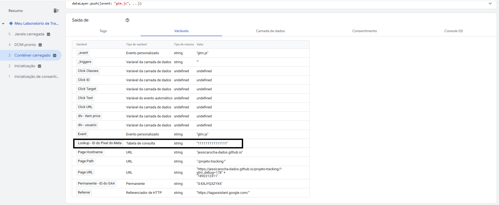

Como evidenciado na captura, a variável leu a rota atual e assumiu instantaneamente o valor mapeado na Linha 1 da nossa regra condicional, pronta para ser injetada em qualquer Tag de marketing que solicite esse ID.

---
# Dia 20: HTML Personalizado, Cookies e Lógica Condicional

Neste marco do laboratório, transacionamos da leitura passiva de dados para a **intervenção ativa no navegador do usuário**. Utilizamos a Tag de HTML Personalizado do GTM não apenas para gravar Cookies, mas para injetar uma inteligência de roteamento de eventos (If/Else) baseada no histórico de navegação.


## Teoria: HTML Personalizado

A Tag de HTML Personalizado permite a execução de JavaScript puro dentro do ecossistema do site, superando as limitações das tags nativas. No mercado avançado de Web Analytics, seus principais casos de uso incluem:

1.  **Modificações de DOM:** Injeção de banners ou pop-ups sem depender do time de TI.
2.  **Integrações via Webhooks/APIs:** Envio de requisições (`fetch()`) para bancos de dados externos.
3.  **Observadores de Mutação (Mutation Observers):** Criação de escutadores para rastrear mensagens de sucesso dinâmicas que não recarregam a página.
4.  **Gerenciamento de Estado (Cookies/Local Storage):** Gravação de dados no navegador para criar memórias de longo prazo sobre o comportamento do usuário.


##  Prática: Script de Identificação de Retenção (Novo vs. Retornante)

Foi desenvolvido no VS Code um script autoexecutável (IIFE) focado em avaliar o status de retenção do usuário na página do projeto.

### Lógica Arquitetural do Script:

1.  **Leitura do Ambiente:** A função `getCookie()` varre o armazenamento do navegador em busca de um cookie específico chamado `status_visitante_lab`.
2.  **Decisão (If/Else):**
    * **Se o Cookie NÃO existir (Cenário A):** O script grava o cookie (com 30 dias de expiração), emite um aviso no Console e envia o evento `usuario_novo_detectado` para a Camada de Dados.
    * **Se o Cookie JÁ existir (Cenário B):** O script reconhece o usuário, emite um aviso de boas-vindas no Console e envia o evento `usuario_retornante_detectado` para a Camada de Dados.

O código-fonte (`cookie_acesso.html`) foi adicionado à raiz do repositório, garantindo versionamento seguro, e posteriormente injetado no GTM através de uma Tag do tipo **HTML Personalizado** com o Acionador de Exibição de Página.


##  Validando a Memória do Navegador

Foi realizado um teste de fluxo completo, do primeiro acesso ao recarregamento da página, para atestar o funcionamento da lógica de if/else e da ponte com a Camada de Dados.

### 1. A Evidência Física da Gravação
Através das ferramentas de desenvolvedor (F12 > Aba *Application*), validamos que o JavaScript do GTM conseguiu furar o bloqueio padrão e gravar fisicamente o nosso arquivo de texto na máquina do usuário.

> **Imagem de Referência: Cookie `status_visitante_lab` alocado com sucesso.**
> 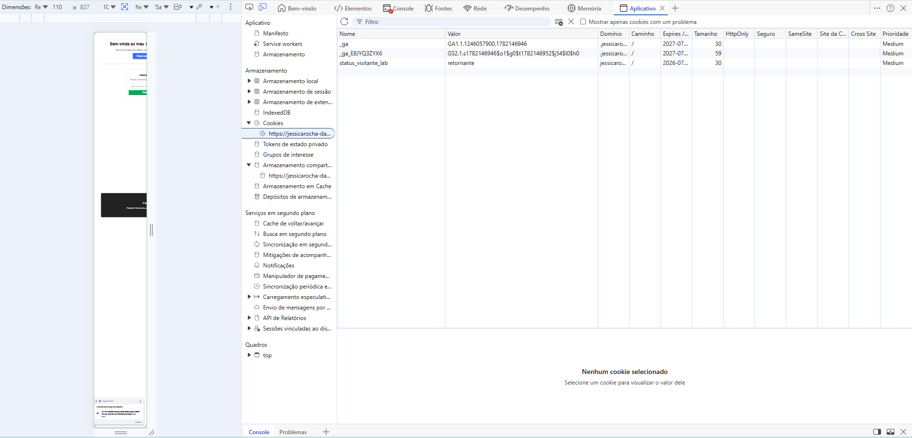

### 2. O Roteamento de Data Layer
Ao abrir o Tag Assistant no primeiro carregamento (Cenário A), constatamos que a estrutura condicional funcionou. O script disparou com sucesso o evento focado na aquisição do usuário.

> **Imagem de Referência: Evento de Novo Usuário na linha do tempo.**
> 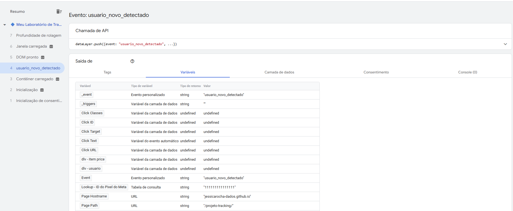

Em seguida, recarregamos a página (F5) para simular um acesso no dia seguinte (Cenário B). A inteligência do script identificou a existência do cookie gravado no passo anterior e ramificou o código para enviar um evento diferente, abrindo portas para configurações avançadas de públicos de Remarketing nas plataformas de Ads.

> **Imagem de Referência: Evento de Retenção na linha do tempo após F5.**
> 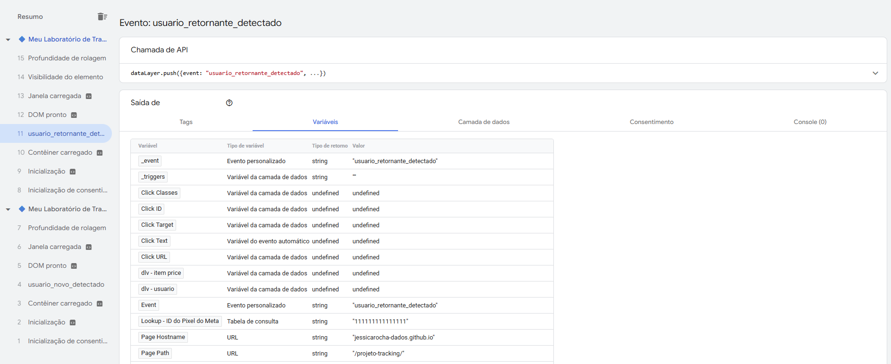

---

# Dia 21: Variáveis de Cookie Primário (1st Party Cookies)

Neste laboratório, completamos o ciclo de persistência de dados. Após configurarmos o navegador para "escrever" dados (Dia 20), implementamos a arquitetura para que o GTM possa "ler" essas informações de forma nativa, contínua e escalável, sem a necessidade de manter funções JavaScript complexas (como `getCookie()`) rodando em loop.


##  Teoria: Variáveis de Cookie Primário

Em Engenharia de Analytics, sempre que possível, devemos substituir códigos customizados por soluções nativas para melhorar a performance da página e a manutenibilidade do contêiner.

A variável de **Cookie Primário (1st Party Cookie)** do GTM serve exatamente para isso. Ela atua como uma "antena" passiva. Ao informarmos o nome exato de um cookie que pertence ao nosso próprio domínio, o GTM automaticamente vasculha o navegador do usuário no instante em que a página carrega e transforma o valor desse cookie em uma variável dinâmica. 

Essa variável pode então ser injetada em qualquer Tag de marketing, permitindo, por exemplo, enviar parâmetros como `user_type: retornante` em todos os eventos do Google Analytics 4.


## Prática: Lendo a Memória do Navegador

Criamos um ouvinte focado em capturar o status de retenção do usuário que configuramos no laboratório anterior.

### Configuração da Variável (`Cookie - Status do Visitante`):
* **Tipo:** Cookie primário (1st Party Cookie)
* **Nome do cookie:** `status_visitante_lab` (Exatamente o mesmo nome declarado no script de gravação).
* **Decodificação URI:** Ativada (Boa prática para evitar quebras em valores com caracteres especiais).

> **Imagem de Referência: Parametrização da Variável no GTM.**
> 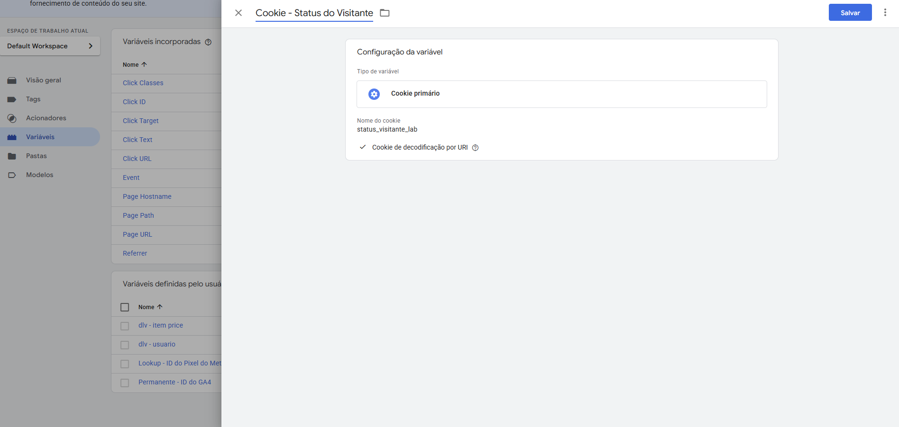


## Debug: Validação de Disparo

Para validar a configuração, realizamos um teste focado na **ordem cronológica** de disparo do Tag Assistant. 

Foi possível observar que em uma primeira visita com o navegador "limpo", a variável retornou `undefined` nos primeiros milissegundos, até que a Tag de HTML Personalizado disparasse e gravasse o arquivo. 

No entanto, ao simularmos um retorno ao site (recarregando a página), a variável provou seu valor ao extrair o dado instantaneamente:

> **Imagem de Referência: GTM lendo o cookie no instante inicial do carregamento.**
> 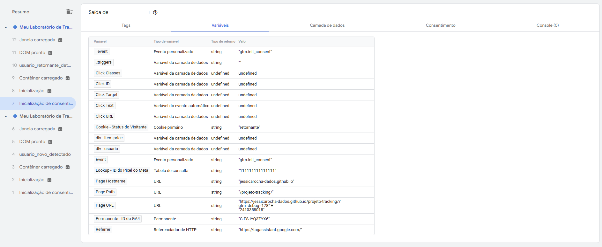

Como evidenciado na captura, no momento da Inicialização de Consentimento (Evento 7 da nova sessão), o GTM já possuía a informação de que o usuário era `"retornante"`, provando que a ponte de leitura entre o site e o contêiner está perfeitamente estabelecida.

---

# Dia 22: Templates Personalizados da Comunidade (Meta Ads)

Neste laboratório, elevamos o nível da nossa arquitetura de rastreamento substituindo a injeção manual de scripts por **Templates da Comunidade**. O foco foi a implementação da Tag Base (PageView) do Meta Ads utilizando o modelo homologado da **Stape**, uma das maiores referências em infraestrutura de rastreamento avançado.


## Teoria: A Galeria de Templates

A Galeria de Templates do GTM funciona como um repositório colaborativo seguro, onde desenvolvedores parceiros disponibilizam modelos prontos de integração. 

As principais vantagens de utilizar templates ao invés da Tag de HTML Personalizado incluem:

* **Segurança:** O código é executado em um ambiente encapsulado (sandbox) com permissões restritas pelo próprio Google.
* **Manutenibilidade:** Interfaces limpas substituem blocos de código extensos e propensos a erros de digitação.
* **Escalabilidade:** Atualizações da API das plataformas (como o Meta) são resolvidas com um simples clique para atualizar o template na galeria, sem necessidade de reescrever funções.


##  Prática: Implementação do Facebook Pixel (by Stape)

Utilizamos o template "Facebook Pixel" desenvolvido pela equipe da Stape.io para configurar a Tag principal de visualização de página.

### Configuração Arquitetural:
* **Tag Type:** Facebook Pixel by Stape.
* **Pixel ID:** Utilizamos a nossa variável inteligente `{{Lookup - ID do Pixel do Meta}}` para garantir que o ID mude dinamicamente caso seja necessário criar lógicas de múltiplos ambientes no futuro.
* **Event Name:** `PageView` (Evento padrão responsável por alimentar as métricas base do Gerenciador de Anúncios).
* **Acionador:** `All Pages` (Garantindo a cobertura total do site).

> **Imagem de Referência: Configuração da Tag com variável de Lookup e Evento PageView.**
> 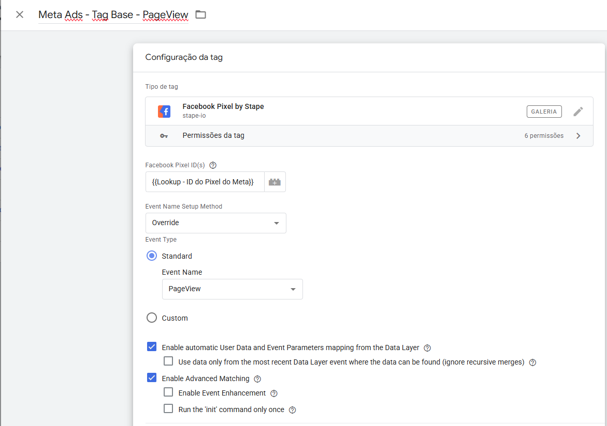

> **Imagem de Referência: Acionador Global para a Tag Base.**
> 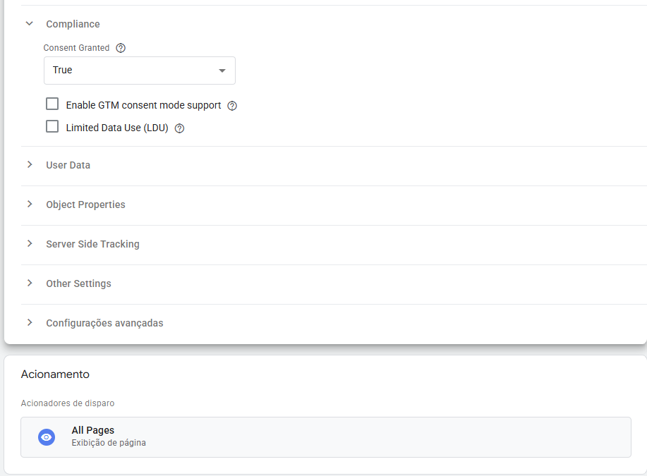

---

## Debug: Validação de Disparo (QA)

Como manda a boa prática da Engenharia de Analytics, nenhuma tag vai para produção sem a validação no ambiente de Debug. 

Ao executar o Tag Assistant, confirmamos que a arquitetura funcionou perfeitamente: no momento em que o evento `Container Loaded` (Contêiner Carregado) ocorreu, a nossa Tag Base do Meta Ads foi disparada com sucesso, injetando o Pixel na página de forma assíncrona e segura através do template da Stape.

> **Imagem de Referência: Tag Base do Meta Ads disparada no evento Container Loaded.**
> 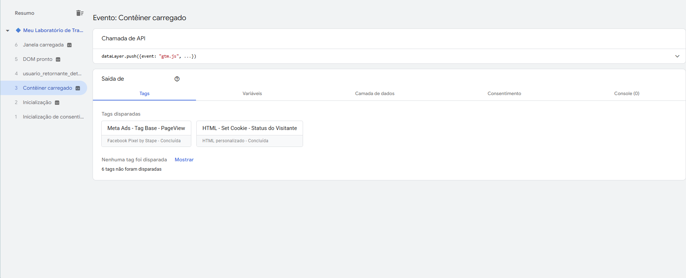

---
# Dia 23: Variáveis de JavaScript Personalizado (Custom JS)

Neste laboratório, exploramos o recurso mais avançado de manipulação de dados dentro do Google Tag Manager: a variável de **JavaScript Personalizado (Custom JS)**. Este recurso atua como uma "faca suíça", permitindo inspecionar o HTML da página, extrair informações e tratá-las antes do envio para as plataformas de mídia.

---

##  Teoria: O Poder do Custom JS

Enquanto os Templates da Comunidade resolvem integrações padronizadas, o Custom JS é utilizado quando precisamos de regras de negócio específicas ou quando os dados nativos do site precisam de limpeza (Data Cleansing).

A regra fundamental de uma Variável Custom JS no GTM é a sua sintaxe obrigatória: ela **deve** ser estruturada como uma função anônima que obrigatoriamente contém a instrução `return` para devolver um valor ao GTM.

\`\`\`javascript
function() {
  // Lógica de captura ou transformação
  return valor_tratado;
}
\`\`\`

O tratamento de dados (como forçar textos para minúsculas) é essencial para manter a integridade dos relatórios em plataformas case-sensitive, como o Google Analytics 4, evitando a fragmentação de métricas por conta de diferenças de digitação.


##  Prática: Web Scraping e Tratamento de Strings

Criamos um script focado em varrer o DOM (Document Object Model), localizar o título principal da página (`<h1>`), extrair o seu conteúdo de texto e forçá-lo para caracteres minúsculos utilizando o método nativo `.toLowerCase()`.
**Configuração da Variável (`JS - Titulo H1 Minusculo`):**

Adicionamos travas de segurança (`if`) para garantir que o script não retorne erros de console caso a página não possua a tag alvo.

> **Imagem de Referência: Estruturação do Script na Variável.**
> 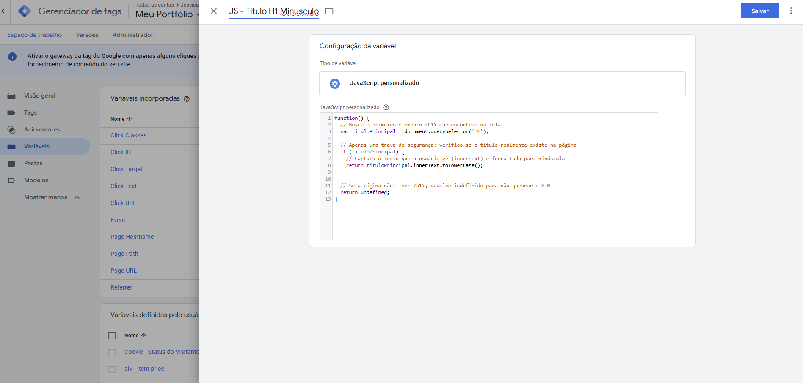

---

##  Laboratório de Debug: Validação no DOM Ready

O teste de disparo exigiu atenção à cronologia de carregamento do navegador.

Como o nosso script depende de ler uma tag HTML física (`<h1>`), a variável retornaria indefinida se lida no primeiro milissegundo (`Consent Initialization`). O momento correto para a coleta desse tipo de dado é no evento **DOM Ready** (DOM Pronto), momento em que a estrutura visual da página já foi desenhada pelo navegador.

> **Imagem de Referência: GTM capturando e transformando o texto no evento DOM Ready.**
> 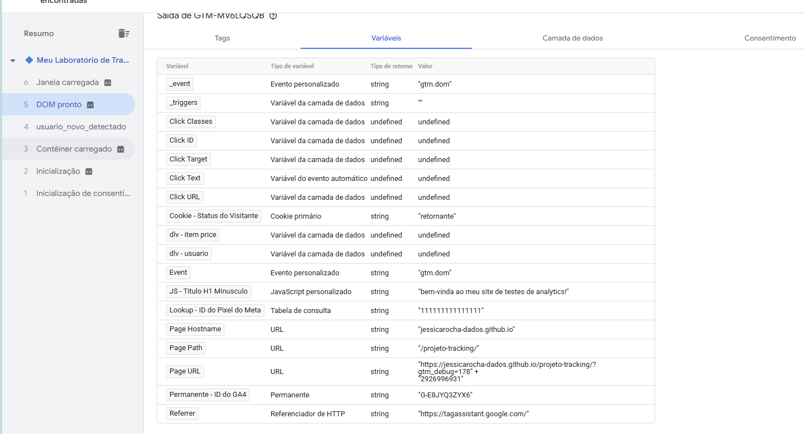

Como demonstrado no painel de Debug, a variável interceptou o título e o devolveu perfeitamente formatado como `"bem-vinda ao meu site de testes de analytics!"`, pronto para ser acoplado a qualquer Tag de rastreamento.
