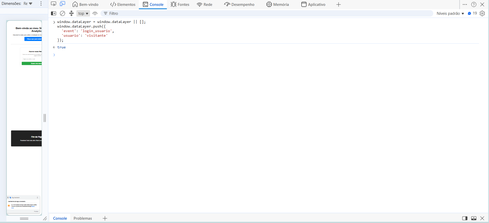
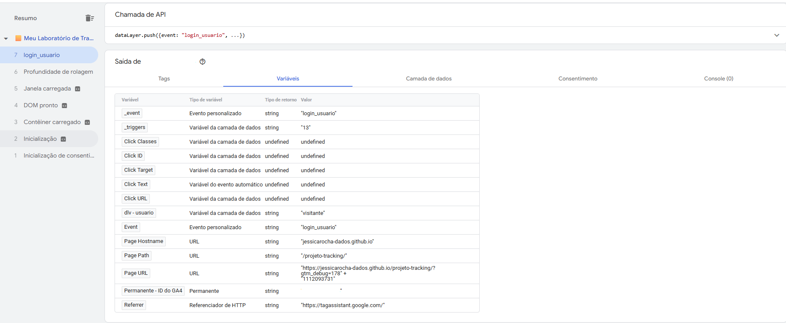
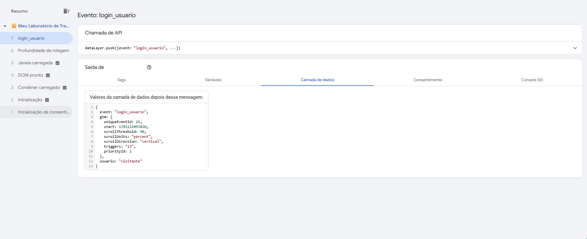
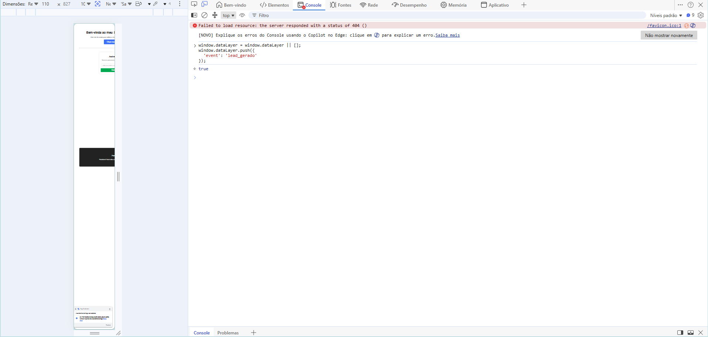
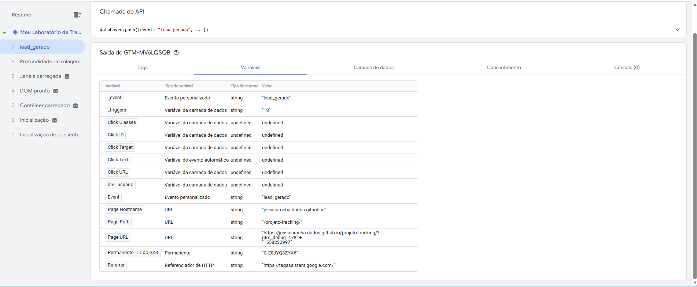
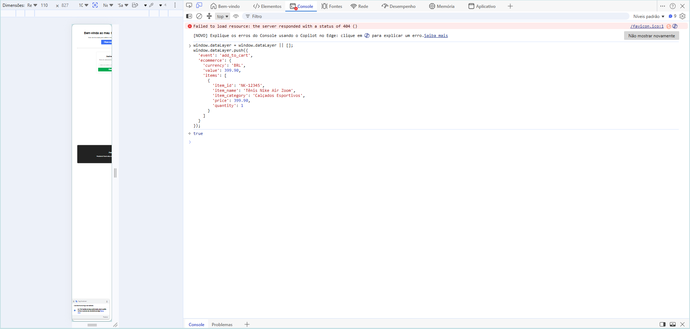
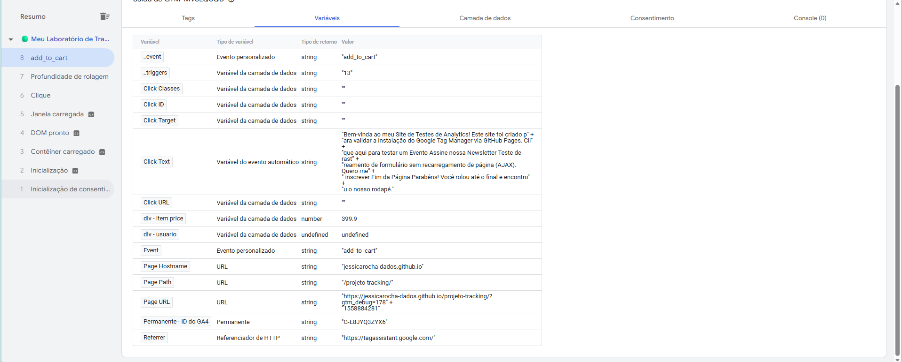
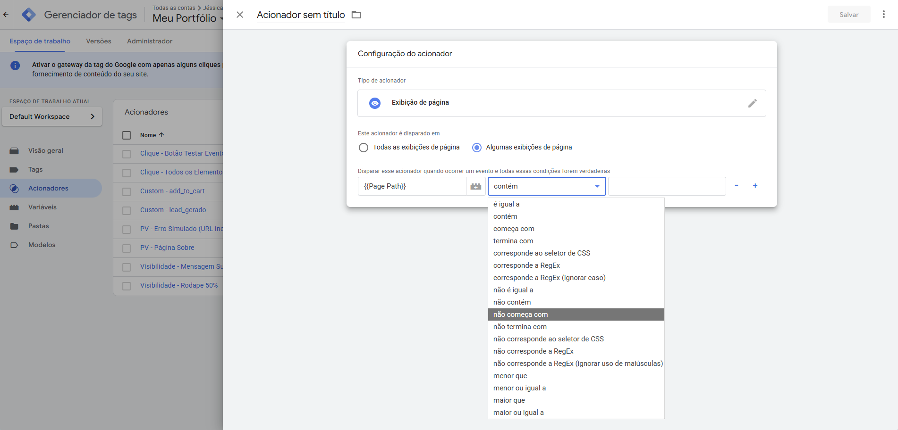
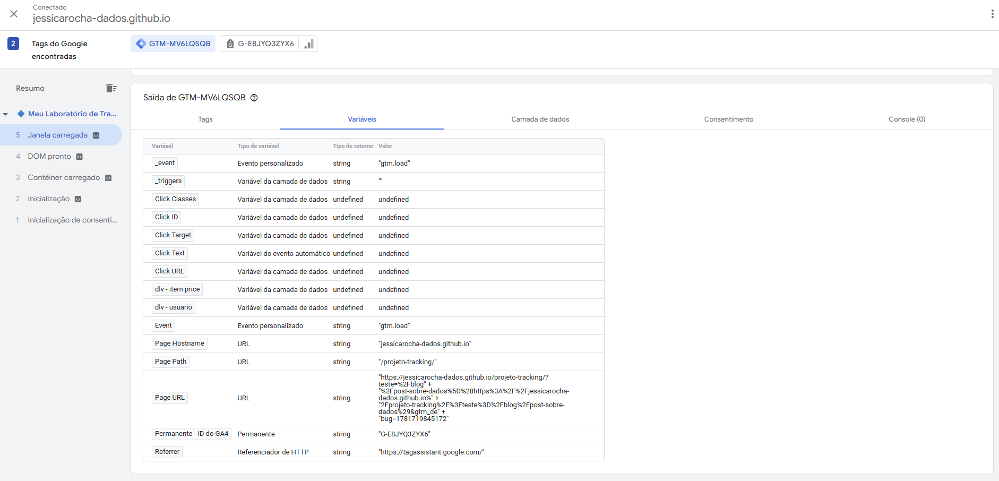

##  Módulo 2: Tracking e Lógica Avançada
**Objetivo:** Parar de depender de CSS (raspagem de tela), utilizar o Data Layer como fonte da verdade e aplicar lógica de programação no Google Tag Manager.


###  Dia 15: O Conceito de Data Layer (Camada de Dados)

####  Visão Geral da Teoria
O Data Layer (Camada de Dados) é um objeto JavaScript do tipo *Array* (uma lista) que armazena informações estruturadas. Ele funciona como uma ponte de comunicação blindada entre o back-end/front-end do site e o Google Tag Manager. 

Ao invés do GTM tentar "adivinhar" dados lendo textos na tela (o que quebra se o layout mudar), a equipe de engenharia do site injeta os dados reais diretamente nesta camada invisível.

**A Regra de Ouro da Injeção de Dados:**
* **Declaração (`=`):** Sobrescreve e apaga o histórico do GTM. Deve ser evitado após o carregamento inicial da página.
* **O Método `.push()`:** O padrão ouro. Adiciona novas informações ao final da lista (array) sem destruir os dados anteriores, acionando o GTM em tempo real a cada novo evento.


#### Laboratório Prático: Explorando a "Matrix"
A missão consistiu em acessar um e-commerce de grande porte (Nike) e inspecionar a arquitetura de dados deles diretamente pelo Console do navegador (DevTools).

**Passo 1: Destravando a Segurança do Navegador (Self-XSS)**
Ao tentar interagir com o console pela primeira vez, o Chrome ativa uma proteção contra *Self-XSS*. Foi necessário executar o comando `permitir colagem` para habilitar a execução de scripts no ambiente, um procedimento de segurança padrão para desenvolvedores e analistas.


**Passo 2: Inspeção do Array `dataLayer`**
Após liberar o console, executamos a chamada `dataLayer` para revelar os pacotes de dados injetados pela engenharia da Nike no carregamento da página. 

Ao expandir o Objeto `0`, pudemos ler chaves riquíssimas em detalhes, sem nenhuma dependência visual da página:
* `event: "pageView"` (aviso claro da ação).
* `platform: "web_mobile"` (identificação exata do ambiente).
* `user: {id: null, email: undefined...}` (comprovação do estado de navegação anônima/deslogada do usuário).


---

# Dia 16: Data Layer Variable (Variáveis de Camada de Dados)

Neste dia, focamos em um dos conceitos mais importantes do web analytics e governança de dados: extrair informações seguras do código do site para o Google Tag Manager usando a **Camada de Dados (Data Layer)**.

## Teoria: O Padrão do Rastreamento

Rastrear interações baseadas em elementos visuais do HTML (como classes CSS ou IDs) é uma prática frágil em ambientes de produção corporativos, pois qualquer mudança de layout ou design feita pela equipe de desenvolvimento pode quebrar a coleta de dados silenciosamente.

O **Data Layer** resolve isso. Ele é um objeto virtual JavaScript que roda de forma independente da interface gráfica. Ele organiza os dados vitais do negócio em um formato estruturado de dicionário (chave-valor), permitindo que o GTM capture essas informações com segurança, previsibilidade e estabilidade.


## Prática: Simulação e Captura de Dados

O objetivo prático do dia foi simular o comportamento de um sistema enviando uma informação dinâmica para o site e configurar o GTM para "pegar" esse dado através de uma **Variável da Camada de Dados**.


### Injeção de Dados no Navegador

Para simular o sistema, abrimos as Ferramentas de Desenvolvedor do navegador (F12) na aba **Console** e executamos o comando de `push` abaixo para avisar ao Data Layer que um usuário do tipo `"visitante"` havia logado:

```javascript
window.dataLayer = window.dataLayer || [];
window.dataLayer.push({
  'event': 'login_usuario',
  'usuario': 'visitante'
});
```

O retorno `true` no console confirmou que o objeto foi inserido com sucesso na camada de dados.




### Criação da Regra de Captura no GTM

O dado foi enviado ao site, mas precisávamos ensinar o GTM a isolar e ler a chave específica. Realizamos a seguinte configuração:

- **Menu de Navegação:** Variáveis > Nova Variável Definida pelo Usuário
- **Tipo de Variável:** Variável da camada de dados *(Data Layer Variable)*
- **Nome da variável da camada de dados:** `usuario` *(exatamente como escrito no JavaScript, respeitando letras minúsculas)*
- **Nomeação da Variável (organização interna):** `dlv - usuario`


### Validação no Tag Assistant (Modo Debug)

Com a variável criada e o ambiente de Preview atualizado, disparamos o evento novamente e validamos o sucesso da operação analisando o evento `login_usuario`.

#### Verificação da Variável Dinâmica

Na aba **Variáveis**, confirmamos que a variável `dlv - usuario` conseguiu encontrar a chave e capturou com sucesso o valor dinâmico `"visitante"`.




#### Verificação da Estrutura Crua (Data Layer)

Na aba **Camada de dados**, auditamos os bastidores. Foi possível visualizar exatamente o pacote de dados estruturados recebido pelo GTM, confirmando que a chave `usuario: "visitante"` estava limpa e disponível.




## Conclusão e Aplicação

Conseguimos extrair a informação com **100% de precisão**. A grande vantagem dessa arquitetura é a **automação**: basta inserir a variável `{{dlv - usuario}}` em Tags do Google Analytics 4 ou Meta Ads.

Se futuramente o sistema enviar valores diferentes — como `"admin"` ou `"cliente_premium"` — o GTM fará a captura dinamicamente, **sem necessidade de intervenção ou manutenção manual** por parte do analista.

| Situação | Comportamento |
|---|---|
| Sistema envia `usuario: "visitante"` | GTM captura → `{{dlv - usuario}}` = `"visitante"` |
| Sistema envia `usuario: "admin"` | GTM captura → `{{dlv - usuario}}` = `"admin"` |
| Sistema envia `usuario: "cliente_premium"` | GTM captura → `{{dlv - usuario}}` = `"cliente_premium"` |

> **Regra:** o nome da chave no `dataLayer.push` do código (`usuario`) deve ser **idêntico** ao nome configurado no GTM. Qualquer divergência retorna `undefined`.
>
> 
---

# Dia 17: Eventos Personalizados (Custom Events) & Variáveis Aninhadas (Dot Notation)

Neste dia, elevamos o nível do laboratório combinando o conceito de acionadores baseados em respostas do sistema com a extração de dados complexos e aninhados usando a **Notação de Ponto (Dot Notation)**.

---

## Teoria: Acionadores de Sistema vs. Interações de Interface

Confiar apenas em cliques de botões ou IDs de elementos HTML para mensurar conversões é uma prática instável. Se um usuário clicar em um botão de formulário que contém erros de preenchimento, a conversão é disparada incorretamente.

Os **Eventos Personalizados (Custom Events)** corrigem essa falha, pois escutam o back-end do site. O GTM só reage quando o sistema valida a ação com sucesso e envia um sinal definitivo via Camada de Dados utilizando a chave reservada `'event'`.

Além disso, em cenários complexos como o e-commerce, os dados não vêm soltos na superfície. Eles chegam estruturados em objetos e arrays (listas). Para acessá-los, mapeamos o caminho exato substituindo os colchetes por pontos, navegando pela hierarquia até o dado final.

---

##  Prática — Parte 1: Evento Personalizado (`lead_gerado`)

Simulamos o comportamento de um formulário que, após o envio bem-sucedido, notifica o GTM.

### Passo 1: Injeção do Evento no Console

Disparamos o evento de sistema utilizando o método `push`:

```javascript
window.dataLayer = window.dataLayer || [];
window.dataLayer.push({
  'event': 'lead_gerado'
});
```



---

### Passo 2: Validação do Gatilho no Tag Assistant

Configuramos um **Acionador** do tipo **Evento Personalizado** para ouvir o nome exato `lead_gerado`. No modo de depuração, o evento foi capturado na linha do tempo e a variável nativa `_event` registrou o valor `"lead_gerado"` corretamente.



---

##  Prática — Parte 2: Extração de Dados Aninhados de E-commerce

Aprofundamos o estudo simulando o evento de adição ao carrinho (`add_to_cart`), onde o preço do produto está encapsulado dentro de um objeto de e-commerce e uma lista de itens.

### Passo 1: Injeção do Payload de E-commerce

Injetamos uma estrutura de dados padrão GA4 contendo chaves aninhadas:

```javascript
window.dataLayer = window.dataLayer || [];
window.dataLayer.push({
  'event': 'add_to_cart',
  'ecommerce': {
    'currency': 'BRL',
    'value': 399.90,
    'items': [
      {
        'item_id': 'NK-12345',
        'item_name': 'Tênis Nike Air Zoom',
        'item_category': 'Calçados Esportivos',
        'price': 399.90,
        'quantity': 1
      }
    ]
  }
});
```



---

### Passo 2: Configuração da Variável com Notação de Ponto (Dot Notation)

Para ler o preço contido no primeiro item do array, criamos uma **Variável de Camada de Dados** mapeando o caminho lógico:

| Segmento         | Significado                                      |
|------------------|--------------------------------------------------|
| `ecommerce`      | Objeto raiz do payload                           |
| `items`          | Array de produtos                                |
| `0`              | Primeiro item do array (índice começa em zero)   |
| `price`          | Chave com o valor numérico do preço              |

**Nome da variável no GTM:** `dlv - item price`

---

### Passo 3: Validação do Valor Dinâmico

Após atualizar o ambiente de Preview e reexecutar o push, inspecionamos o evento `add_to_cart`. Na aba **Variáveis**, confirmamos que a variável `dlv - item price` isolou com sucesso o valor numérico `399.9`.



---

##  Conclusão e Impacto de Negócio

A união do **Acionador Customizado** com a **Variável Aninhada** cria a fundação para o rastreamento avançado de conversões.

Agora o GTM:

- **Sabe o momento exato** em que a ação de e-commerce ocorre (`add_to_cart`)
- **Possui o valor financeiro preciso** (`399.9`) pronto para ser injetado em tags de conversão

Isso permite:

- Cálculo exato do **ROAS** (Retorno sobre Investimento em Anúncios)
- Alimentação dos algoritmos de **lances automáticos** do Google Ads e Meta Ads com dados de alta fidelidade
- Rastreamento confiável baseado em **resposta do sistema**, e não em interação de interface

---
# Dia 18: Expressões Regulares (RegEx) em Acionadores

Neste dia, introduzimos o uso de Expressões Regulares (RegEx) para criar regras dinâmicas e inteligentes de disparo no Google Tag Manager, superando a limitação de URLs estáticas.


## Teoria:

Em arquiteturas reais de web analytics, raramente lidamos com URLs perfeitamente exatas. Lidamos frequentemente com parâmetros de busca, IDs dinâmicos de produtos e variações de rotas de campanhas. O RegEx atua como um "curinga" de rastreamento, permitindo que o GTM identifique padrões estruturais em vez de textos engessados.

Os três símbolos fundamentais aplicados neste laboratório foram:
* **`^` (Circunflexo):** Trava a correspondência no **início** do texto (Começa com).
* **`.` (Ponto final):** Representa **qualquer caractere** (uma letra, um número, um hífen, etc.).
* **`*` (Asterisco):** Indica que a regra anterior pode se repetir **zero ou mais vezes**.

**A Fórmula:** `^/projeto-tracking/blog/.*`
*Tradução do GTM:* "O gatilho deve disparar se a URL começar obrigatoriamente com `/projeto-tracking/blog/` e, depois disso, aceitar absolutamente qualquer conjunto de caracteres."


## Prática: 

Criamos um acionador do tipo **Exibição de página (Page View)** configurado para reagir apenas quando a URL se encaixa no padrão estabelecido pela expressão.

### Configuração no GTM:
1. **Tipo de Acionador:** Exibição de página (Page View).
2. **Condição:** Algumas exibições de página.
3. **Regra:** `{{Page Path}}` -> `corresponde a RegEx (ignorar caso)` -> `^/projeto-tracking/blog/.*`

> **Imagem de Referência:**
> 


## Laboratório de Debug: Erro 404 e URL Encoding

Durante os testes práticos de simulação da pasta (`/blog/`), esbarramos em dois conceitos avançados de infraestrutura que todo Analytics Engineer precisa dominar:

1. **O Erro 404:** Como a pasta `/blog/` não existia fisicamente no servidor do GitHub Pages, fomos redirecionados para a página de erro 404 padrão do GitHub. Por ser uma página automática do servidor, ela **não possui o snippet do GTM instalado**. Resultado: O Tag Assistant perdeu a conexão imediatamente. A lição clara foi que o GTM só consegue ler e disparar dados em páginas onde seu código-fonte base está fisicamente injetado.
2. **URL Encoding (Codificação de URL):** Ao tentarmos contornar o Erro 404 adicionando um parâmetro falso de busca na URL principal (ex: `?teste=/blog/`), observamos pela variável `Page URL` que o GTM leu o valor como `%2Fblog%2F`. Isso acontece porque navegadores codificam caracteres especiais (como a barra `/`, que vira `%2F`) quando inseridos como parâmetros. Esse detalhe provou que expressões regulares literais podem falhar se não considerarmos a transformação nativa dos dados no navegador.

> **Imagem de Referência: A captura do URL Encoding na variável Page URL**
> 

## Conclusão e Impacto de Negócio

Dominar Expressões Regulares liberta a arquitetura de dados da dependência de URLs exatas. A capacidade de usar padrões matemáticos de texto garante que as configurações de tagueamento permaneçam perfeitamente ativas e escaláveis, mesmo quando o site cresce, URLs mudam de formato ou novas campanhas de marketing anexam dezenas de parâmetros dinâmicos (UTMs) aos links.
