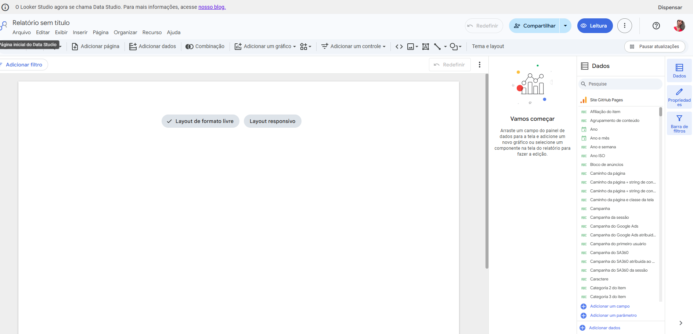
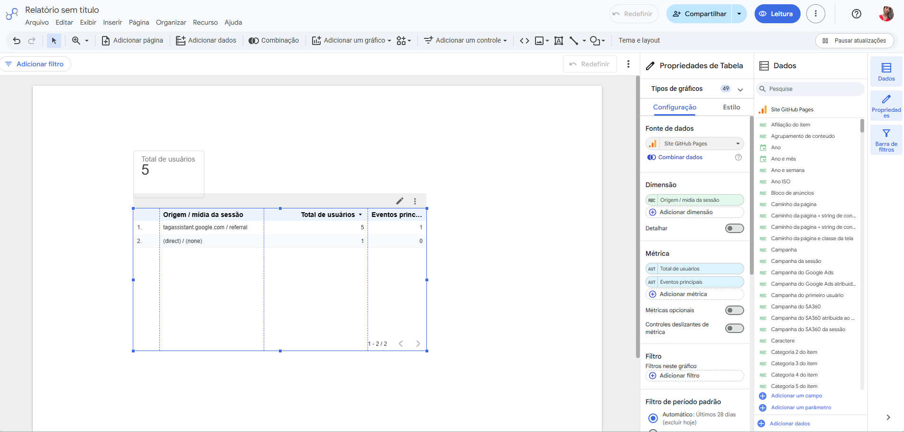
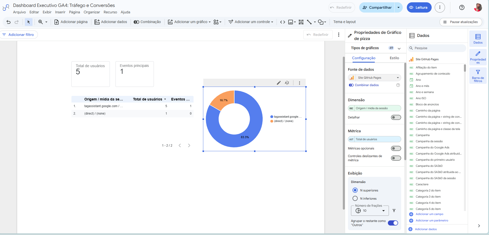
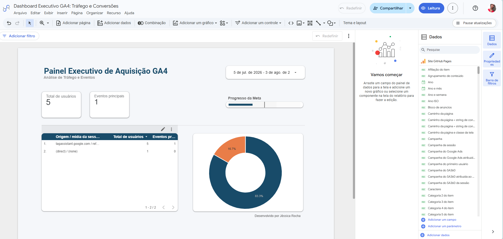

#  Projeto Final (Módulo 3): Dashboard Executivo no Looker Studio (Dias 35 a 37)

##  Visão Geral
Este projeto final consolida a nossa jornada de engenharia de dados do Módulo 3. O objetivo é transformar os dados brutos de navegação e as conversões mapeadas via Data Layer em inteligência de negócios através de um painel executivo e visual no Looker Studio.

---

##  Dia 35: Conexão e Infraestrutura de Dados
O foco inicial foi garantir a integridade da fundação técnica estabelecendo a conexão nativa entre a propriedade do GA4 e o Looker Studio. 

**Teoria Aplicada:**
Estudamos o impacto das **Cotas de API (API Quotas)** do GA4. Em painéis com alto volume de acessos simultâneos, o limite de requisições pode ser excedido, quebrando os gráficos. Para contornar isso em ambientes corporativos, documentamos a importância de utilizar a extração de dados estática (Extract Data) ou a exportação nativa para o BigQuery (via SQL) para sustentar a operação.

**Evidência Visual:**

---

##  Dia 36: Estruturação e Cruzamento Analítico
Com a base de dados conectada e segura, iniciamos a construção do esqueleto do dashboard aplicando a "Regra dos 5 Segundos" de design hierárquico (leitura em Z). O foco foi responder à pergunta central de negócios: *"Quais canais de aquisição trazem o tráfego mais qualificado?"*

**Prática Executada:**
* **Scorecards (Visão Geral):** Inserção de cartões no topo da tela para leitura rápida e absoluta do `Total de usuários` e dos `Eventos principais` (nomenclatura atualizada do GA4 para conversões).
* **Tabela Principal:** Cruzamento estratégico da dimensão de `Origem / mídia da sessão` com as métricas de volume e conversão para auditar o tráfego.
* **Proporção Visual:** Inserção de um gráfico de rosca para ilustrar rapidamente o peso e a dominância de cada canal de tráfego.

**Evidências Visuais:**

---

##  Dia 37: Reestruturação UI/UX e Consolidação do Painel Executivo (GA4)

###  Introdução e Contexto do Desafio
O estado inicial deste projeto consistia em uma extração bruta de dados diretamente do Google Analytics 4 (GA4), resultando em visualizações estáticas e de difícil interpretação. Tínhamos em mãos a fundação técnica — os dados estavam sendo capturados corretamente via Google Tag Assistant —, mas faltava a camada de **Data Storytelling**. 

O desafio desta etapa final foi realizar uma **reestruturação arquitetônica e visual completa** do dashboard. O objetivo era transformar uma tela de conferência técnica em um verdadeiro Produto de Dados: um Painel Executivo autônomo, capaz de entregar respostas rápidas e claras para tomadores de decisão, sem exigir conhecimento prévio da ferramenta GA4.

###  A Jornada de Execução e Refinamento
Para elevar o nível do painel, apliquei conceitos avançados de *Business Intelligence* e design de interface (UX/UI):
* **Arquitetura da Informação:** Separação clara entre controles globais (filtros de data) e os dados granulares, utilizando contraste de fundo (`#F5F7FA`) e componentes elevados (efeito de sombra e bordas arredondadas).
* **Redução da Carga Cognitiva:** Maximização do *Data-Ink Ratio* (proporção tinta-dado) ao remover legendas redundantes e focar em tipografia hierárquica.
* **Contextualização de Metas:** Inserção de uma barra de progresso estratégica ao lado das conversões, transformando a métrica de "Eventos Principais" em um KPI de performance.
* **Padronização Visual:** Adoção de uma paleta de cores corporativa, utilizando tons de Azul Petróleo (`#1A4C6B`) para volumes absolutos e Laranja Queimado (`#E27C3E`) para destaques e proporções.

###  Geração de Valor ao Negócio 
Neste cenário de validação de infraestrutura, este dashboard atua como a homologação final de uma esteira de dados, entregando alto valor agregado ao negócio:
* **Validação do Pipeline End-to-End:** A visualização exata do tráfego de teste (`tagassistant.google.com`) comprova a integridade da arquitetura de rastreamento, garantindo que os dados fluem perfeitamente desde o disparo da tag no site até o Looker Studio.
* **Prontidão para Escala (MVP):** A estrutura construída já está preparada para absorver volumes reais de acessos. Os filtros dinâmicos e a disposição visual não precisarão ser refeitos quando a operação escalar.
* **Tradução Executiva:** A interface complexa do GA4 foi abstraída. Gestores agora possuem uma visão clara e direta e podem acompanhar a saúde da aquisição em 
segundos.

### Principais Aprendizados e Conclusões
A execução deste trabalho consolidou habilidades fundamentais não apenas em ferramentas, mas em visão analítica:
1. **Dados sem contexto são apenas números:** Um dashboard eficiente não apenas mostra o "quanto", mas o "quão perto" estamos do objetivo .
2. **Design é funcionalidade:** A escolha de cores, sombras e alinhamentos não é uma questão estética, mas sim uma ferramenta para guiar os olhos do usuário para o que realmente importa na tomada de decisão.
3. **Transparência em Qualidade de Dados (QA):** Manter os dados de teste visíveis e íntegros foi essencial para provar a confiabilidade do processo de engenharia de analytics realizado nas etapas anteriores.

**Evidência Visual (Dashboard Final):**

