#  Módulo 3: E-commerce, Consentimento e Visualização

**Objetivo:** Estruturar dados transacionais de alto valor (Padrão GA4 E-commerce) e conectar com painéis de visualização estratégica.

---

##  Dia 29: Injeção do Payload Standard E-commerce (`view_item`)

A transição de métricas de engajamento (leads) para métricas de receita (vendas) exige a adoção rigorosa do **Esquema Padrão de E-commerce do Google Analytics 4**. 

###  O que foi feito nesta etapa?
Para iniciar a arquitetura de tracking de e-commerce, atuei simulando o comportamento do código fonte do site (Front-end). 
Realizei a **injeção manual de um payload via console do navegador** para disparar o evento `view_item` (visualização de produto). O objetivo técnico foi auditar se o contêiner do GTM estava apto a interceptar e estruturar cargas complexas de dados transacionais antes de configurarmos o roteamento para o Analytics.

###  A Arquitetura do Dado Transacional
O código injetado seguiu estritamente as regras de taxonomia do Google:
* **Objeto Raiz:** A chave `ecommerce` encapsulando toda a transação (indispensável para relatórios de monetização).
* **Métricas Financeiras:** Parâmetros de `currency` (moeda) e `value` (valor total).
* **Estrutura de Itens (Array):** A lista `items` mapeando as propriedades comerciais exatas do produto (ID/SKU, Nome, Categoria, Marca, Preço e Quantidade).

A auditoria no ambiente de depuração (Debug Mode) comprovou o sucesso da operação, com o GTM formatando perfeitamente as variáveis no Data Layer.

### 📸 Evidências Visuais: Rastreabilidade de Ponta a Ponta

A documentação abaixo atesta o ciclo completo do dado: do disparo na interface (origem) à captura na Camada de Dados (destino).

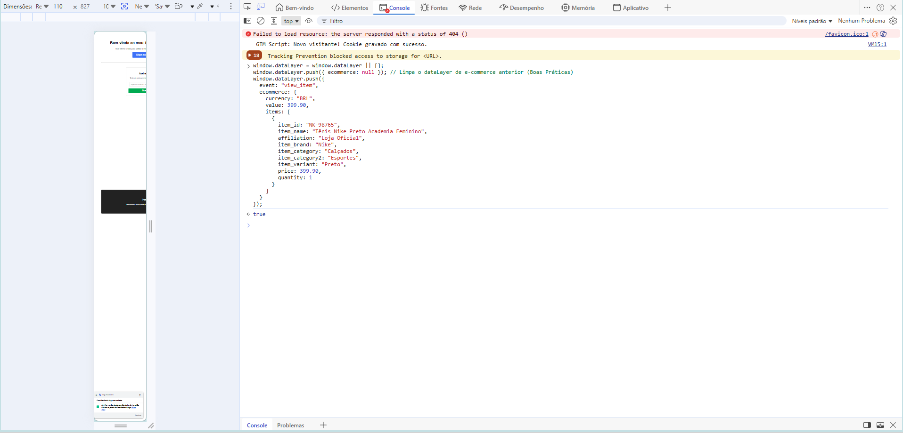
*Imagem 1: Ação (Front-end) - Injeção do payload transacional simulando o comportamento do site.*

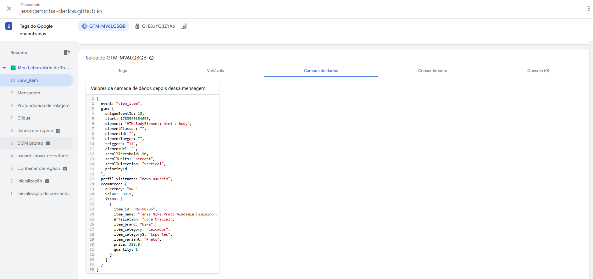
*Imagem 2: Reação (GTM) - Tag Assistant confirmando a captura e estruturação exata do objeto ecommerce e do array de produtos.*

---

## Dia 30: O Funil de Conversão e Evento de Compra (`purchase`)

Enquanto eventos de topo de funil sinalizam intenção, o evento `purchase` é o marco definitivo de conversão em qualquer ecossistema de e-commerce. É ele o responsável por alimentar as métricas de Receita, ROI e ROAS nas plataformas de análise de dados e painéis de mídia paga.

###  O Raciocínio Analítico e Desafio Técnico
O objetivo desta etapa foi estruturar a arquitetura de captação transacional no Google Tag Manager (GTM). O desafio técnico consistia em garantir que o GTM interceptasse as variáveis complexas de e-commerce (como ID do pedido, valor total, moeda e o array do catálogo de produtos) no momento exato da validação da compra, repassando-as de forma íntegra para o Google Analytics 4.

### Arquitetura da Solução: Automação via Data Layer
Para criar um fluxo escalável e alinhado às melhores práticas de engenharia de tracking, optei por não mapear variáveis transacionais uma a uma. Em vez disso, utilizei a funcionalidade nativa do GA4 de **leitura direta do Data Layer**.

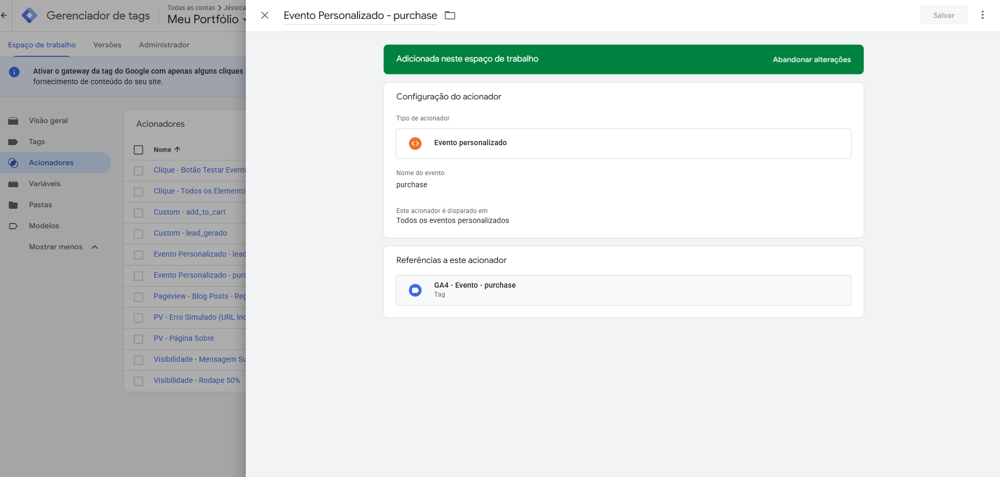
*Imagem 1: A Causa - Criação do Acionador (Gatilho) do tipo Evento Personalizado, configurado estritamente para interceptar a chave `purchase` injetada pelo Front-end na conclusão do checkout.*

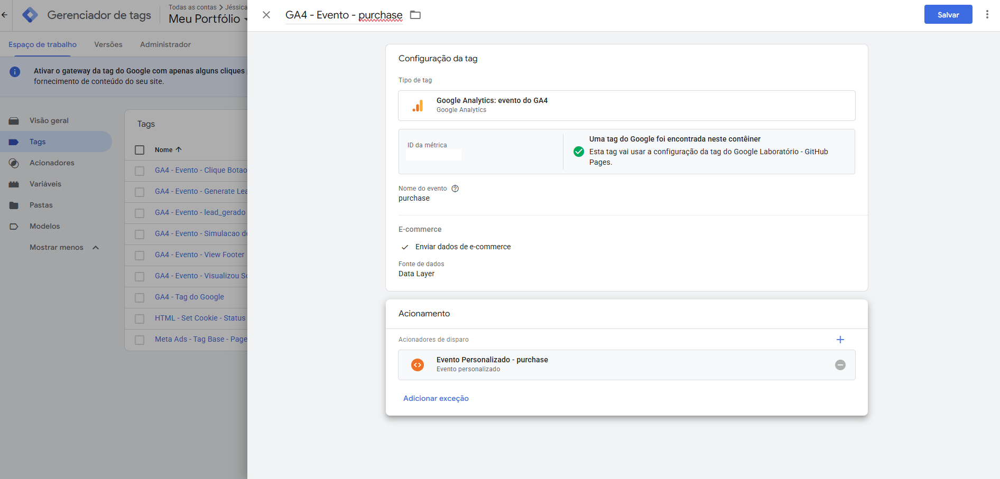
*Imagem 2: A Configuração - Tag de Evento do GA4 vinculada ao acionador. Destaque para a configuração avançada ativando a leitura nativa de E-commerce, permitindo que a tag extraia o objeto transacional inteiro direto da fonte de dados.*

###  Garantia de Qualidade (QA) e Homologação
Nunca assumimos que uma tag funciona sem a devida prova técnica. Para certificar a integridade do fluxo de dados, simulei o comportamento do site injetando um payload transacional completo via console do navegador. A auditoria no modo de depuração (Tag Assistant) comprovou o sucesso da arquitetura.

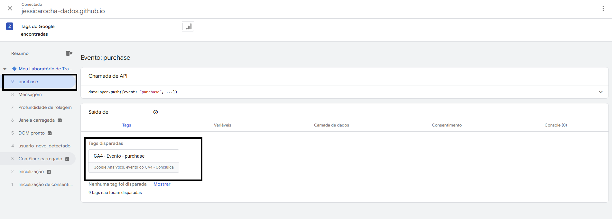
*Imagem 3: O Efeito - Teste em ambiente de homologação comprovando a interceptação do evento `purchase` (passo 9) e o acionamento bem-sucedido da Tag de conversão correspondente.*

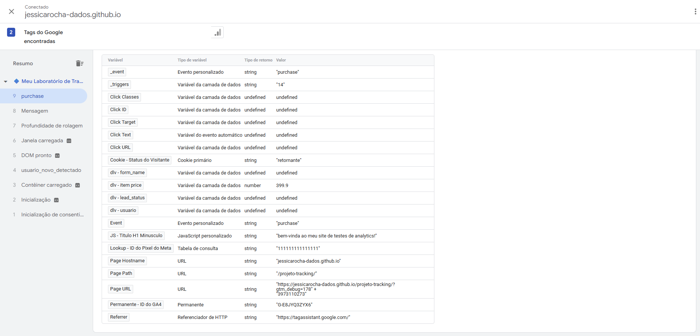
*Imagem 4: O Contexto - Inspeção da aba de variáveis em tempo de execução, atestando que o ecossistema do GTM mapeou com perfeição os parâmetros no momento exato do disparo.*

---

##  Dia 31: Enriquecimento de Dados com Dimensões Personalizadas

Para elevar a maturidade da nossa coleta de dados além das métricas padrão (pageviews, cliques), implementamos o rastreamento de **Dimensões Personalizadas**. O objetivo estratégico desta etapa foi injetar variáveis de contexto de negócio (ex: status da assinatura do usuário) diretamente na camada de dados (Data Layer), permitindo que o Google Analytics 4 cruze o comportamento de navegação com o perfil do cliente.

###  Arquitetura da Solução e Raciocínio Técnico

O fluxo de dados foi desenhado em três camadas: captação no front-end, roteamento no middleware (GTM) e armazenamento no destino final (GA4).

#### 1. Roteamento: Mapeando o Front-end no GTM
**O Raciocínio:** O dado de negócio (o plano do cliente) nasce no código do site via `dataLayer.push`. No entanto, o GTM é "cego" a esses dados até que criemos um receptor específico para escutá-los. 
**A Execução:** Criamos uma Variável da Camada de Dados configurada para ler a chave exata inserida pelos desenvolvedores (`plano_do_cliente`), traduzindo-a para uma variável interna utilizável pelo GTM.

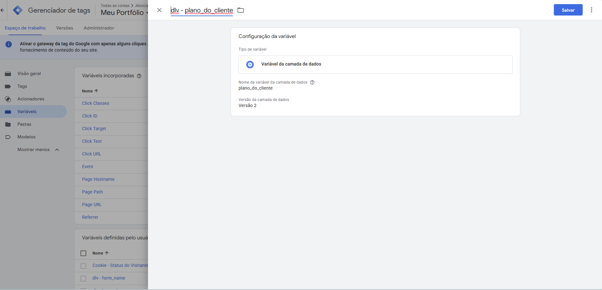
*Imagem 1: Configuração da Variável `dlv - plano_do_cliente`, atuando como a ponte de extração entre o código HTML e o ecossistema do Tag Manager.*

#### 2. Acoplamento: Injetando o Dado no Payload do GA4
**O Raciocínio:** Ter o dado no GTM não significa que ele vai para o Analytics. Precisamos atrelar essa informação ao pacote de dados (payload) que é enviado aos servidores do Google. Ao adicionar esse parâmetro na Tag Base (Tag do Google/Configurações Compartilhadas), garantimos que **todos** os eventos subsequentes (pageviews, cliques, compras) já carreguem automaticamente o plano do cliente, mantendo o rastreamento holístico.
**A Execução:** Vinculamos a variável criada ao parâmetro de evento técnico `plano_cliente` dentro das configurações da tag principal.

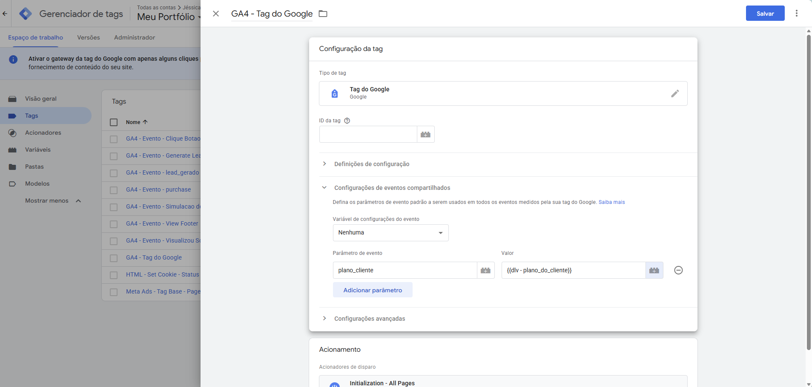
*Imagem 2: Parâmetro `plano_cliente` adicionado à tag base, garantindo a herança dessa dimensão para todos os hits da sessão.*

#### 3. Armazenamento: O Registro Oficial na Plataforma
**O Raciocínio:** O GA4 recebe parâmetros personalizados nos bastidores para evitar sobrecarga0 no banco de dados. Para que o dado fique visível, processável e disponível para a criação de gráficos na interface, é imprescindível registrar formalmente essa chave.
**A Execução:** Acessamos o painel de administração e criamos uma nova Definição Personalizada com escopo de Evento, casando o nome legível ("Plano do Cliente") com o parâmetro técnico configurado no GTM.

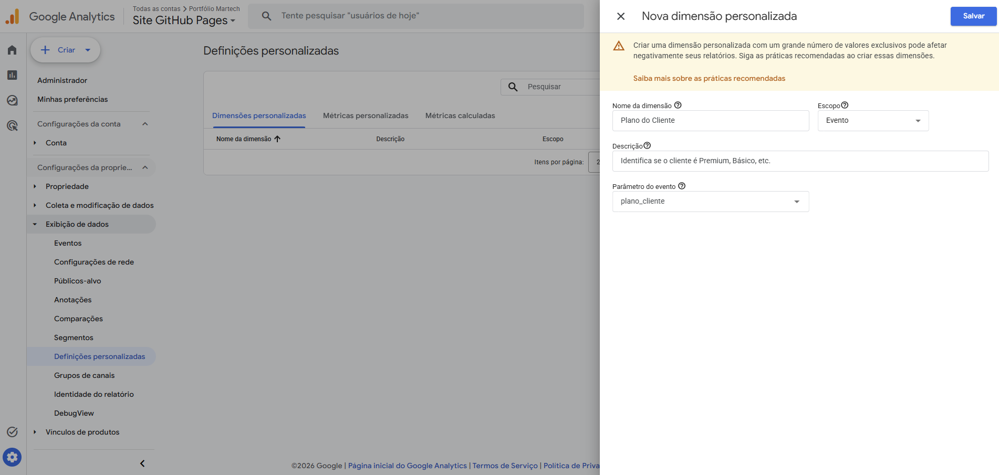
*Imagem 3: Registro de interface no GA4, etapa final para liberar o dado para relatórios e cruzamentos (Explorações).*

###  Garantia de Qualidade (QA)
A engenharia de dados exige validação. Simulamos o carregamento da página no ambiente de homologação para auditar o ciclo de vida da variável. O painel de depuração atestou que, no exato momento da "Inicialização" da página, o GTM capturou com sucesso a string de valor.

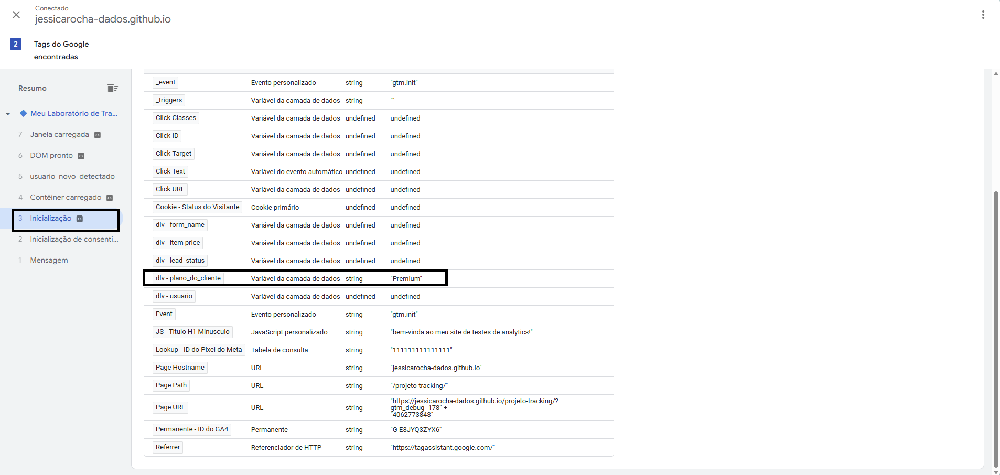
*Imagem 4: QA (Quality Assurance) comprovando a extração perfeita do valor "Premium" pelo GTM antes mesmo do disparo de qualquer tag analítica.*

---

##  Dia 32: Visualização e Construção de Relatórios Customizados

Após garantir a injeção e o roteamento da Dimensão Personalizada (`plano_cliente`) através do GTM, a etapa final do ciclo de vida do dado consiste em transformá-lo em inteligência acionável. Para isso, utilizamos o módulo de **Explorações (Explorations)** do GA4 para construir relatórios dinâmicos do zero.

###  Metodologia de Construção do Painel

A criação do relatório exigiu o pareamento das variáveis qualitativas (dimensões) com as quantitativas (métricas) dentro de uma estrutura de formato livre.

**1. Importação de Variáveis:**
O primeiro passo foi resgatar a nossa dimensão recém-registrada no banco de dados do GA4, trazendo-a para o ambiente de rascunho do relatório.

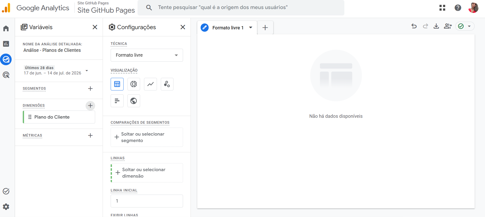
*Imagem 1: Acesso ao módulo de Explorações e importação da dimensão customizada "Plano do Cliente" para a paleta de variáveis.*

**2. Cruzamento e Renderização (Data Viz):**
Para gerar a visualização em tabela, cruzamos a dimensão de contexto de negócio com as métricas de volume (`Usuários ativos` e `Contagem de eventos`).

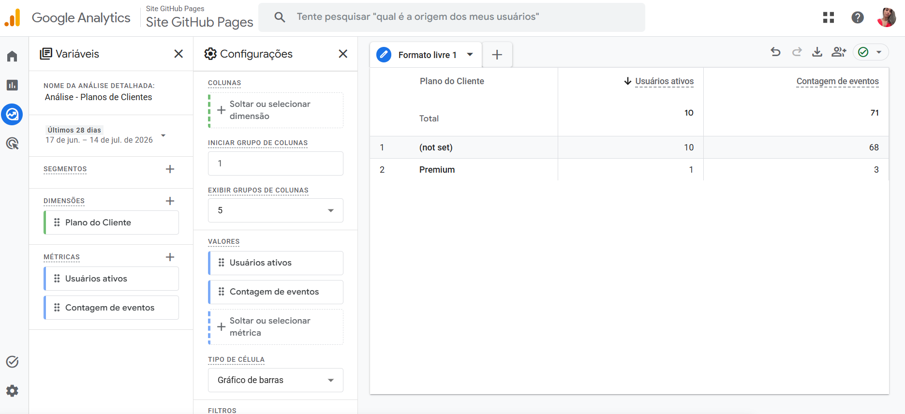
*Imagem 2: Tabela customizada renderizando com sucesso a volumetria de eventos e usuários segregada pela chave "Premium".*

###  Visão de Negócio: Porquê desta Implementação?

A coleta de dados sem um objetivo de negócio é apenas custo de servidor. O verdadeiro valor de capturar o `plano_cliente` via Data Layer e materializá-lo no GA4 reside na capacidade de **responder a perguntas complexas de Growth Analytics e Performance de Marketing**.

Ao isolar o comportamento do usuário "Premium" do tráfego geral `(not set)`, habilitamos o time de negócios a realizar as seguintes análises:

* ** Otimização de CAC (Custo de Aquisição):** Cruzar a origem de tráfego com o plano do cliente para descobrir quais campanhas trazem usuários Premium versus usuários Básicos.
* ** Análise de Engajamento e Retenção:** Identificar se clientes de alto valor consomem mais páginas do site ou realizam eventos-chave com maior frequência.
* ** Personalização de Experiência:** Construir públicos-alvo (Audiences) no GA4 baseados no plano e exportá-los para o Google Ads, permitindo remarketing altamente segmentado.

> **O Ciclo de Inteligência de Dados:**
> `Front-end (HTML)` ➔ `Data Layer (Contexto)` ➔ `GTM (Roteamento)` ➔ `GA4 (Armazenamento)` ➔ **`Explorations (Tomada de Decisão)`**

A presença da linha **Premium** na tabela acima é a validação técnica final deste fluxo. O dado que nasceu como uma simples string de código no front-end foi transformado com sucesso em inteligência acionável e estruturada. O volume atribuído a **(not set)** reflete adequadamente a retroatividade dos dados e sessões sem disparo da variável de negócio, mantendo a integridade histórica do banco.

---

##  Dia 33: Governança de Dados e Consent Mode V2 (Teoria e Prática Avançada)

A governança de dados tornou-se um pilar fundamental da engenharia de rastreamento. Com as diretrizes da LGPD (e legislações globais de privacidade), a coleta de dados de marketing e análise estatística exige o consentimento explícito, prévio e informado do usuário. Hoje, implementamos a base técnica para essa gestão através do **Google Consent Mode V2**.

###  Contexto Teórico: O Papel da CMP e do Consent Mode
O gerenciamento profissional de privacidade exige que o disparo de tags seja condicionado à escolha do usuário capturada por uma CMP (Consent Management Platform, como o Cookiebot). O **Consent Mode V2** atua como a ponte de comunicação nativa, permitindo que o Google Tag Manager (GTM) orquestre o comportamento das tags:
*   **Consentimento negado:** As tags bloqueiam a escrita de cookies no navegador, mas o GA4 utiliza **Modelagem Comportamental (Machine Learning)** baseada em pings anônimos para estimar a volumetria de conversões perdidas, protegendo a inteligência de marketing.
*   **Consentimento concedido:** O fluxo de rastreamento opera em sua totalidade.

### ⚙️ Implementação e Auditoria de Bloqueio (QA - Basic Mode)
Ativamos a "Visão Geral de Consentimento" no contêiner do GTM e construímos um cenário de testes rigoroso para validar a mecânica de governança na prática. 

**Passo 1: Criação da Tag de Simulação**
Criamos uma tag HTML personalizada simulando o disparo de um script de marketing padrão.

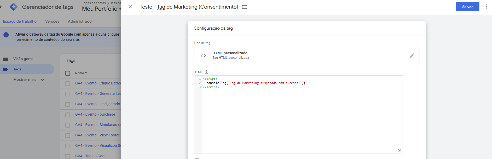
*Imagem 1: Configuração de uma tag genérica para validação de regras de privacidade.*

**Passo 2: Aplicação da Regra de Consentimento**
Inserimos nas configurações avançadas da tag a exigência estrita do parâmetro `ad_storage` (consentimento para armazenamento de publicidade).

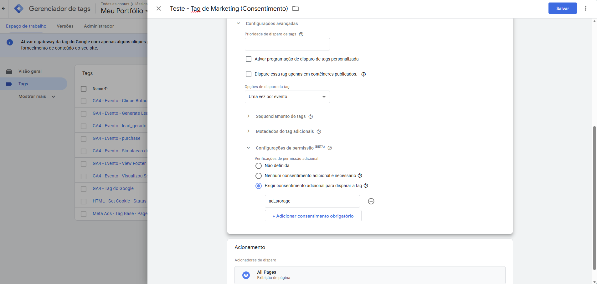
*Imagem 2: Tag atrelada à regra de governança, aguardando a liberação explícita do usuário.*

**Passo 3: A Prova de Conceito (PoC)**
Durante a depuração, simulamos o acesso de um usuário que ainda não aceitou os cookies.

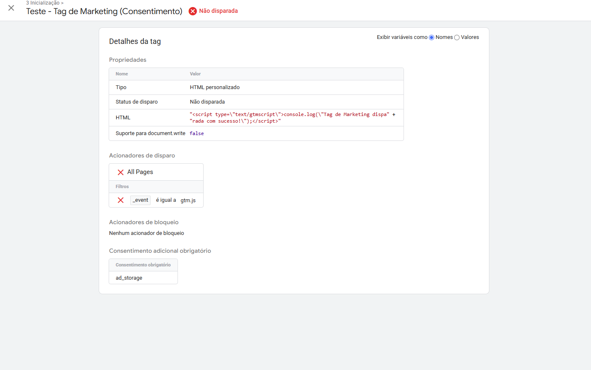
*Imagem 3: O Tag Assistant atesta a eficácia da arquitetura. A tag foi interceptada e abortada de forma nativa pelo GTM, provando que o rastreamento respeita o estado atual de privacidade.*

Esta etapa garante que a infraestrutura seja auditável e em total conformidade jurídica antes mesmo da integração com o banner final (CMP).

###  Evolução da Arquitetura: Basic vs. Advanced Consent Mode
Na etapa anterior, validamos a interceptação de tags na interface do GTM, uma abordagem conservadora que se assemelha ao **Basic Consent Mode** (onde há o bloqueio total da tag em caso de recusa). Para elevar a maturidade da nossa engenharia de rastreamento e proteger a inteligência de negócios, implementamos agora o **Advanced Consent Mode**.

**O que muda no fluxo de dados?**
No modo avançado, as tags do Google não são totalmente bloqueadas, mas instruídas a operarem em um **estado restrito** quando o consentimento é negado:
1. **Conformidade Jurídica (Artigo 12 da LGPD):** O sistema é estritamente proibido de gravar cookies ou capturar identificadores pessoais (como Client IDs ou IPs). 
2. **Pings Anônimos:** As tags passam a enviar apenas sinais básicos, estatísticos e efêmeros (ex: "um clique ocorreu"), sem vincular a ação a um indivíduo.
3. **Machine Learning:** Esses dados anonimizados alimentam a Modelagem Comportamental do GA4, permitindo que a ferramenta estime a volumetria de tráfego e conversões com alta precisão, sem ferir a privacidade do usuário.

###  Prática: A Recusa de Cookies via Código-Fonte (Default Denied)
Para que toda essa lógica avançada funcione, a aplicação precisa nascer bloqueada. Injetamos um script estrutural no `<head>` do código HTML, estrategicamente posicionado antes da inicialização do GTM. 

Este código transmite a ordem primária: o estado padrão (`default`) para armazenamento de publicidade e estatísticas é categoricamente **recusado (`denied`)**.

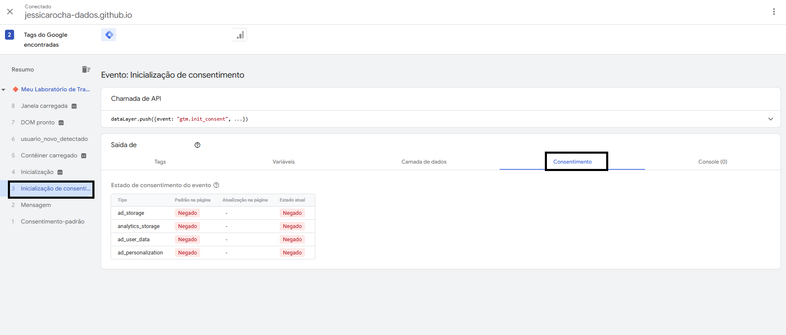
*Imagem 4: A auditoria de QA (Tag Assistant) comprova o sucesso da arquitetura. A coluna "Padrão na página" atesta que todos os privilégios de armazenamento (`ad_storage`, `analytics_storage`, `ad_user_data`, `ad_personalization`) carregam com o status restrito de fábrica (Negado). O ecossistema agora é seguro por padrão, aguardando a futura injeção da escolha explícita do usuário através da CMP.*
---
