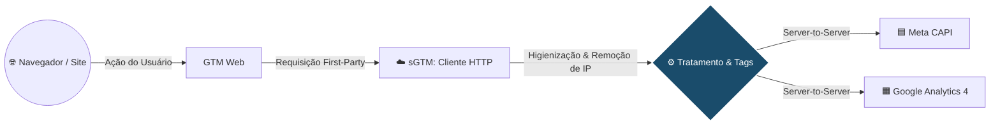
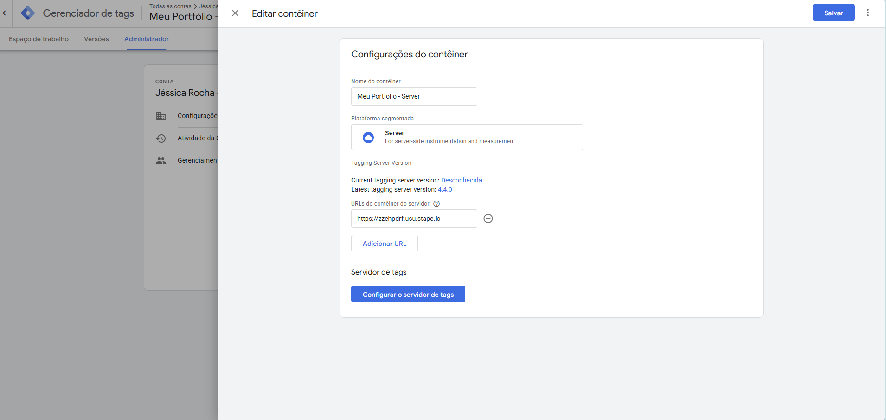
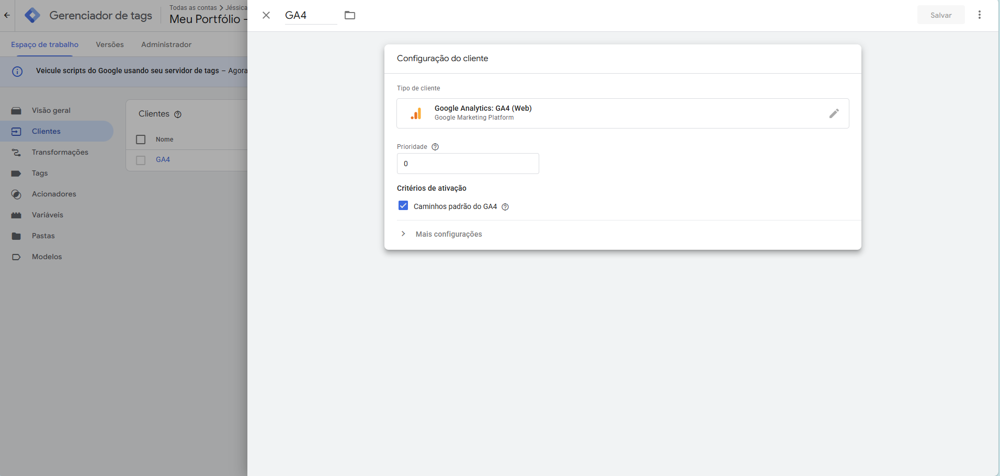
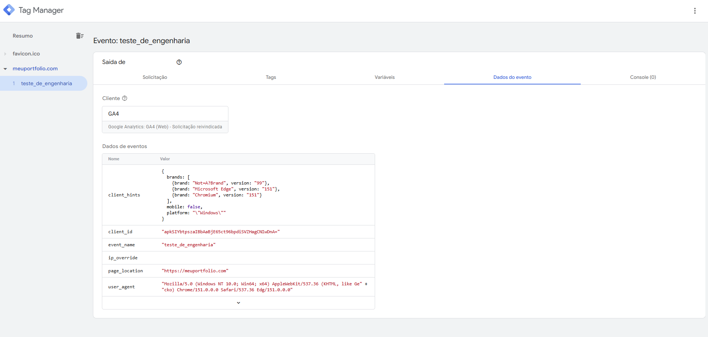
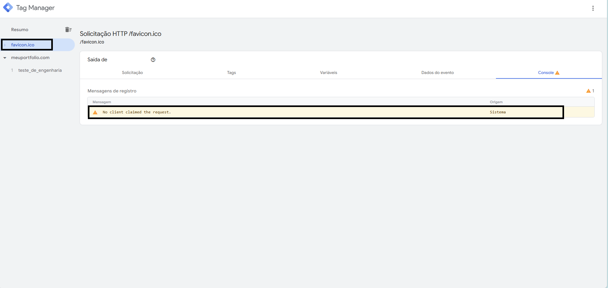
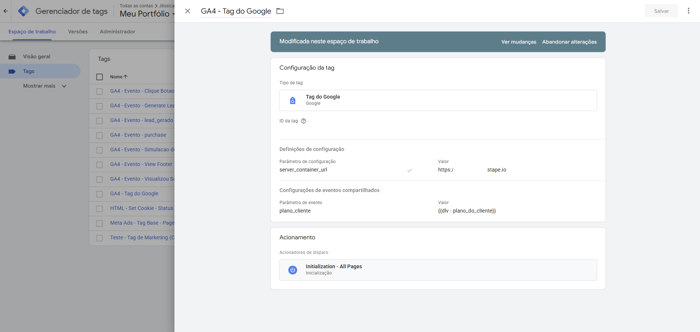
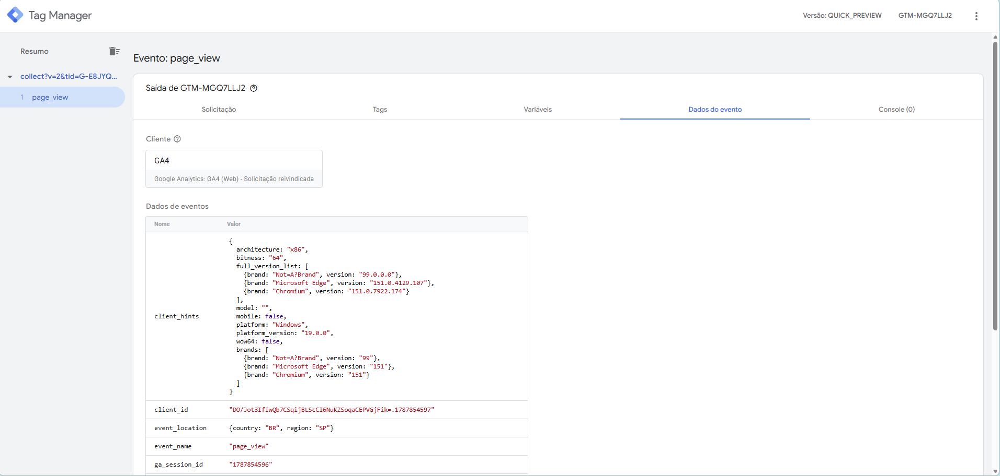
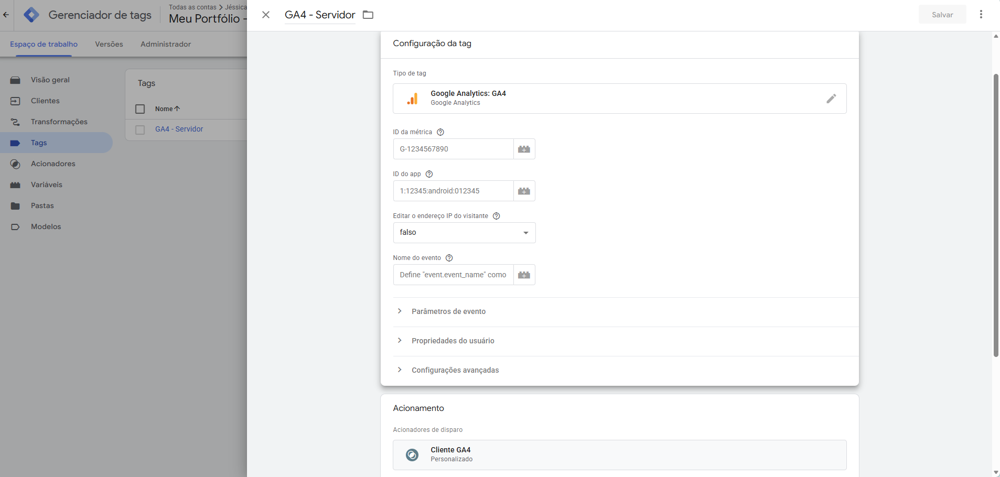
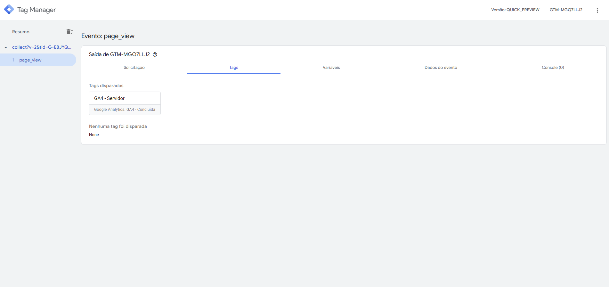

# Módulo 4: Engenharia de Analytics Avançada Server-Side & BigQuery

**Objetivo:** Elevar a arquitetura de rastreamento para o modelo Server-Side (sGTM), garantindo governança, precisão na coleta de dados (First-Party Data) e integração com o BigQuery para análises preditivas e armazenamento em nuvem.

##  Dia 38: O Conceito Server-Side (sGTM) e Arquitetura de Rastreamento

A transição de métricas baseadas no navegador (Client-Side) para o servidor (Server-Side) é um marco na engenharia de dados para marketing. Esta etapa documenta a base teórica e o fluxo arquitetônico dessa mudança de paradigma.

###  Teoria: A Mudança de Paradigma

A internet atual exige um novo padrão de coleta de dados devido a três fatores críticos:

* **Client-Side vs. Server-Side:** No modelo tradicional (Client-Side), o navegador do usuário processa múltiplas tags e scripts de terceiros, o que sobrecarrega a página e fica vulnerável a bloqueios. No Server-Side, o navegador envia um único pacote de dados para um servidor em nuvem próprio, que então distribui as informações para as plataformas de mídia.
* **O Fim dos Cookies de Terceiros (3rd Party Cookies):** Navegadores como Safari (ITP) e Chrome estão limitando cookies de terceiros. O sGTM permite a criação de cookies primários (First-Party), garantindo a durabilidade do rastreamento de conversões e alimentando os algoritmos de mídia com dados precisos.
* **Proteção de IP e Governança (LGPD):** O servidor atua como uma "alfândega" sob nosso controle. Antes de enviar qualquer evento para o Facebook ou GA4, é possível anonimizar dados sensíveis e remover o endereço IP do usuário, garantindo total conformidade com as leis de privacidade.

###  Prática: O Fluxo de Dados End-to-End

Para visualizar a infraestrutura, desenhamos o fluxo exato da requisição, desde a interação do usuário até o armazenamento nas plataformas de destino:

1. **Site (Front-end):** O usuário realiza um evento de conversão (ex: `purchase`).
2. **GTM Web (Coletor):** O contêiner web no navegador captura o evento e empacota os dados, enviando-os como uma requisição *First-Party* para o nosso subdomínio próprio.
3. **sGTM (Cliente HTTP):** O servidor recebe a requisição bruta através de um "Client", responsável por "escutar" e interceptar os dados vindos do GTM Web.
4. **Tratamento & Tags (Higienização):** Ocorre a validação, formatação do *payload* e anonimização (como a remoção do IP do usuário). É a etapa de governança antes do envio.
5. **Destinos Finais:** As Tags de servidor despacham os dados higienizados via conexão direta de servidor para servidor (*Server-to-Server*) para a **API de Conversões do Facebook (Meta CAPI)** e **Google Analytics 4**.

---

##  Dia 39: Provisionamento de Server-Side Tracking (sGTM) 

**A Teoria: Por que Server-Side?**

O Server-Side Tracking (rastreamento do lado do servidor) muda a forma como coletamos e distribuímos dados. No modelo tradicional (Web), o navegador do usuário envia os eventos diretamente para as plataformas de mídia, o que frequentemente resulta em perda de dados devido a AdBlockers e restrições de navegadores (como o ITP da Apple). 

Com a arquitetura Server-Side, o navegador envia os dados para o *nosso* próprio servidor em nuvem. A partir daí, é o nosso servidor que processa, enriquece e envia as informações para os destinos finais. O resultado prático é uma mensuração de performance muito mais precisa, maior controle sobre a privacidade dos dados e um carregamento de página mais leve.

 **Implementação Prática: Deploy e Roteamento do Servidor**

Para tirar essa arquitetura do papel utilizando uma infraestrutura de custo zero, executamos os seguintes passos:

* Criação de um novo contêiner do tipo **Servidor** na conta do Google Tag Manager.
* Execução do provisionamento manual para extração da *Container Configuration String*.
* Deploy de um servidor na nuvem utilizando o **Stape.io** (hospedado na região US-West).
* Conexão e roteamento final da *Tagging Server URL* gerada pelo Stape para dentro do painel administrativo do GTM.
  

**📸 Evidências Visuais: (Infraestrutura Online):**

---
### Dia 40: Arquitetura Server-Side (sGTM) - O Cliente vs. A Tag

**A Teoria: A Base do Server-Side**

Para dominar a infraestrutura no GTM Server-Side, é fundamental compreender a separação arquitetônica de responsabilidades entre dois componentes centrais:

* **O Cliente:** Atua como a interface de entrada e processamento inicial do servidor. Ele monitora continuamente as requisições HTTP originadas na web, intercepta os payloads brutos, valida o protocolo e converte as informações em um **Objeto de Dados de Evento** (Event Data Object) padronizado.
  
* **A Tag:** Funciona como o agente de roteamento e saída de dados. Ela não recebe requisições externas diretamente; sua função é consumir o evento já normalizado pelo Cliente, aplicar as regras de negócio e realizar o disparo (dispatch) das informações processadas para os endpoints finais.

**Prática - Etapa 1: Configuração do Cliente GA4**

O primeiro passo foi preparar o servidor em nuvem para escutar e receber os dados corretamente da web.
* Validamos a configuração do Cliente **Google Analytics: GA4 (Web)** nativo do sGTM.
* Habilitamos a opção **Caminhos padrão do GA4**, instruindo o servidor a reconhecer e autorizar o tráfego de entrada na rota oficial `/g/collect`.

*Evidência - Configuração do Cliente:*

**Prática - Etapa 2: Validação de Payload e Injeção de Dados**

Na engenharia de dados, não basta configurar; é preciso testar e atestar o fluxo da informação. Para validar que a infraestrutura provisionada no Stape.io estava operante, realizamos uma injeção manual de payload.

1. Forjamos uma requisição HTTP manual apontando para a nossa *Tagging Server URL*, simulando um disparo real de evento via navegador.
2. Durante o teste, diagnosticamos e resolvemos um erro de processamento (`dp(...).startsWith is not a function`). O erro ocorreu porque o Cliente GA4 exige parâmetros obrigatórios de origem para estruturar o dado adequadamente.
3. Ajustamos o payload adicionando o parâmetro `&dl=` (Document Location) e disparamos a URL limpa e estruturada: 
   `.../g/collect?v=2&tid=G-TESTE123&en=teste_de_engenharia&cid=123.456&dl=https://meuportfolio.com`

**O Resultado Prático:**

A validação foi concluída com êxito. O painel de diagnóstico (Tag Assistant) confirmou que o Cliente GA4 interceptou a requisição HTTP, reivindicou a solicitação e executou o *parse* automático das informações. A URL de teste foi estruturada em um **Objeto de Dados de Evento** legível pelo servidor, categorizando chaves primárias como `event_name` (teste_de_engenharia), `page_location` e variáveis de `user_agent`.

*Evidência - Payload Processado e Estruturado:*

**Observação de Debug: O Alerta do `/favicon.ico`**

Durante os testes de injeção de payload via navegador, o painel do Tag Assistant registrou uma solicitação paralela para a rota `/favicon.ico` com o aviso amarelo *"No client claimed the request"* (Nenhum cliente reivindicou a solicitação).

**Análise do Comportamento:**

* **A Origem:** Navegadores web (Chrome, Edge) disparam automaticamente uma requisição buscando o ícone da aba (`favicon.ico`) ao acessar qualquer URL.
* **O Filtro do Servidor:** Como configuramos nosso Cliente GA4 para escutar estritamente a rota oficial do Analytics (`/g/collect`), ele ignorou a requisição do ícone.
  
* **Conclusão:** A ausência de um cliente para processar essa requisição gerou o alerta no log do sistema. Este é um comportamento esperado e positivo, pois prova que o servidor está filtrando o tráfego corretamente e rejeitando requisições (gastos de processamento) que não pertencem ao escopo da engenharia de dados.
  
*Evidência - Log de Debug do Sistema:*

----

### Dia 41: Unificando o Fluxo (Web to Server)

A transição para o Server-Side Tracking muda a rota de envio: em vez do navegador do usuário disparar dados diretamente para as plataformas (Google, Meta), ele envia um fluxo único para um servidor próprio.

#### Teoria: Redirecionando a Rota de Dados

Esta mudança de infraestrutura é um pilar na engenharia de dados moderna por resolver problemas críticos da coleta tradicional:

* **Controle e Qualidade:** Atuar em um contexto de primeira parte mitiga o impacto de AdBlockers e restrições de cookies (ITP da Apple), garantindo maior precisão na coleta.
* **Segurança:** Permite mascarar ou remover dados sensíveis antes de chegarem aos destinos finais.
* **Performance:** Melhora o tempo de carregamento e o SEO do site, pois reduz a carga de scripts processados pelo navegador.

#### Prática: Configuração da Rota e Interceptação

Para implementar a transição e validar se o pipeline de dados estava íntegro, executamos o seguinte fluxo prático entre os contêineres:

**1. Redirecionamento na Origem (GTM Web):** 
Acessamos a tag `GA4 - Tag do Google` e adicionamos o parâmetro estrutural `server_container_url` apontando para o servidor. 
Ao invés de configurar o redirecionamento individualmente em cada evento, optamos por centralizar essa regra na Tag de Configuração base. A imagem ilustra o preenchimento na raiz da tag, o que cria uma regra de herança obrigatória. Isso elimina o risco de vazamento de dados e garante que absolutamente todo o tráfego do site flua através da nossa infraestrutura desde o momento em que a página é carregada.

**2. Interceptação e Estruturação (GTM Server):** 
No servidor, confirmamos a chegada do dado. O "Cliente" GA4 atuou interceptando a requisição HTTP bruta, assumindo a propriedade da solicitação, e a converteu em um pacote de dados limpo e estruturado.
A imagem destaca o status "Solicitação reivindicada" e a aba de "Dados do evento". Esta é uma etapa importante do sGTM. A escolha de usar o Cliente nativo do GA4 abstrai toda a complexidade do protocolo HTTP bruto. Ele atua como um tradutor, pegando uma URL caótica e transformando-a em um *Event Data Object* padronizado (contendo variáveis separadas como `client_id`, `user_agent`, `ip`). Essa estruturação é o que permite construir um pipeline escalável, pois agora qualquer outra tag (como a API de Conversões da Meta) poderá consumir esses mesmos dados limpos.

**3. Despacho Final (GTM Server):** 
Criamos um acionador disparado pela variável de sistema `Client Name` (exatamente igual a `GA4`) e configuramos a tag responsável pela entrega final, a `GA4 - Servidor`. 
Como demonstrado na imagem, o campo "ID da métrica" foi intencionalmente deixado em branco. Essa decisão foi para  garantir a escalabilidade do sistema. Ao deixar o campo vazio, forçamos a Tag a extrair dinamicamente o Measurement ID e todos os parâmetros diretamente do *Event Data Object* estruturado no passo anterior. Isso cria uma configuração livre de redundâncias e à prova de falhas: se o contêiner Web gerenciar múltiplos IDs do GA4 no futuro, esta única Tag do servidor será capaz de rotear todos eles corretamente sem nenhuma alteração manual. O acionador por `Client Name` adiciona uma camada de segurança, garantindo que esta tag só dispare se a origem dos dados for, de fato, o cliente GA4.

**4. Validação End-to-End (Preview):** 
Rodamos o modo de visualização simultaneamente no Web e no Server. Simulamos a interação no front-end e acompanhamos o evento nascer no navegador, ser interceptado pelo servidor e, por fim, disparar com sucesso a tag de envio.
A imagem final do debug comprovando o status de "Fired" na aba Tags é a validação definitiva do pipeline de dados. Sem esta etapa de verificação simultânea, seria impossível garantir que a camada de abstração (Web -> Servidor) não fragmentou o *payload* (pacote de dados). O disparo bem-sucedido documentado atesta que o Google Analytics recebeu a requisição final através do nosso servidor, selando a migração arquitetônica e atestando a confiabilidade dos dados coletados.

