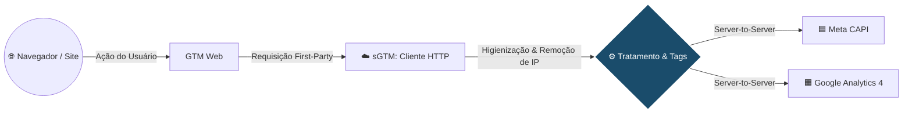

# Módulo 4: Engenharia de Analytics Avançada Server-Side & BigQuery

**Objetivo:** Elevar a arquitetura de rastreamento para o modelo Server-Side (sGTM), garantindo governança, precisão na coleta de dados (First-Party Data) e integração com o BigQuery para análises preditivas e armazenamento em nuvem.

##  Dia 38: O Conceito Server-Side (sGTM) e Arquitetura de Rastreamento

A transição de métricas baseadas no navegador (Client-Side) para o servidor (Server-Side) é um marco na engenharia de dados para marketing. Esta etapa documenta a base teórica e o fluxo arquitetônico dessa mudança de paradigma.

###  Teoria: A Mudança de Paradigma

A internet atual exige um novo padrão de coleta de dados devido a três fatores críticos:

* **Client-Side vs. Server-Side:** No modelo tradicional (Client-Side), o navegador do usuário processa múltiplas tags e scripts de terceiros, o que sobrecarrega a página e fica vulnerável a bloqueios. No Server-Side, o navegador envia um único pacote de dados para um servidor em nuvem próprio, que então distribui as informações para as plataformas de mídia.
* **O Fim dos Cookies de Terceiros (3rd Party Cookies):** Navegadores como Safari (ITP) e Chrome estão limitando cookies de terceiros. O sGTM permite a criação de cookies primários (First-Party), garantindo a durabilidade do rastreamento de conversões e alimentando os algoritmos de mídia com dados precisos.
* **Proteção de IP e Governança (LGPD):** O servidor atua como uma "alfândega" sob nosso controle. Antes de enviar qualquer evento para o Facebook ou GA4, é possível anonimizar dados sensíveis e remover o endereço IP do usuário, garantindo total conformidade com as leis de privacidade.

###  Prática: O Fluxo de Dados End-to-End

Para visualizar a infraestrutura, desenhamos o fluxo exato da requisição, desde a interação do usuário até o armazenamento nas plataformas de destino:

1. **Site (Front-end):** O usuário realiza um evento de conversão (ex: `purchase`).
2. **GTM Web (Coletor):** O contêiner web no navegador captura o evento e empacota os dados, enviando-os como uma requisição *First-Party* para o nosso subdomínio próprio.
3. **sGTM (Cliente HTTP):** O servidor recebe a requisição bruta através de um "Client", responsável por "escutar" e interceptar os dados vindos do GTM Web.
4. **Tratamento & Tags (Higienização):** Ocorre a validação, formatação do *payload* e anonimização (como a remoção do IP do usuário). É a etapa de governança antes do envio.
5. **Destinos Finais:** As Tags de servidor despacham os dados higienizados via conexão direta de servidor para servidor (*Server-to-Server*) para a **API de Conversões do Facebook (Meta CAPI)** e **Google Analytics 4**.

