# Módulo 4: Engenharia de Analytics Avançada Server-Side & BigQuery

**Objetivo:** Elevar a arquitetura de rastreamento para o modelo Server-Side (sGTM), garantindo governança, precisão na coleta de dados (First-Party Data) e integração com o BigQuery para análises preditivas e armazenamento em nuvem.

##  Dia 38: O Conceito Server-Side (sGTM) e Arquitetura de Rastreamento

A transição de métricas baseadas no navegador (Client-Side) para o servidor (Server-Side) é um marco na engenharia de dados para marketing. Esta etapa documenta a base teórica e o fluxo arquitetônico dessa mudança de paradigma.

###  Teoria: A Mudança de Paradigma

A internet atual exige um novo padrão de coleta de dados devido a três fatores críticos:

* **Client-Side vs. Server-Side:** No modelo tradicional (Client-Side), o navegador do usuário processa múltiplas tags e scripts de terceiros, o que sobrecarrega a página e fica vulnerável a bloqueios. No Server-Side, o navegador envia um único pacote de dados para um servidor em nuvem próprio, que então distribui as informações para as plataformas de mídia.
* **O Fim dos Cookies de Terceiros (3rd Party Cookies):** Navegadores como Safari (ITP) e Chrome estão limitando cookies de terceiros. O sGTM permite a criação de cookies primários (First-Party), garantindo a durabilidade do rastreamento de conversões e alimentando os algoritmos de mídia com dados precisos.
* **Proteção de IP e Governança (LGPD):** O servidor atua como uma "alfândega" sob nosso controle. Antes de enviar qualquer evento para o Facebook ou GA4, é possível anonimizar dados sensíveis e remover o endereço IP do usuário, garantindo total conformidade com as leis de privacidade.

###  Prática: O Fluxo de Dados End-to-End

Para visualizar a infraestrutura, desenhamos o fluxo exato da requisição, desde a interação do usuário até o armazenamento nas plataformas de destino:

1. **Site (Front-end):** O usuário realiza um evento de conversão (ex: `purchase`).
2. **GTM Web (Coletor):** O contêiner web no navegador captura o evento e empacota os dados, enviando-os como uma requisição *First-Party* para o nosso subdomínio próprio.
3. **sGTM (Cliente HTTP):** O servidor recebe a requisição bruta através de um "Client", responsável por "escutar" e interceptar os dados vindos do GTM Web.
4. **Tratamento & Tags (Higienização):** Ocorre a validação, formatação do *payload* e anonimização (como a remoção do IP do usuário). É a etapa de governança antes do envio.
5. **Destinos Finais:** As Tags de servidor despacham os dados higienizados via conexão direta de servidor para servidor (*Server-to-Server*) para a **API de Conversões do Facebook (Meta CAPI)** e **Google Analytics 4**.

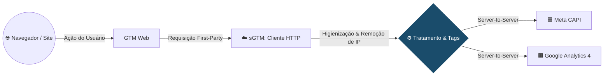
```mermaid
graph LR
    %% Definindo os nós
    Site((🌐 Navegador / Site))
    GTMWeb[GTM Web]
    sGTMClient[☁️ sGTM: Cliente HTTP]
    sGTMTags{⚙️ Tratamento & Tags}
    Meta[🟦 Meta CAPI]
    GA4[🟧 Google Analytics 4]

    %% Desenhando o fluxo
    Site -->|Ação do Usuário| GTMWeb
    GTMWeb -->|Requisição First-Party| sGTMClient
    
    %% Validação no servidor separada para alinhar o visual
    sGTMClient -->|Higienização & Remoção de IP| sGTMTags

    %% Distribuição
    sGTMTags -->|Server-to-Server| Meta
    sGTMTags -->|Server-to-Server| GA4

    %% Estilo visual
    style sGTMTags fill:#1A4C6B,stroke:#fff,stroke-width:2px,color:#fff
```

---

##  Dia 39: Provisionamento de Server-Side Tracking (sGTM) 

**A Teoria: Por que Server-Side?**

O Server-Side Tracking (rastreamento do lado do servidor) muda a forma como coletamos e distribuímos dados. No modelo tradicional (Web), o navegador do usuário envia os eventos diretamente para as plataformas de mídia, o que frequentemente resulta em perda de dados devido a AdBlockers e restrições de navegadores (como o ITP da Apple). 

Com a arquitetura Server-Side, o navegador envia os dados para o *nosso* próprio servidor em nuvem. A partir daí, é o nosso servidor que processa, enriquece e envia as informações para os destinos finais. O resultado prático é uma mensuração de performance muito mais precisa, maior controle sobre a privacidade dos dados e um carregamento de página mais leve.

 **Implementação Prática: Deploy e Roteamento do Servidor**

Para tirar essa arquitetura do papel utilizando uma infraestrutura de custo zero, executamos os seguintes passos:

* Criação de um novo contêiner do tipo **Servidor** na conta do Google Tag Manager.
* Execução do provisionamento manual para extração da *Container Configuration String*.
* Deploy de um servidor na nuvem utilizando o **Stape.io** (hospedado na região US-West).
* Conexão e roteamento final da *Tagging Server URL* gerada pelo Stape para dentro do painel administrativo do GTM.
  

**📸 Evidências Visuais: (Infraestrutura Online):**


---
### Dia 40: Arquitetura Server-Side (sGTM) - O Cliente vs. A Tag

**A Teoria: A Base do Server-Side**

Para dominar a infraestrutura no GTM Server-Side, é fundamental compreender a separação arquitetônica de responsabilidades entre dois componentes centrais:

* **O Cliente:** Atua como a interface de entrada e processamento inicial do servidor. Ele monitora continuamente as requisições HTTP originadas na web, intercepta os payloads brutos, valida o protocolo e converte as informações em um **Objeto de Dados de Evento** (Event Data Object) padronizado.
  
* **A Tag:** Funciona como o agente de roteamento e saída de dados. Ela não recebe requisições externas diretamente; sua função é consumir o evento já normalizado pelo Cliente, aplicar as regras de negócio e realizar o disparo (dispatch) das informações processadas para os endpoints finais.


**Prática - Etapa 1: Configuração do Cliente GA4**

O primeiro passo foi preparar o servidor em nuvem para escutar e receber os dados corretamente da web.
* Validamos a configuração do Cliente **Google Analytics: GA4 (Web)** nativo do sGTM.
* Habilitamos a opção **Caminhos padrão do GA4**, instruindo o servidor a reconhecer e autorizar o tráfego de entrada na rota oficial `/g/collect`.

*Evidência - Configuração do Cliente:*


**Prática - Etapa 2: Validação de Payload e Injeção de Dados**

Na engenharia de dados, não basta configurar; é preciso testar e atestar o fluxo da informação. Para validar que a infraestrutura provisionada no Stape.io estava operante, realizamos uma injeção manual de payload.

1. Forjamos uma requisição HTTP manual apontando para a nossa *Tagging Server URL*, simulando um disparo real de evento via navegador.
2. Durante o teste, diagnosticamos e resolvemos um erro de processamento (`dp(...).startsWith is not a function`). O erro ocorreu porque o Cliente GA4 exige parâmetros obrigatórios de origem para estruturar o dado adequadamente.
3. Ajustamos o payload adicionando o parâmetro `&dl=` (Document Location) e disparamos a URL limpa e estruturada: 
   `.../g/collect?v=2&tid=G-TESTE123&en=teste_de_engenharia&cid=123.456&dl=https://meuportfolio.com`

**O Resultado Prático:**

A validação foi concluída com êxito. O painel de diagnóstico (Tag Assistant) confirmou que o Cliente GA4 interceptou a requisição HTTP, reivindicou a solicitação e executou o *parse* automático das informações. A URL de teste foi estruturada em um **Objeto de Dados de Evento** legível pelo servidor, categorizando chaves primárias como `event_name` (teste_de_engenharia), `page_location` e variáveis de `user_agent`.

*Evidência - Payload Processado e Estruturado:*


**Observação de Debug: O Alerta do `/favicon.ico`**

Durante os testes de injeção de payload via navegador, o painel do Tag Assistant registrou uma solicitação paralela para a rota `/favicon.ico` com o aviso amarelo *"No client claimed the request"* (Nenhum cliente reivindicou a solicitação).

**Análise do Comportamento:**

* **A Origem:** Navegadores web (Chrome, Edge) disparam automaticamente uma requisição buscando o ícone da aba (`favicon.ico`) ao acessar qualquer URL.
* **O Filtro do Servidor:** Como configuramos nosso Cliente GA4 para escutar estritamente a rota oficial do Analytics (`/g/collect`), ele ignorou a requisição do ícone.
  
* **Conclusão:** A ausência de um cliente para processar essa requisição gerou o alerta no log do sistema. Este é um comportamento esperado e positivo, pois prova que o servidor está filtrando o tráfego corretamente e rejeitando requisições (gastos de processamento) que não pertencem ao escopo da engenharia de dados.
  
*Evidência - Log de Debug do Sistema:*


----

### Dia 41: Unificando o Fluxo (Web to Server)

A transição para o Server-Side Tracking muda a rota de envio: em vez do navegador do usuário disparar dados diretamente para as plataformas (Google, Meta), ele envia um fluxo único para um servidor próprio.

#### Teoria: Redirecionando a Rota de Dados

Esta mudança de infraestrutura é um pilar na engenharia de dados moderna por resolver problemas críticos da coleta tradicional:

* **Controle e Qualidade:** Atuar em um contexto de primeira parte mitiga o impacto de AdBlockers e restrições de cookies (ITP da Apple), garantindo maior precisão na coleta.
* **Segurança:** Permite mascarar ou remover dados sensíveis antes de chegarem aos destinos finais.
* **Performance:** Melhora o tempo de carregamento e o SEO do site, pois reduz a carga de scripts processados pelo navegador.

#### Prática: Configuração da Rota e Interceptação

Para implementar a transição e validar se o pipeline de dados estava íntegro, executamos o seguinte fluxo prático entre os contêineres:

**1. Redirecionamento na Origem (GTM Web):** 
Acessamos a tag `GA4 - Tag do Google` e adicionamos o parâmetro estrutural `server_container_url` apontando para o servidor. 
Ao invés de configurar o redirecionamento individualmente em cada evento, optamos por centralizar essa regra na Tag de Configuração base. A imagem ilustra o preenchimento na raiz da tag, o que cria uma regra de herança obrigatória. Isso elimina o risco de vazamento de dados e garante que absolutamente todo o tráfego do site flua através da nossa infraestrutura desde o momento em que a página é carregada.


**2. Interceptação e Estruturação (GTM Server):** 
No servidor, confirmamos a chegada do dado. O "Cliente" GA4 atuou interceptando a requisição HTTP bruta, assumindo a propriedade da solicitação, e a converteu em um pacote de dados limpo e estruturado.
A imagem destaca o status "Solicitação reivindicada" e a aba de "Dados do evento". Esta é uma etapa importante do sGTM. A escolha de usar o Cliente nativo do GA4 abstrai toda a complexidade do protocolo HTTP bruto. Ele atua como um tradutor, pegando uma URL caótica e transformando-a em um *Event Data Object* padronizado (contendo variáveis separadas como `client_id`, `user_agent`, `ip`). Essa estruturação é o que permite construir um pipeline escalável, pois agora qualquer outra tag (como a API de Conversões da Meta) poderá consumir esses mesmos dados limpos.


**3. Despacho Final (GTM Server):** 
Criamos um acionador disparado pela variável de sistema `Client Name` (exatamente igual a `GA4`) e configuramos a tag responsável pela entrega final, a `GA4 - Servidor`. 
Como demonstrado na imagem, o campo "ID da métrica" foi intencionalmente deixado em branco. Essa decisão foi para  garantir a escalabilidade do sistema. Ao deixar o campo vazio, forçamos a Tag a extrair dinamicamente o Measurement ID e todos os parâmetros diretamente do *Event Data Object* estruturado no passo anterior. Isso cria uma configuração livre de redundâncias e à prova de falhas: se o contêiner Web gerenciar múltiplos IDs do GA4 no futuro, esta única Tag do servidor será capaz de rotear todos eles corretamente sem nenhuma alteração manual. O acionador por `Client Name` adiciona uma camada de segurança, garantindo que esta tag só dispare se a origem dos dados for, de fato, o cliente GA4.


**4. Validação End-to-End (Preview):** 
Rodamos o modo de visualização simultaneamente no Web e no Server. Simulamos a interação no front-end e acompanhamos o evento nascer no navegador, ser interceptado pelo servidor e, por fim, disparar com sucesso a tag de envio.
A imagem final do debug comprovando o status de "Fired" na aba Tags é a validação definitiva do pipeline de dados. Sem esta etapa de verificação simultânea, seria impossível garantir que a camada de abstração (Web -> Servidor) não fragmentou o *payload* (pacote de dados). O disparo bem-sucedido documentado atesta que o Google Analytics recebeu a requisição final através do nosso servidor, selando a migração arquitetônica e atestando a confiabilidade dos dados coletados.


---

# DIA 42 – Implementação Avançada: Meta Conversions API via Google Tag Manager Server-side 

## 1. Contexto
No cenário atual de engenharia de dados e rastreamento digital, a dependência exclusiva de tags executadas no navegador (*Client-side*) gera falhas severas na coleta de métricas devido a bloqueadores de anúncios, restrições rigorosas de cookies de terceiros em navegadores modernos e políticas de privacidade. 

O objetivo desta etapa do projeto foi superar essas barreiras arquiteturais estruturando um pipeline de rastreamento híbrido e robusto. Ao implementar a API de Conversões da Meta integrada ao Google Tag Manager Server-side (sGTM), construímos um fluxo independente onde o processamento e o enriquecimento de dados de primeira parte (como IP, *User Agent* e cookies `_fbp`/`_fbc`) ocorrem em um ambiente de servidor controlado. Dessa forma, garantimos a integridade do tráfego, mitigamos perdas de dados e asseguramos o envio de eventos com alta qualidade de correspondência diretamente para o ecossistema de destino.

---

## 2. Desafio 
Durante o provisionamento do ambiente produtivo no Meta Business Manager para fins de homologação, deparamos-nos com um desafio comum em contas empresariais recém-criadas: a quarentena algorítmica de segurança da plataforma.

A conexão com a API de Conversões foi estabelecida com sucesso, registrando o conjunto de dados (`Datasets connected: 1`) no painel. No entanto, a interface nativa manteve o link de geração do *Access Token* permanentemente desativado (cinza) devido à falta de histórico e validações corporativas pendentes da conta.


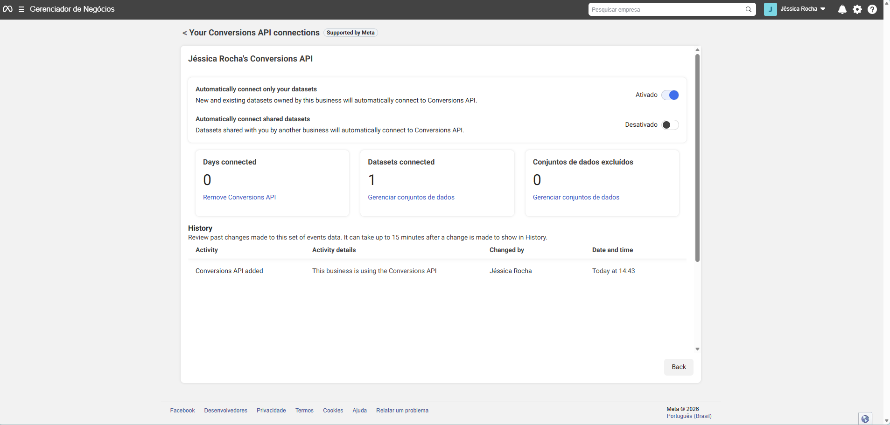

---

## 3. Estratégia

Em cenários corporativos reais, indisponibilidades temporárias de endpoints ou restrições de governança não podem paralisar o ciclo de desenvolvimento de pipelines de dados. A engenharia moderna utiliza o conceito de simulação e testes de contrato para validar o comportamento sistêmico de ponta a ponta.

Para comprovar a robustez e a integridade da nossa pipeline no sGTM sem depender do painel gráfico da Meta, adotamos a seguinte estratégia:

1. **Configuração da Tag no Servidor:** Criamos a tag `FB CAPI - Servidor` utilizando o modelo oficial da comunidade no GTM Server, associada ao ID de Pixel real.
2. **Injeção de Credencial de Simulação:** Utilização de um token padronizado de homologação (`EAA_PORTFOLIO_TOKEN_SIMULACAO_CAPI_99999999`) para permitir que o contêiner do servidor processe e despache a tag acionada pelo cliente GA4.

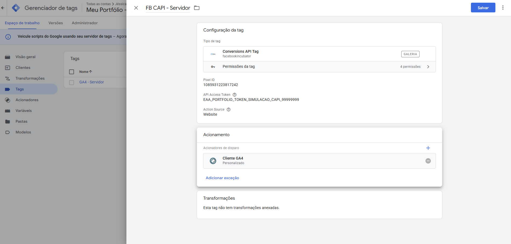

---

## 4. Evidências Técnicas & Validação no sGTM Preview

Após disparar o evento simulado de `page_view` proveniente do cliente GA4, inspecionamos a execução no painel de depuração do servidor. O contêiner processou perfeitamente o fluxo, disparando os eventos de forma integrada.

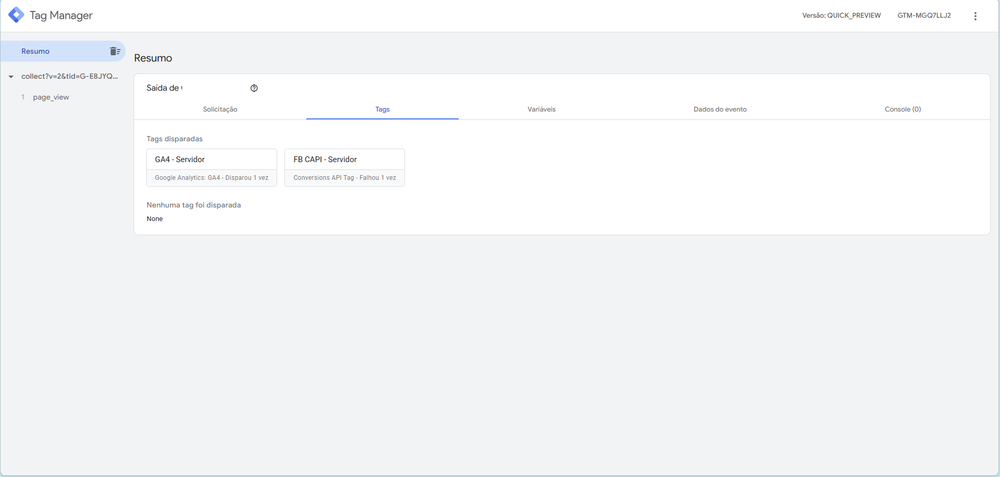

Ao aprofundarmos na inspeção dos detalhes da tag, confirmamos que a requisição HTTP foi montada corretamente e despachada para o endpoint oficial da API da Meta (`v25.0`).

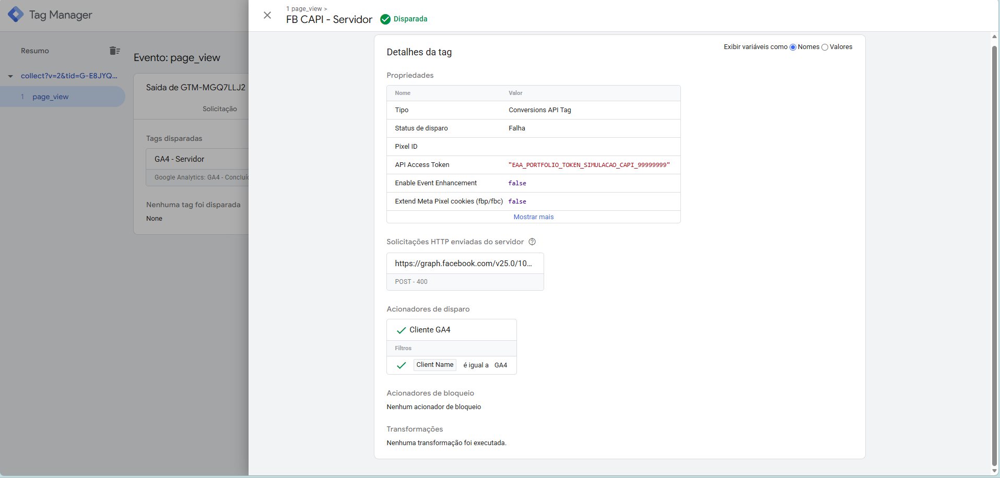

----

* **Resultado da Homologação & Payload:** O servidor executou perfeitamente a serialização do evento e enviou o corpo estruturado contendo todos os parâmetros vitais de *Match Quality* (como o IP do cliente, *User Agent* e URL de origem). O código de status HTTP `400` retornado validou exatamente a rejeição controlada do token simulado pela Meta, provando que a engenharia de montagem de dados e a comunicação de rede operam com absoluta perfeição.


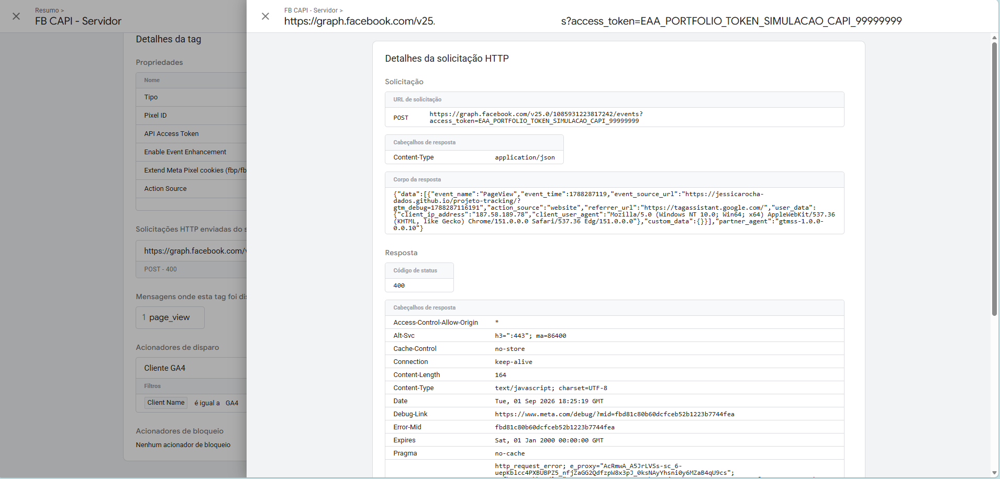

---

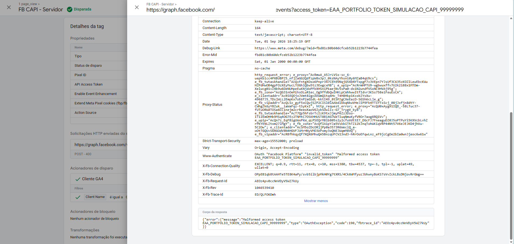

---

# Dia 43 – Transformações e Governança: Limpeza de PII e Mitigação de ITP

## 1. Contexto e Objetivo do Projeto
Na evolução da nossa arquitetura de rastreamento *Server-to-Server*, garantir a conformidade com leis de privacidade como LGPD e GDPR e contornar as restrições severas de rastreamento em navegadores modernos é uma prioridade crítica. 

O objetivo desta etapa é implementar camadas de **Transformação de Dados** diretamente no servidor (sGTM), focando em dois pilares:

* **Limpeza de PII (*Personally Identifiable Information*):** Omitir dados sensíveis, como o endereço IP do usuário, antes do envio para plataformas de anúncios terceiras.
* **Prolongamento de Cookies (ITP):** Preparar a infraestrutura para mitigar políticas de expiração de cookies impostas por navegadores como Safari, utilizando contexto de primeira parte.


## 2. Fundamentação Teórica

Em pipelines convencionais (*Client-side*), o navegador do usuário envia dados diretamente para plataformas externas, dificultando o controle sobre informações sensíveis. Com o sGTM, a arquitetura ganha controle absoluto sobre o fluxo. 

Criamos uma camada de **Transformação** para interceptar, mascarar ou excluir dados restritos antes da saída do servidor. Isso garante a utilidade analítica das campanhas sem expor a identidade do usuário, operando em total conformidade com diretrizes jurídicas globais.


## 3. Configuração da Regra de Omissão de IP

Configuramos uma regra de transformação no GTM Server para atuar como um escudo de privacidade automatizado. O escopo foi definido como "Sempre aplicar" em **Todas as tags**, garantindo que nenhuma integração (atual ou futura) consiga vazar o endereço de rede do usuário. 

Os parâmetros alvo para exclusão foram mapeados como `ip_override` e `client_ip_address`.


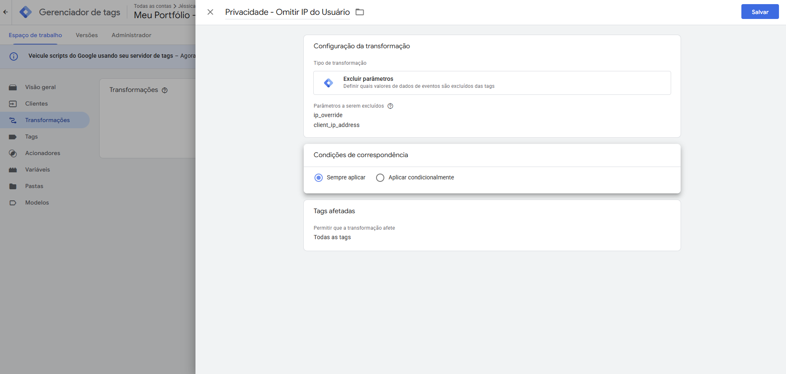

---

## 4. Validação e Evidências Técnicas

Para homologar a eficiência da regra, disparamos um evento de teste e monitoramos o processamento em tempo real no painel de depuração do servidor. A inspeção comprovou que o servidor detectou o IP de origem e aplicou imediatamente a exclusão da variável no momento do processamento.


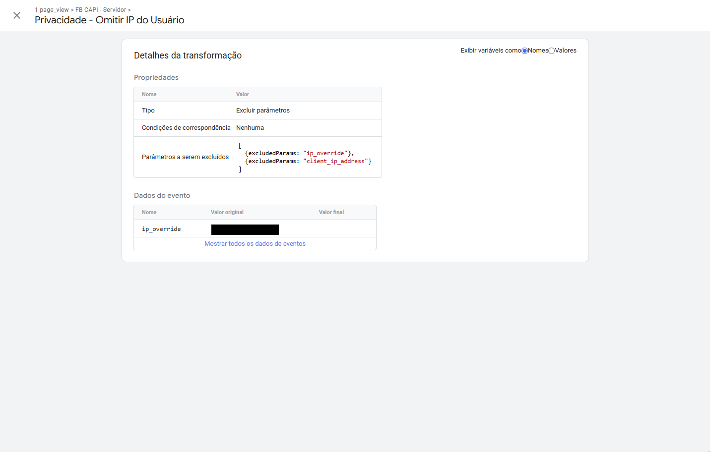

A prova definitiva de conformidade ocorre na inspeção do tráfego de saída. Ao analisarmos a requisição HTTP final enviada para a Meta, o *Payload* (corpo estruturado JSON) confirma a ausência absoluta da chave de IP. 


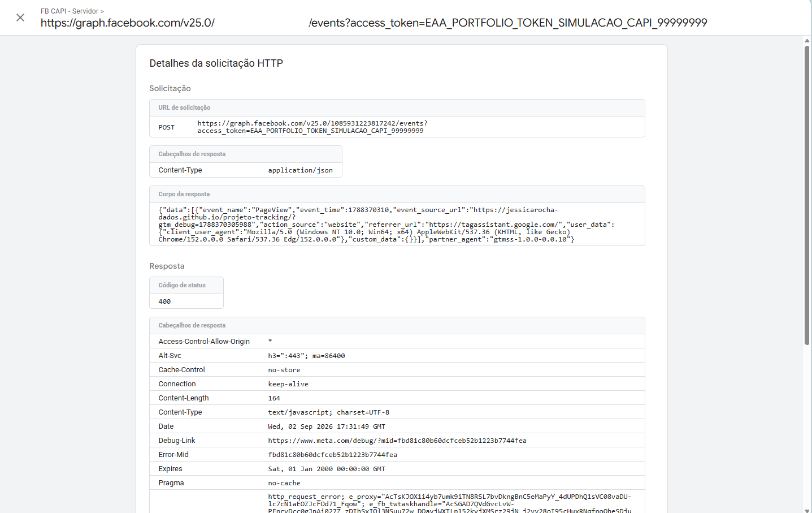

---

# DIA 44 – Conexão GA4 e BigQuery: Arquitetura de Dados 

## 1. Contexto e Objetivo do Projeto
A interface nativa do GA4 é otimizada para relatórios rápidos, mas apresenta barreiras estruturais severas para análises avançadas de mídia paga. Ao tentar realizar cruzamentos complexos, esbarramos em três problemas:
* **Amostragem:** O GA4 analisa apenas uma fração do tráfego em alto volume e infere o restante, destruindo a precisão matemática dos dados.
* **Limites de Cardinalidade:** Dimensões com muitos valores únicos (como URLs ou campanhas) são agrupadas em uma linha genérica `(other)`.
* **Thresholding:** Omissão de dados por regras de privacidade em volumes baixos de tráfego.

O objetivo desta etapa é conectar o fluxo de coleta diretamente ao **Google BigQuery**, estabelecendo um banco de dados. Cada evento validado pelo pipeline vira uma linha imutável no *Data Warehouse*, sem amostragem, permitindo a futura construção de modelos de atribuição reais via SQL.

---

## 2. Decisão Arquitetural: Sandbox e Custo Zero
Para este laboratório, decidi utilizar o ambiente **Sandbox do Google Cloud Platform (GCP)**, que fornece limites robustos de armazenamento e processamento gratuitos sem a necessidade de vincular uma conta de faturamento.

Como a exportação "Contínua" exige um cartão de crédito cadastrado na nuvem, configuramos a **Exportação Diária**. Essa abordagem garante que trabalharemos exclusivamente com os nossos próprios dados reais gerados pelo GTM Server, mantendo o custo de infraestrutura em R$ 0,00.

---

## 3. Configuração Realizada
A infraestrutura foi provisionada e o vínculo entre as plataformas foi estabelecido com sucesso:
1. Provisionamento do projeto `Portifolio Martech` no Google Cloud Platform.
2. Vinculação estabelecida no painel Administrativo do GA4 > Vínculos do BigQuery.
3. Região de processamento definida como `Estados Unidos (us)` para garantir conformidade de armazenamento multi-região.
4. Frequência de exportação de Eventos e Usuários configurada como **Diária**, preservando a arquitetura Sandbox.

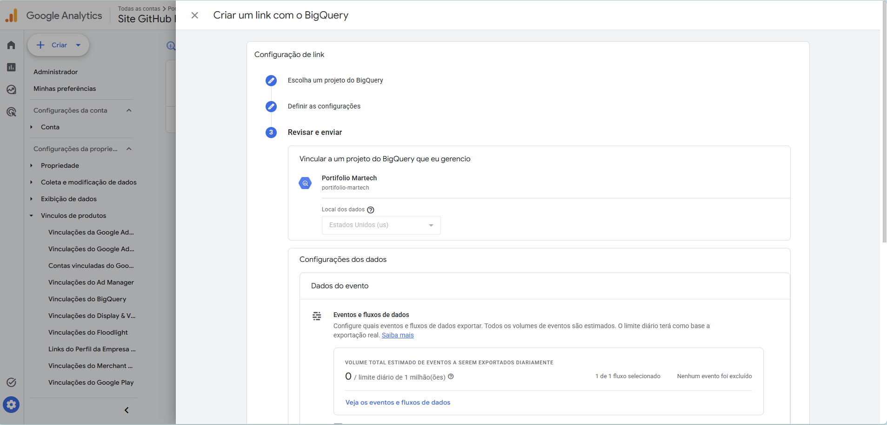
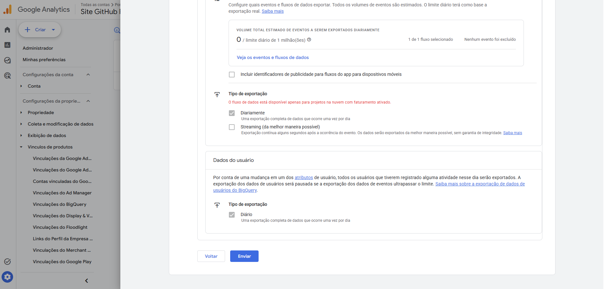
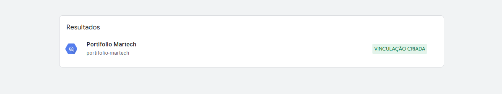

---

## 4. Próximos Passos: Validação 
Como a exportação diária processa os pacotes em lote durante a madrugada, o tráfego de teste gerado no dia de hoje será consolidado pelo Google nas próximas horas. 

No próximo dia do desafio, acessaremos o BigQuery Studio para validar a criação automática das tabelas particionadas (`events_` e `users_`) e realizaremos as primeiras extrações via SQL direto na nuvem para atestar a qualidade dos dados.

A implementação desta regra elevou a maturidade do pipeline, aplicando os princípios *Privacidade desde a concepção* diretamente na infraestrutura de dados. O ambiente agora protege a privacidade do usuário de ponta a ponta de forma automatizada, entregando pacotes de dados devidamente limpos para o ecossistema de marketing corporativo.

---
# DIA 45 – Rastreamento de Conversões e Refinamento de Dados no Pipeline (GA4, GTM Web/Server & BigQuery)

## 1. Contexto e Objetivo do Projeto

Após a consolidação da infraestrutura de Data Warehouse estabelecida no dia anterior, o objetivo desta etapa foi avançar na maturidade do rastreamento de mídia paga. Um pipeline de dados robusto precisa ir além do tráfego básico de páginas (`page_view`): ele deve capturar conversões reais de negócios com precisão cirúrgica e garantir que o ecossistema de nuvem receba os dados limpos de distorções geográficas causadas por servidores intermediários.

Nesta fase, focamos em três pilares:

* **Rastreamento de Conversões (Leads):** Mapeamento do envio bem-sucedido de formulários utilizando eventos personalizados integrados à camada de dados.
* **Validação de Fluxo:** Acompanhamento do tráfego do navegador até o servidor em nuvem (Stape) e sua chegada sem amostragem ao GA4.
* **Correção de Geolocalização:** Solução do problema clássico de infraestrutura Server-Side onde o IP do servidor substitui o IP real do usuário, ajustando a geolocalização dos eventos para o Brasil.

## 2. Etapas de Implementação e Validação

### Passo 1: Validação da Infraestrutura no BigQuery Studio

Antes de iniciar os testes de conversão, realizamos a primeira extração de dados no Data Warehouse provisionado no GCP. A exportação diária processou com sucesso os pacotes em lote, criando o dataset e as tabelas particionadas no ambiente Sandbox.

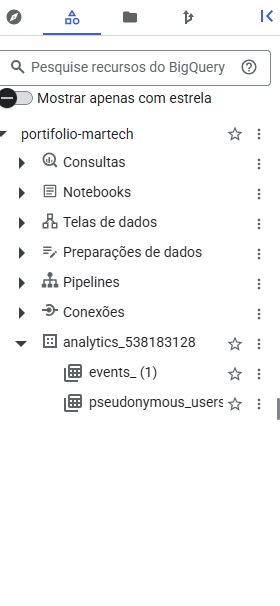

```sql
SELECT 
  event_date,
  event_timestamp,
  event_name,
  user_pseudo_id,
  geo.country
FROM 
  `portifolio-martech.analytics_538183128.events_*`
ORDER BY 
  event_timestamp DESC
LIMIT 10;
```

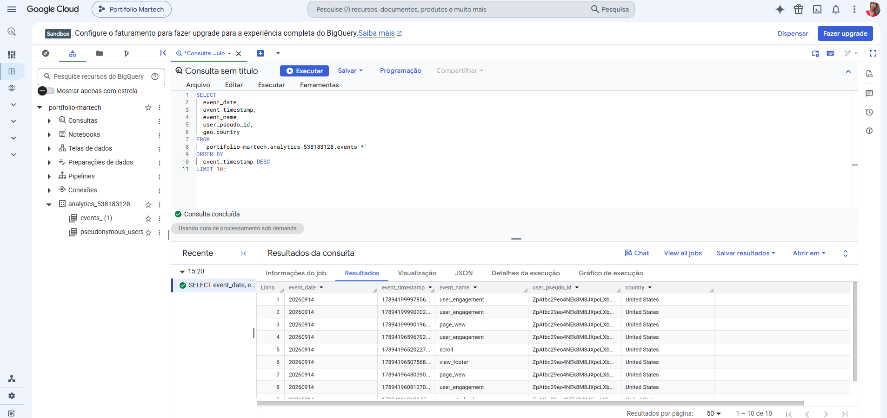

A consulta SQL atestou que os eventos básicos (`page_view`, `user_engagement`, `scroll`) e personalizados (`view_footer`) já estavam armazenados em formato bruto e estruturado.

### Passo 2: Configuração e Disparo de Conversões no GTM Web

Utilizando a camada de dados do site de testes hospedado no GitHub Pages, configuramos a interceptação do envio de formulários de newsletter.

1. O usuário aciona a inscrição, disparando o evento personalizado `lead_gerado` mapeado no Data Layer.
2. O GTM Web captura o evento e o traduz para o padrão corporativo recomendado pelo Google Analytics 4: `generate_lead`.

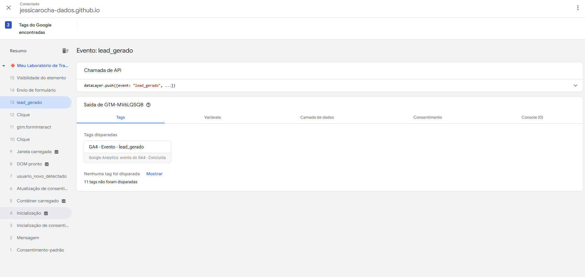

### Passo 3: Roteamento via GTM Server-Side (Stape)

Com o evento empacotado no navegador, a requisição foi direcionada para o contêiner do GTM Server-Side. O painel de debug do servidor confirmou o processamento bem-sucedido da conversão, repassando o pacote limpo para o endpoint do GA4 enquanto gerenciava de forma isolada as chamadas de API de conversão externa.

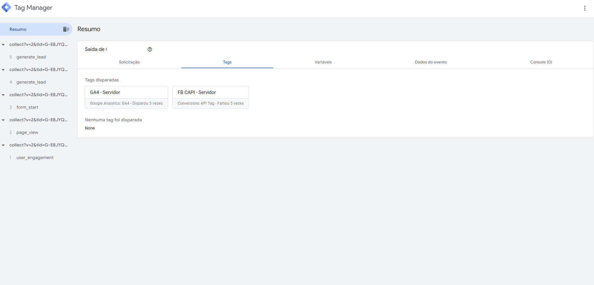

### Passo 4: Refinamento Técnico e Correção de Geolocalização

Como o tráfego em arquiteturas Server-Side passa primeiro por um servidor em nuvem, o GA4 inicialmente registrava os acessos geolocalizados nos Estados Unidos.

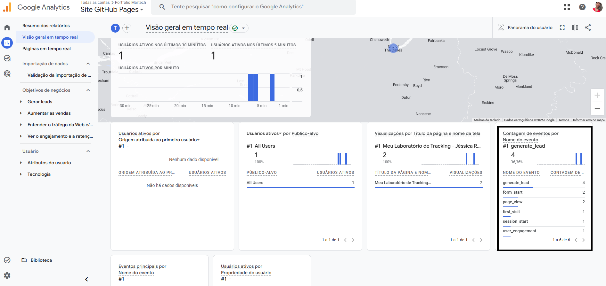

Para resolver essa anomalia e garantir a integridade analítica:

1. Criamos uma variável no GTM Server baseada no cabeçalho HTTP `X-Forwarded-For` para resgatar o IP real do visitante.
2. Injetamos o parâmetro de substituição `ip_override` na tag de disparo do GA4.

O resultado foi validado em tempo real: o painel do Google Analytics passou a computar os eventos de conversão e a posicionar corretamente o usuário ativo no Brasil (São Paulo).

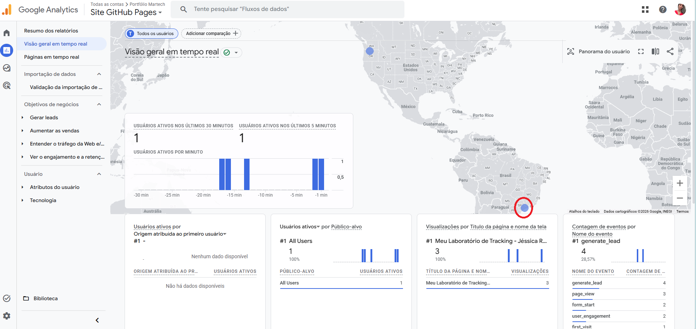

## 3. Conclusão da Etapa

Com as validações concluídas, a arquitetura de dados do laboratório atinge um patamar avançado de engenharia de tracking. O pipeline agora garante rastreamento de conversões sem perda de dados, conformidade técnica com o tratamento de IPs e armazenamento imutável pronto para alimentar modelos de atribuição e dashboards executivos.

---

## DIA 46 – Ingestão de Dados, ELT e FinOps (Camada Bronze)

### 1. Contexto do Projeto e Evolução Arquitetural
Após garantir a exportação diária dos eventos do GA4 no BigQuery, o objetivo desta etapa foi simular a extração real do Data Warehouse e iniciar a implementação lógica da **Arquitetura Medalhão (Medallion Architecture)** via Python e Pandas.

Nesta fase, focamos nos conceitos como:
* **Pipeline ELT (Extract, Load, Transform):** Exportamos o dataset bruto do BigQuery e realizamos a ingestão na primeira camada lógica (Bronze), sem realizar limpezas prévias.
* **FinOps (Otimização de Custos):** A extração e leitura ocorrem em lote (Batch), consumindo poder computacional de forma pontual sob demanda, em vez de manter instâncias ligadas 24/7.

### 2. Etapas de Implementação

**Passo 1: Estabelecimento da Camada Bronze**
Importamos o dataset real (`dia46_bronze_eventos_ga4.csv`). O dado foi mantido estritamente em seu estado bruto (ex: a coluna `event_date` armazenada nativamente como número inteiro `YYYYMMDD` pela API do Google), respeitando a regra fundamental de imutabilidade do Data Lakehouse.

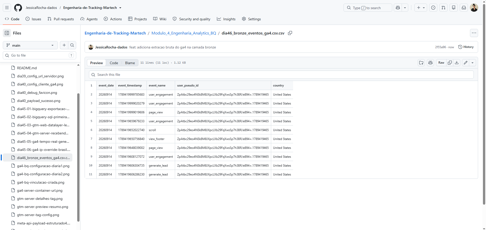

**Passo 2**:
Desenvolvemos o script de leitura (`dia46_ingestao_bronze.py`) para consumir os eventos em lote, estruturar o DataFrame e preparar o terreno para a futura etapa de transformação (Camada Silver), onde as tipagens e limpezas serão aplicadas.

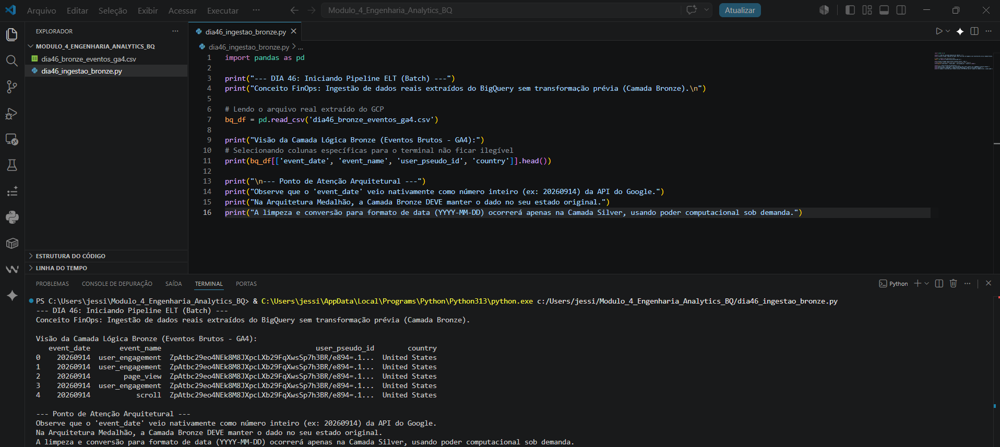

### 3. Conclusão e Impacto Arquitetural 
O desenvolvimento deste script consolida a base de um Data Lakehouse moderno. A decisão de extrair os eventos do GA4 e armazená-los estritamente em seu estado bruto (Camada Bronze) materializa a transição do padrão ETL legado para o **ELT**. Utilizando Python e Pandas para uma ingestão em lote (Batch), eliminamos a dependência de servidores de transformação rodando ininterruptamente. Essa abordagem atende diretamente aos princípios de **FinOps**, otimizando os custos computacionais da nuvem.

---

###  Governança de Dados e Rastreabilidade (Data Lineage)

Durante a revisão estrutural da Camada Bronze, identifiquei a necessidade técnica de implementar metadados de controle para garantir a rastreabilidade no Data Lakehouse. Com essa atualização no código, o pipeline registra de forma autônoma **quando** e **de onde** cada linha de dado foi extraída.

Através do Pandas, injetei duas novas colunas no momento exato da ingestão:
* `_ingestion_timestamp`: Captura a data e hora exatas da execução via biblioteca `datetime`.
* `_source_file`: Identifica o nome do arquivo ou sistema de origem.

**Padrão Arquitetural Adotado:** Utilizei o prefixo sublinhado (`_`) para isolar visualmente e logicamente os metadados gerados pela Engenharia em relação à carga útil de negócios (ex: `event_name` e `user_pseudo_id`). Essa prática garante a integridade do dado bruto na Camada Bronze e viabiliza auditorias precisas em lotes específicos no futuro.

Abaixo, a demonstração da implementação no código e a validação das colunas geradas no terminal:
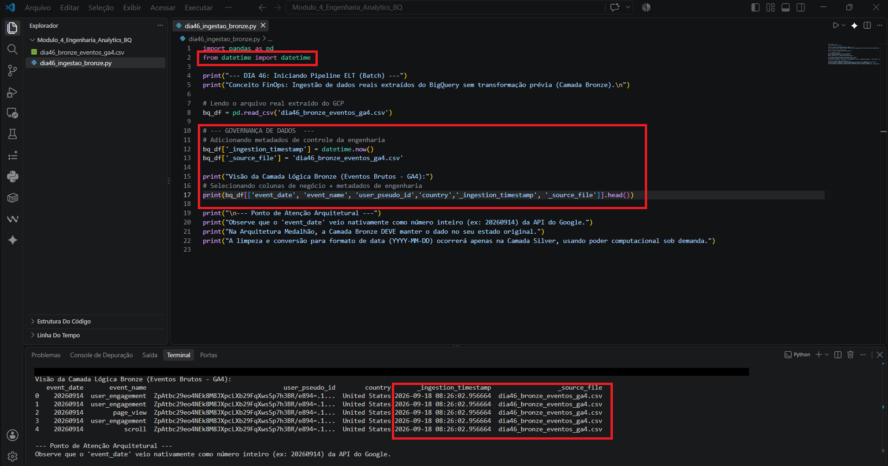

---
### DIA 47 - Camada Silver: Limpeza, Tipagem e Data Quality

Com a ingestão bruta garantida na Camada Bronze, a etapa seguinte do pipeline ELT consistiu em higienizar o dataset do GA4, aplicando regras de qualidade de dados (*Data Quality*) através da biblioteca Pandas. O objetivo desta camada é refinar o dado, entregando uma base estruturada, livre de inconsistências e pronta para cruzamentos seguros no Data Lakehouse.

As seguintes transformações foram aplicadas no script `dia47_limpeza_silver.py`:
* **Conversão de Tipagem:** A coluna `event_date` (extraída da API como número inteiro) foi convertida para o formato padrão de banco de dados `datetime64[ns]` (`YYYY-MM-DD`), essencial para filtros temporais analíticos.
* **Tratamento de Nulos (NaN):** Valores ausentes na origem foram preenchidos preventivamente com *strings* de controle (ex: `NÃO INFORMADO` e `ID_AUSENTE`), blindando a base contra quebras sistêmicas em futuros cruzamentos (JOINs) via SQL.
* **Padronização de Strings:** Aplicação de caixa alta (`.upper()`) em colunas categóricas de texto para evitar divergências de agrupamento e garantir métricas exatas no BI.

Abaixo, a evidência da execução do script e a validação técnica das novas tipagens diretamente no terminal:

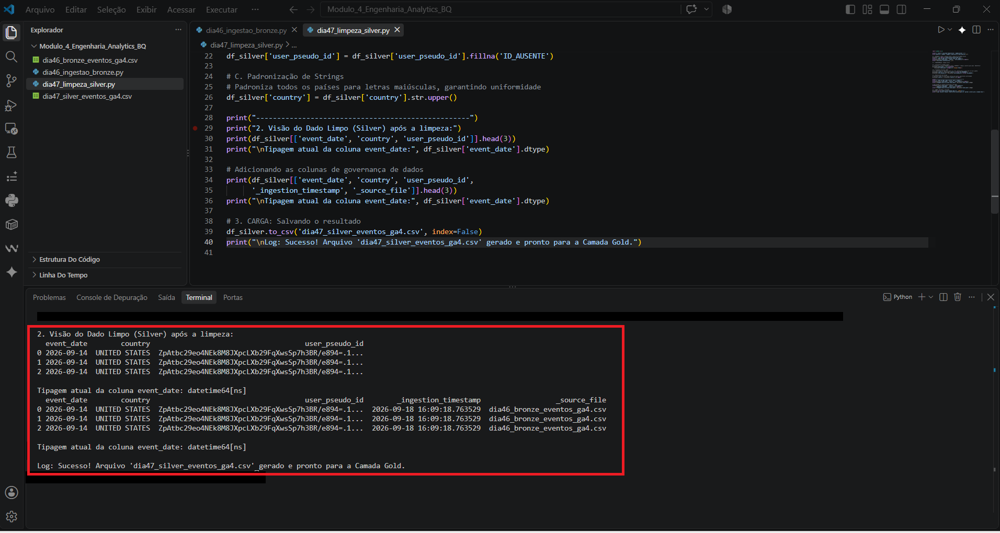

**📌 Observação Técnica: Escalabilidade em Ambientes de Big Data**
O escopo atual contempla as higienizações fundamentais para a estrutura deste dataset. Em cenários corporativos de alto volume (milhões de eventos diários) ou ao integrar bases auxiliares (como CRMs), a lógica desta Camada Silver seria expandida para incorporar:
* **Desduplicação Ativa:** Implementação de `.drop_duplicates()` para mitigar falhas de rede das APIs de anúncios, que frequentemente disparam eventos duplicados.
* **Adequação à LGPD/GDPR (Mascaramento de PII):** Aplicação de algoritmos de criptografia (*hash SHA-256*) em dados sensíveis (e-mail, CPF). 
* **Parsing de UTMs:** Desmembramento de parâmetros complexos de URL através de Expressões Regulares (*Regex*) para isolar origem, mídia e campanha em colunas dedicadas.
* **Filtros de Tráfego Inválido:** Exclusão automatizada de eventos gerados por IPs internos da empresa ou *bots* mapeados, garantindo a pureza do ROI das campanhas.
* **Resultado:** Arquivo refinado (`dia47_silver_eventos_ga4.csv`) gerado com sucesso, encerramos a fase de transformação e nos prepararemos para as agregações de negócio na Camada Gold.
  
**Nota: O GA4 já provê conformidade nativa ao anonimizar os usuários via `user_pseudo_id`, dispensando o hash nesta etapa específica.**

---

## Dia 48: Construindo uma Arquitetura Medalhão no GCP 

Este registro documenta a evolução da nossa infraestrutura de dados focada em marketing analytics. O objetivo foi superar as limitações de execuções locais e construir um pipeline de ponta a ponta (ELT) no Google BigQuery, unindo práticas de Engenharia de Dados e Engenharia de Analytics.

Abaixo, o passo a passo da consolidação do nosso Data Warehouse.

### 1. Infraestrutura como Código (IaC) e Segurança
O primeiro grande desafio foi contornar conflitos de cache e autenticação local. A solução adotada foi a implementação de uma **Service Account**.

Para garantir o padrão de segurança do mercado, o arquivo `credenciais_gcp.json` foi isolado através do `.gitignore`, protegendo a chave contra vazamentos no repositório. Em seguida, executamos o script `00_setup_arquitetura.py`. Este código conectou-se ao GCP e provisionou automaticamente os datasets `bronze` e `silver`, utilizando parâmetros de idempotência (`exists_ok=True`) para evitar duplicidades na infraestrutura.

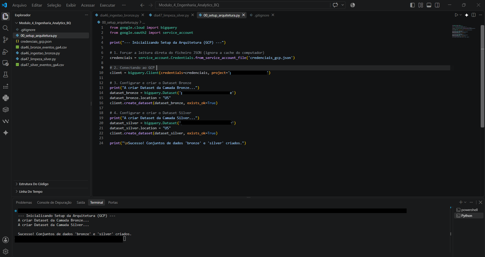

---

### 2. Ingestão de Dados Brutos (Camada Bronze)
Após o provisionamento dos ambientes em nuvem, iniciamos o processo de extração e carga. Executamos o script `dia46_ingestao_bronze.py`, responsável por ler os arquivos originais e fazer o upload para o banco.

Utilizando o método `to_gbq` da biblioteca Pandas, os eventos brutos foram enviados para a tabela `portifolio-martech.bronze.eventos_ga4`. O terminal registrou a conclusão da carga em 100% com sucesso, garantindo que o dado chegasse ao BigQuery no seu estado original e imutável.

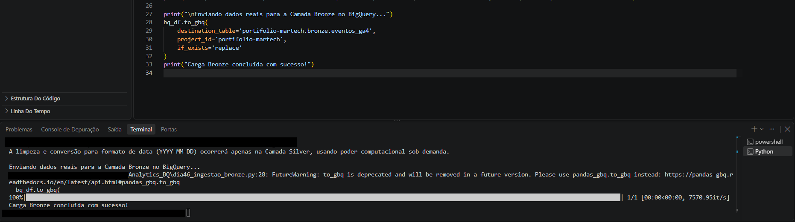

---

### 3. Qualidade e Limpeza (Camada Silver)
Dados brutos não geram análises confiáveis sem tratamento. Na etapa seguinte, simulamos o poder computacional para aplicar regras de **Data Quality** através do script `dia47_limpeza_silver.py`.

Realizamos a conversão das strings de data para o formato `YYYY-MM-DD`, padronizamos o nome dos países e tratamos IDs ausentes. O terminal confirmou a execução e o envio desses dados tratados para a nossa segunda camada no BigQuery.

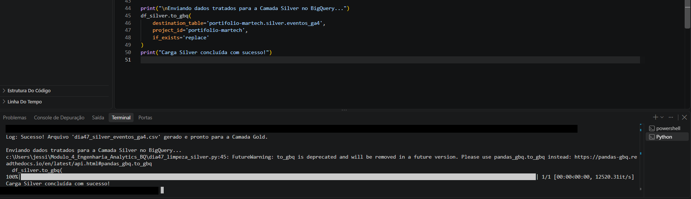

---

### 4. Engenharia de Analytics e Regras de Negócio (Camada Gold)
Por fim, com o dado limpo e tipado estruturado na camada Silver, migramos do Python para o **SQL** diretamente na interface do Google Cloud.

Criamos o dataset `gold` e executamos uma consulta para estruturar a nossa Tabela Fato (`fato_eventos_marketing`). Através de agregações baseadas em data e país, consolidamos métricas essenciais como a contagem de interações e o volume de usuários únicos (`COUNT DISTINCT`). A consulta foi finalizada com status de sucesso em 3 segundos, provando a eficiência do processamento na nuvem.

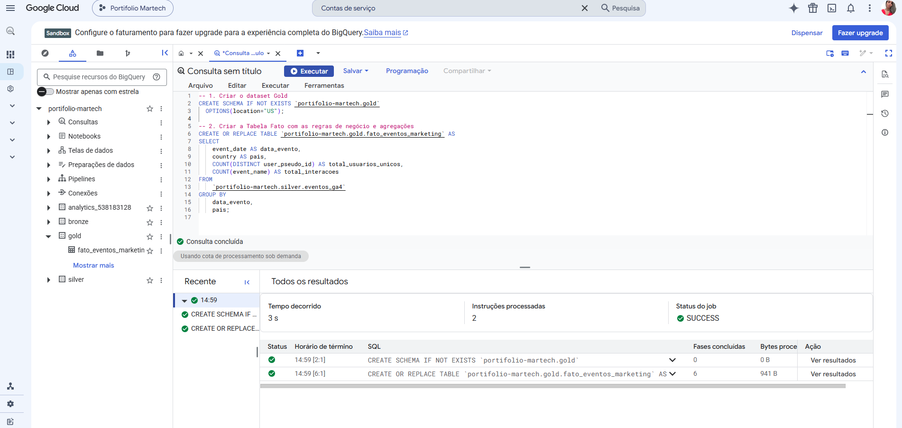

Com a infraestrutura provisionada e os dados consolidados na camada Gold, o próximo passo do projeto focará na implementação de práticas de DataOps. Desenvolverei testes automatizados de Qualidade de Dados (Data Quality) para atestar a integridade das métricas e garantir total governança antes de liberar a base para consumo em ferramentas de Business Intelligence (BI).

---

# Dia 49: Implementação de Data Quality e Circuit Breaker na Camada Gold

Nesta fase do projeto, o foco foi estruturar a governança dos dados aplicando princípios fundamentais de **DataOps**. O objetivo do dia foi construir uma barreira de proteção automatizada para garantir que a tabela da Camada Gold esteja perfeitamente íntegra antes de ser consumida por ferramentas de Business Intelligence (BI).

## 1. Conceitos Fundamentais
Para garantir a confiabilidade do pipeline, aplicamos dois conceitos essenciais de engenharia de dados:
* **Data Quality:** É o processo de validar se as informações processadas são precisas, consistentes e estão de acordo com as regras do negócio. Sem a garantia de qualidade, um pipeline rápido apenas entrega dados errados mais depressa para a área de negócios.
* **Circuit Breaker:** Inspirado na engenharia elétrica, é um padrão de arquitetura focado em segurança. No contexto de dados, significa criar um mecanismo de interrupção imediata (*Fail Fast*). Se uma anomalia for detectada na validação, o fluxo é bloqueado, evitando que dados corrompidos atualizem os painéis de visualização.

## 2. Como Funciona no Código (Python + BigQuery)
Para implementar essa arquitetura, desenvolvi o script `dia49_validacao_gold.py`. O código delega o esforço computacional ao BigQuery, executando consultas SQL para aferir métricas e validando os resultados no Python através do comando `assert`. O `assert` funciona como o nosso "disjuntor": se a condição não for atendida, ele "desarma" e interrompe o código.

O script executa duas frentes de validação:
1. **Integridade Técnica:** Verifica a granularidade da tabela (combinação de data do evento e país). A consulta SQL conta as ocorrências e o script garante que **não existem linhas duplicadas**.
2. **Regras de Negócio:** Valida a lógica dos dados da empresa. O sistema garante que as métricas de `total_interacoes` e `total_usuarios_unicos` **nunca apresentem valores negativos**.

## 3. Execução e Aprovação 

Na execução com a base de dados real do projeto, o pipeline fluiu conforme o planejado. O terminal confirmou a aprovação em ambos os testes e o script finalizou com a mensagem de que a Camada Gold está íntegra e liberada para o BI. Isso atesta o sucesso das transformações realizadas na Camada Silver.

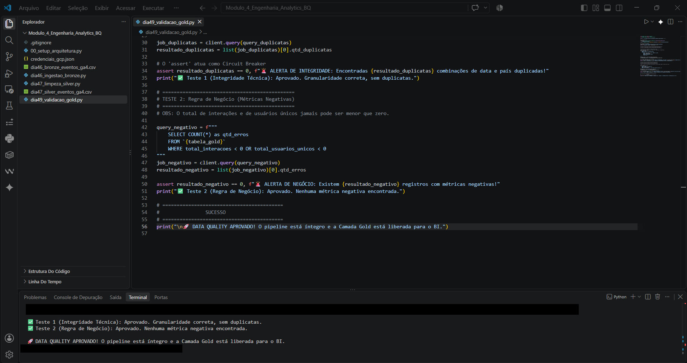

## 4. Simulação de Falha (O Circuit Breaker)

Para comprovar a eficácia prática da barreira de segurança, forcei uma falha alterando intencionalmente uma regra de negócio no código (`WHERE total_interacoes > 0`). 
O sistema reagiu exatamente como projetado: o código identificou a divergência e disparou a exceção `AssertionError` na linha 50, paralisando a execução e emitindo o log *"🚨 ALERTA DE NEGÓCIO: Existem 1 registros com métricas negativas!"*. 
Esta simulação atesta a maturidade do pipeline, provando que ele é capaz de proteger o usuário final e alertar a engenharia caso ocorram inconsistências na origem.

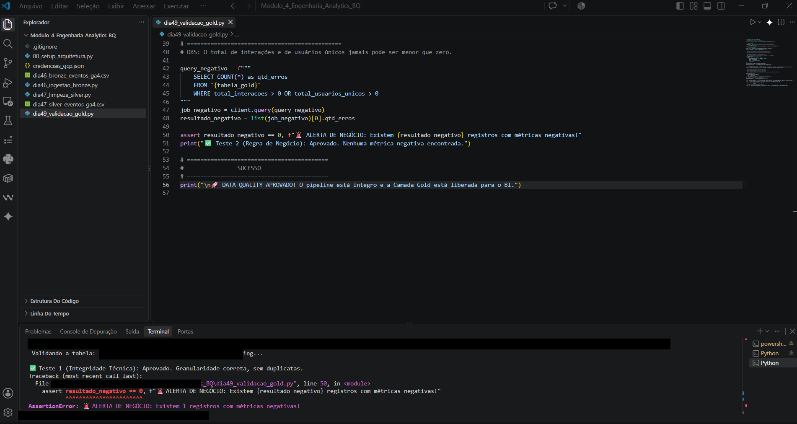

---
# Implementação de DataOps e Automação de CI/CD 

Nesta etapa do projeto, o foco foi elevar a maturidade da infraestrutura aplicando conceitos práticos de **DataOps**. Após construirmos as camadas Bronze, Silver e Gold, o desafio deixou de ser apenas processar dados e passou a ser: *como garantir que essa pipeline funcione de forma automática, segura e à prova de falhas?*

Para isso, estruturei uma esteira de Integração e Entrega Contínuas (CI/CD) utilizando o GitHub Actions e organizei a arquitetura do repositório para refletir boas práticas de engenharia.

### 1. Reestruturação e Governança do Repositório
Antes de automatizar, foi necessário organizar a "casa". A estrutura do projeto foi refinada para garantir que o código e a configuração estivessem perfeitamente isolados e seguros:
* **Isolamento de Módulos:** Todos os scripts de processamento em Python (desde o `00_setup_arquitetura.py` até o `dia49_validacao_gold.py`) foram consolidados dentro da pasta `Modulo_4_Engenharia_Analytics_BQ`.
* **Segurança de Credenciais:** As chaves de serviço do GCP (`credenciais_gcp.json`) foram isoladas e protegidas através do arquivo `.gitignore`, garantindo que nenhuma informação sensível de faturamento ou acesso ao BigQuery fosse exposta na nuvem.
* **Padronização CI/CD:** A pasta `.github/workflows` foi mantida estritamente na raiz do repositório, seguindo o padrão exigido pelo GitHub para o reconhecimento de automações.

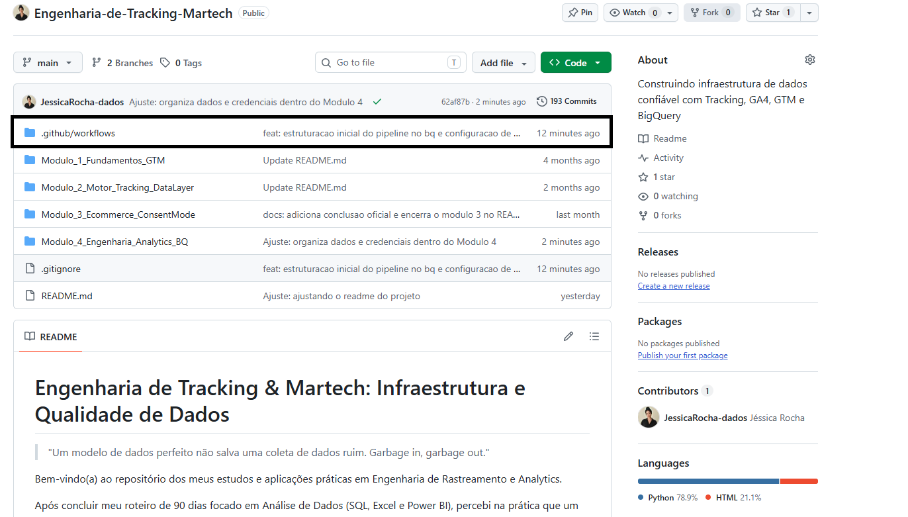

### 2. A Pipeline de CI/CD (GitHub Actions)
A parte mais importante desta etapa é o arquivo `ci_cd_dataops.yml`. Ele atua como um fiscal rigoroso que valida a integridade da nossa Camada Gold de forma automatizada. 

A arquitetura da nossa pipeline foi desenhada com os seguintes passos:
* **O Gatilho (Trigger):** A automação é disparada automaticamente sempre que um novo código é enviado (`push`) para a branch `main`.
* **O Ambiente:** O GitHub provisiona uma máquina virtual limpa rodando a versão mais recente do Ubuntu (`ubuntu-latest`).
* **Step 1 & 2 - Preparação:** O ambiente clona o repositório (`actions/checkout@v3`) e configura a linguagem base instalando o Python na versão 3.10 (`actions/setup-python@v4`).
* **Step 3 - Dependências:** Instalação das bibliotecas necessárias, especificamente o pacote `google-cloud-bigquery`.
* **Step 4 - Autenticação Segura:** Simulação da injeção segura de credenciais de produção utilizando o cofre de segredos da plataforma (GitHub Secrets).
* **Step 5 - Circuit Breaker:** Execução do script `dia49_validacao_gold.py`. Este é o teste final de qualidade: se os dados não passarem nas regras de negócio, a pipeline quebra e impede que dados corrompidos cheguem aos painéis de BI.

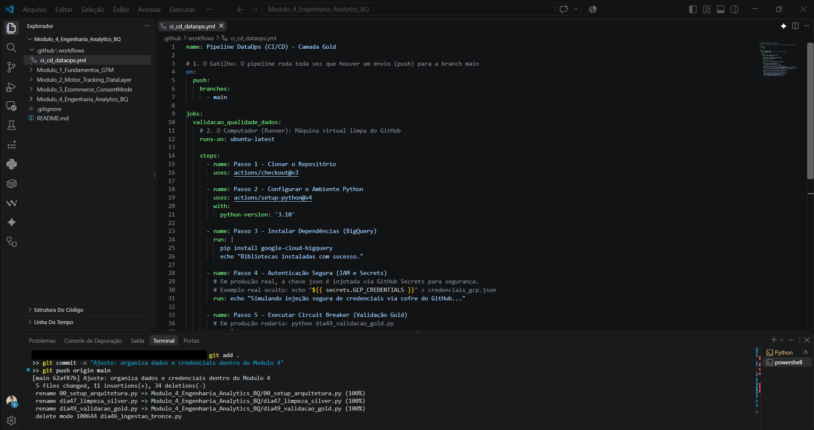

### 3. Resultados e Aprendizados
O resultado dessa orquestração pode ser visto na aba de *Actions* do repositório, onde as execuções da "Pipeline DataOps (CI/CD) - Camada Gold" rodaram com sucesso (indicadas pelos ícones de verificação verdes). 

Essa implementação foi um divisor de águas no meu aprendizado de Python e SQL. Ela prova que construir código é apenas metade do caminho; a outra metade é garantir que ele rode de forma previsível, testável e segura em um ambiente de produção simulado. É um passo fundamental na transição de scripts isolados para uma engenharia de dados real e colaborativa.

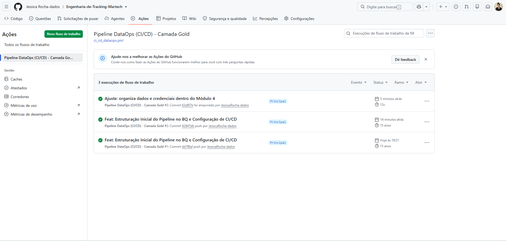

### Os Próximos Passos

A jornada de aprendizado e evolução do projeto continua! Com a base de engenharia de rastreamento, processamento de dados e CI/CD já consolidadas, a estrutura evoluirá para novos níveis de maturidade e escala:

* **Nuvem e Visão de Orquestração (GCP / Databricks)**
  O foco será levar a execução da nossa arquitetura para um ambiente de orquestração avançado. O objetivo é explorar como escalar pipelines de dados na nuvem (Google Cloud Platform) e utilizar o Databricks para o processamento e orquestração de fluxos complexos. Essa etapa aproxima ainda mais o projeto dos desafios reais de escalabilidade e Big Data enfrentados na Engenharia de Dados moderna.
